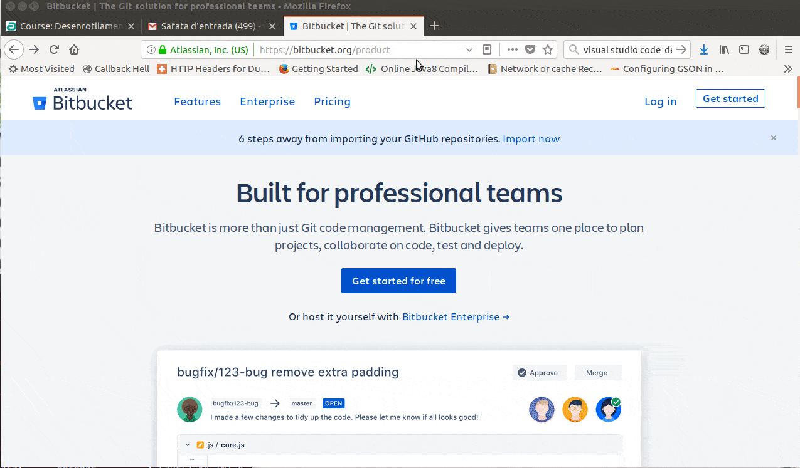
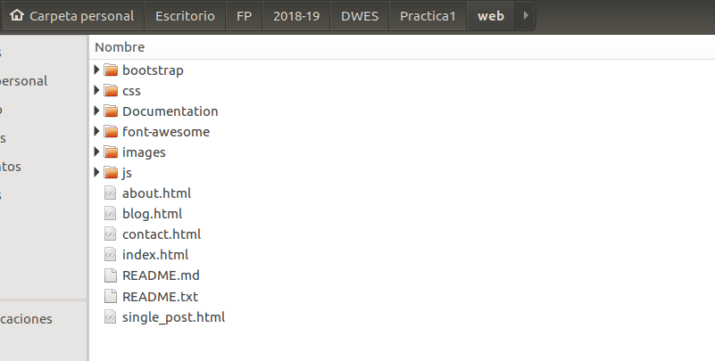
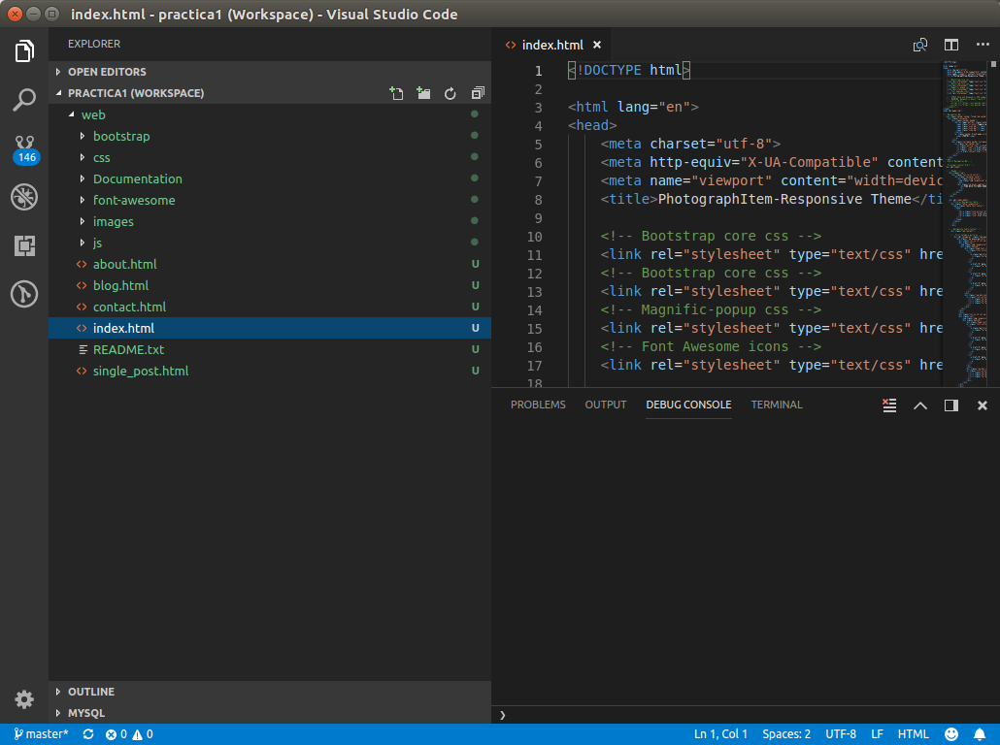
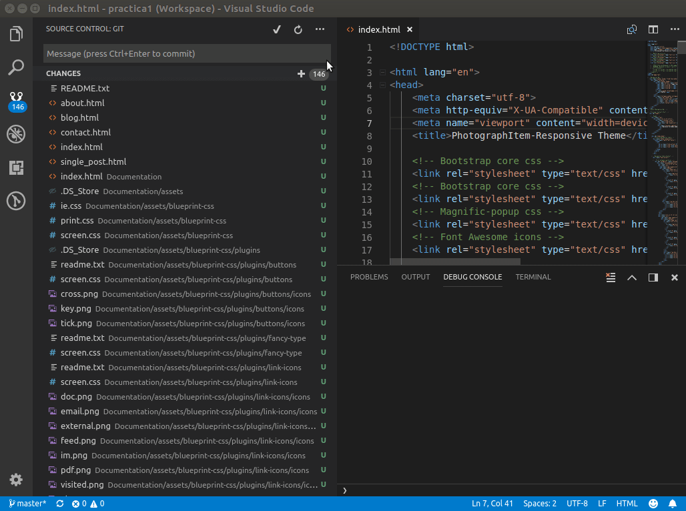
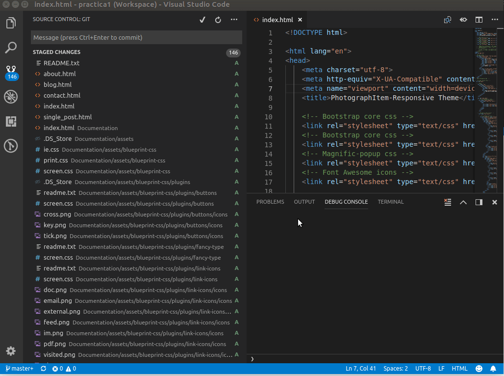
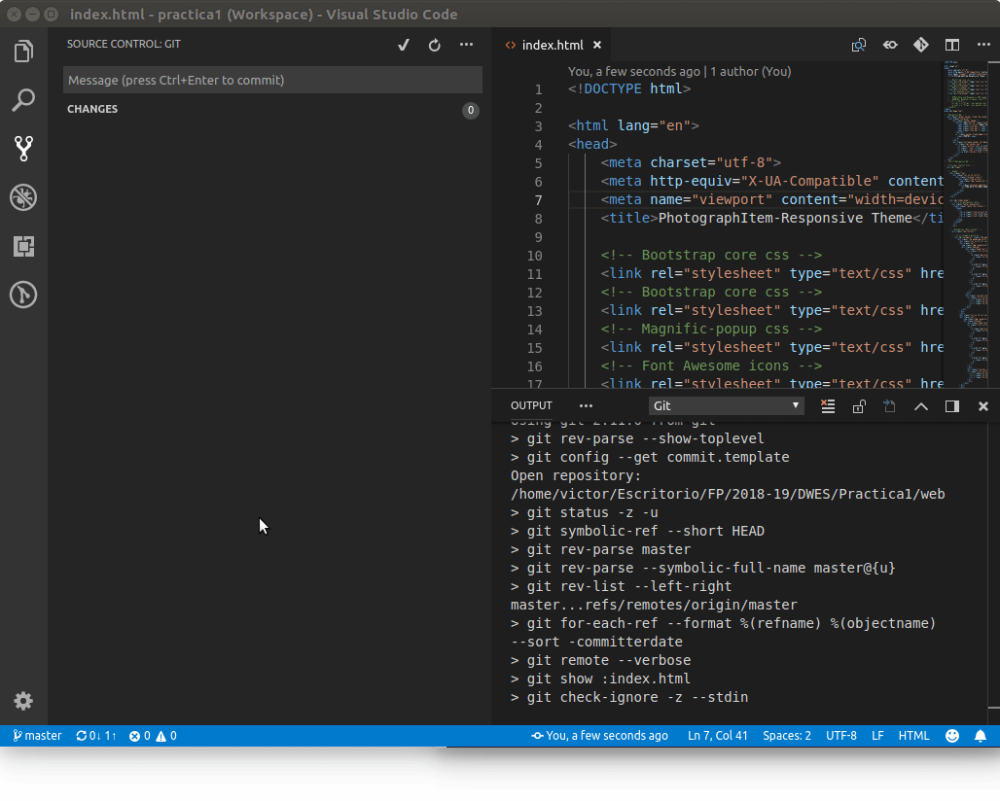
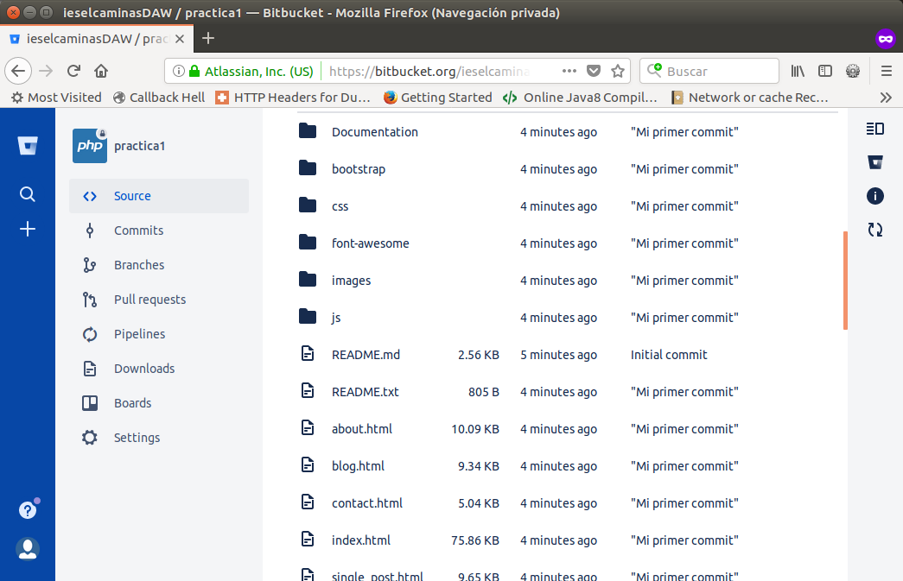
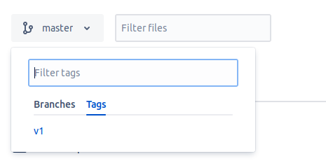
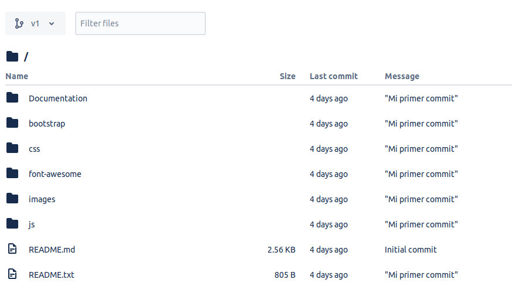

## Crear host virtual

El primer paso va a ser crear un host virtual para el dominio www.proyecto1.local siguiendo las instrucciones de los apuntes.

Por ejemplo, podéis crearlo en el directorio en `/home/admin01/Documentos/proyectos/proyecto1`

## Crear un repositorio remoto



## Instalar git

Instalad git mediante el siguiente comando:

```bash
sudo apt install git
```

Ahora vamos a configurarlo con el usuario que hemos usado en https://bitbucket.org/

```bash
git config --global user.name "Víctor Ponz"
git config --global user.email "victor.ponz@ieselcaminas.org"
```

Clonad el repositorio creado en https://bitbucket.org/. 

Debéis hacerlo en vuestro directorio del host virtual `/home/admin01/Documentos/proyectos/proyecto1`

<script id="asciicast-COwLwT5vxGF7qlW8aHwexhqnz" src="https://asciinema.org/a/COwLwT5vxGF7qlW8aHwexhqnz.js" async></script>
Para comprobar que todo ha ido bien, podemos ejecutar el comando `git remote -v`. Este comando nos indica a qué repositorio remoto tenemos conectado con nuestro repositorio local
<script id="asciicast-faOrRlSYjGO2SBQj5V1QhDqhv" src="https://asciinema.org/a/faOrRlSYjGO2SBQj5V1QhDqhv.js" async></script>

## Plantilla HTML

Como base para nuestro proyecto, usaremos una plantilla HTML que poco a poco vamos a ir adaptando para trabajar con PHP.

Descargad la plantilla del aula virtual y descomprimidla dentro de la carpeta del proyecto.



## Crear un workspace en VSC o Atom

El siguiente paso será crear una espacio de trabajo en VSC o Atom. 



Como podéis observar, al estar conectado con un repositorio git aparecen 146 archivos que están `untracked` (**u**).

Lo primero será añadirlos para que estén el control de versiones:



Ahora ya están *controlados* por git. Equivale a hacer `git add *`

Vamos a pasarlos a la zona HEAD, equivale a `git commit `



Y ahora voy a subirlos al repositorio remoto, equivale a `git push`



Ahora ya tenemos nuestro repositorio remoto actualizado:



## Crear un nuevo tag

Vamos a hacer [tags](https://git-scm.com/book/en/v2/Git-Basics-Tagging) para mantener versiones de nuestra aplicación, de esta forma siempre tendremos una copia de cómo estaba el proyecto antes de empezar con una nueva actividad.

Tan sencillo como:

```bash
git tag nombre-de-la-version
git push origin master nombre-de-la-version
```

Por ejemplo, queremos guardarnos esta versión como `v1`.

```bash
git tag v1
git push origin master v1
```





Si queréis borrar un tag:
​	

```bash
git push origin :refs/tags/nombre-de-la-version # Borra el tag remoto
git tag -d nombre-de-la-version # Borra el tag local
```

Por ejemplo

```bash
git push origin :refs/tags/v1
git tag -d v1
```

------


## Credits.

Víctor Ponz victorponz@gmail.com

Este material está licenciado bajo una licencia [Creative Commons, Attribution-NonCommercial-ShareAlike](https://creativecommons.org/licenses/by-nc-sa/3.0/)


Adaptado del curso [Desarrollo web con PHP y MVC](https://www.udemy.com/desarrollo-web-con-php-7-y-mysql-utilizando-mvc/), realizado en el Cefire, impartido por [**Alejandro Amat Reina**](https://www.udemy.com/user/alejandro-amat-reina/)


