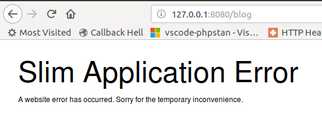
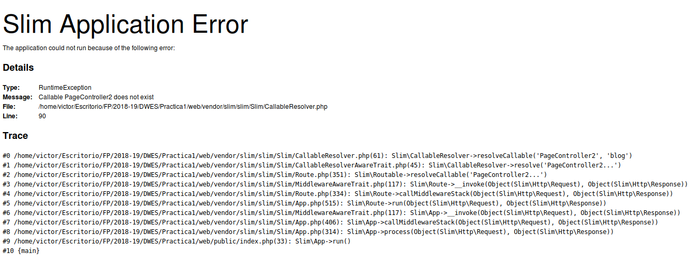
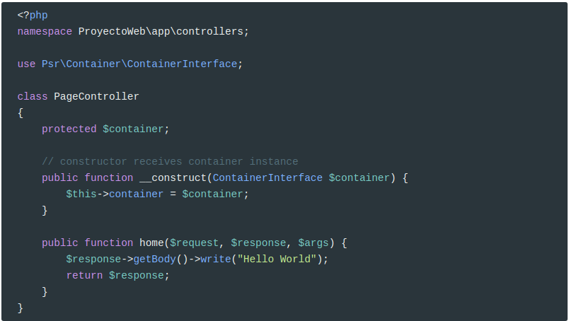
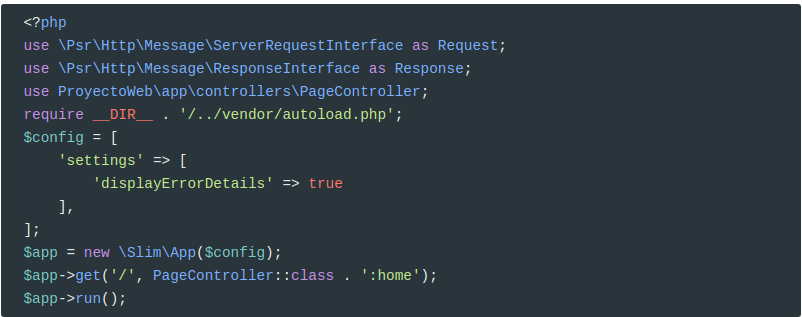
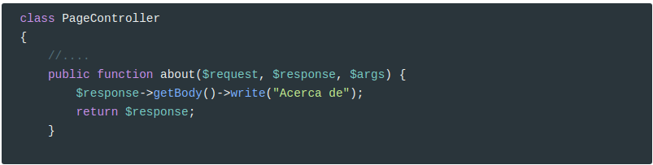
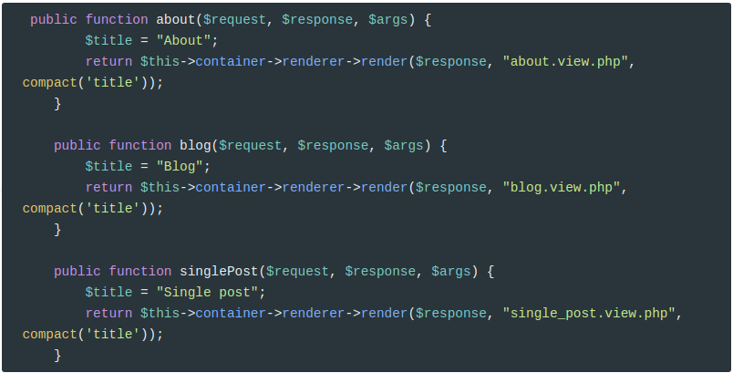
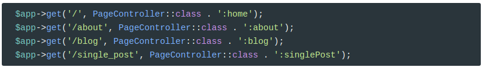
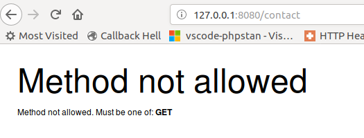
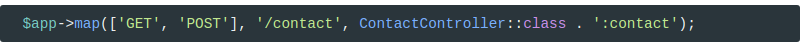

En el apartado 9, hicimos nuestro propio controlador frontal. Pero en esta práctica vamos a usar el controlador frontal que proporciona el **microframework** [Slim](https://www.slimframework.com/).

Según la [Wikipedia](https://en.wikipedia.org/wiki/Front_controller):

>  The **front controller** [software design pattern](https://en.wikipedia.org/wiki/Software_design_pattern) is listed in several pattern catalogs and related to the design of web applications. It is "a [controller](https://en.wikipedia.org/wiki/Model%E2%80%93view%E2%80%93controller) that handles all requests for a [website](https://en.wikipedia.org/wiki/Website)",[[1\]](https://en.wikipedia.org/wiki/Front_controller#cite_note-:0-1) which is a useful structure for web application developers to achieve the flexibility and reuse without code redundancy.

Para instalarlo, usamos **composer**

```bash
composer require slim/slim
```

Usarlo dentro de nuestra aplicación es bien sencillo:

<script src="https://gist.github.com/victorponz/d94947575300082c30c6309e8c1f69e0.js"></script>
Como podéis observar en la línea `8`, Slim funciona asociando un `path` con una función, anónima en este ejemplo. Cuando el usuario visita la página `/hello/víctor`, se encarga de llamar a dicha función pasando como parámetro la variable `$name`.

Además, como parámetros a dicha función, siempre le inyecta automáticamente las dependencias `Request` y `Response` que representan a la petición del cliente y al respuesta del servidor, respectivamente.

## Mostrar errores en el navegador

Si se produce algún error, Slim nos mostrará la siguiente información



Que no informa de qué tipo de error se ha producido y deberemos mirar el log para ver qué ha ocurrido:


Si queremos que nos informe, hemos de configurar la aplicación:

```php
$config = [
    'settings' => [
        'displayErrorDetails' => true
    ],
];
$app = new \Slim\App($config);

```

Y ahora la salida es:



## Clases Controladores

Lo habitual es tener las funciones asociadas con una ruta o rutas en un **Clase Controlador** propia. Veamos qué es esto de las Clases Controladores:

Hasta ahora hemos creado un script físico para cada una de las rutas junto con su correspondiente vista. En esta práctica uniremos todas estas rutas en varias Clases Controladores, asociando un método a cada una de ellas.

Por ejemplo, vamos a crear una ruta para `/` y su correspondiente Clase Controladora. Esta clase la creamos en `src/app/controllers` tal como indica el `namespace`



Y ahora definamos la ruta en el controlador frontal:



Ahora lo que estamos haciendo es que cuando la ruta sea `/`invoque al método `home` de la clase `PageController`.

Para añadir un controlador nuevo para la ruta `/about`simplemente creamos un nuevo método dentro de `PageController`.



Y añadimos esta nueva ruta al controlador frontal:


**Así de simple.**

## Plantillas PHP

Pero nosotros lo que queremos es que estos métodos nos rendericen las vistas que hemos creado. Para ello vamos a usar un `Renderer` de Slim

```
composer require slim/php-view
```

El primer paso es crear una instancia de este `Renderer` y añadirla al contenedor de dependencias que ya trae Slim:

```php
$container = $app->getContainer();
$container['renderer'] = new PhpRenderer("../src/app/views");
```

donde `../src/app/views` es el directorio donde almacenamos las vistas.

Es decir, en `index.php`

```php
<?php
session_start();
require __DIR__ . '/../vendor/autoload.php';
require_once __DIR__ . '/../src/core/bootstrap.php';
use \Psr\Http\Message\ServerRequestInterface as Request;
use \Psr\Http\Message\ResponseInterface as Response;
use Slim\Views\PhpRenderer;
use ProyectoWeb\app\controllers\PageController;
use ProyectoWeb\core\App;

App::bind('rootDir', __DIR__ . '/');

$config = [
    'settings' => [
        'displayErrorDetails' => true
    ],
];
$app = new \Slim\App($config);

$container = $app->getContainer();
$container['renderer'] = new PhpRenderer("../src/app/views");

$app->get('/', PageController::class . ':home');
$app->run();
```

Y modificamos `/core/bootstrap.php`

```php
<?php
use ProyectoWeb\core\App;
use ProyectoWeb\database\Connection;
use ProyectoWeb\app\utils\MyLog;

$config = require_once __DIR__ . '/../app/config.php';
App::bind('config', $config);
App::bind('connection', Connection::make(App::get('config')['database']));
App::bind("logger", MyLog::load($config['logs']['channel'], __DIR__ ."/../logs/" . $config['logs']['filename'],  $config['logs']['level']));
```

Por ejemplo, vamos a ver cómo modificar `PageController::home`

Aquí está el código original del controlador `index.php`

```php
<?php
    $title = "Home";

    use ProyectoWeb\entity\ImagenGaleria;
    use ProyectoWeb\entity\Asociado;
    use ProyectoWeb\entity\Categoria;
    use ProyectoWeb\repository\AsociadoRepository;
    use ProyectoWeb\repository\CategoriaRepository;
    use ProyectoWeb\repository\ImagenGaleriaRepository;
    
    $repositorioCategorias = new CategoriaRepository();
    $repositorioImagenes = new ImagenGaleriaRepository();
    $repositorioAsociados = new AsociadoRepository();

    $categorias = $repositorioCategorias->findAll();
    $imagenes = [];
    foreach ($categorias as $categoria) {
        $imagenes[] = ['categoria' => $categoria, 'imagenes' => $repositorioImagenes->findByCategoria($categoria->getId())];
    }
    $asociados = $repositorioAsociados->getAsociados();

    include(__DIR__ . "/../views/index.view.php");
```

Lo primero es pasar los `use` dentro de controlador:

```php
<?php
namespace ProyectoWeb\app\controllers;

use Psr\Container\ContainerInterface;
use ProyectoWeb\entity\ImagenGaleria;
use ProyectoWeb\entity\Asociado;
use ProyectoWeb\entity\Categoria;
use ProyectoWeb\repository\AsociadoRepository;
use ProyectoWeb\repository\CategoriaRepository;
use ProyectoWeb\repository\ImagenGaleriaRepository;
```

Y ahora pasamos todo el código php al método `home`:

```php
public function home($request, $response, $args) {
     $title = "Home";
     $repositorioCategorias = new CategoriaRepository();
     $repositorioImagenes = new ImagenGaleriaRepository();
     $repositorioAsociados = new AsociadoRepository();
 
     $categorias = $repositorioCategorias->findAll();
     $imagenes = [];
     foreach ($categorias as $categoria) {
         $imagenes[] = ['categoria' => $categoria, 'imagenes' => $repositorioImagenes->findByCategoria($categoria->getId())];
     }
     $asociados = $repositorioAsociados->getAsociados();

     return $this->container
         ->renderer
         ->render($response, 
                  "index.view.php", 
                  compact('title', 'imagenes', 'asociados'));
}
```

Lo único que hemos cambiado es:

```php
include(__DIR__ . "/../views/index.view.php");
```

por

```php
 return $this->container
         ->renderer
         ->render($response, 
                  "index.view.php", 
                  compact('title', 'imagenes', 'asociados'));
```

El segundo parámetro del método `render` es el nombre de la plantilla.

El tercer parámetro es un array asociativo con todas las variables que se usan en la plantilla.

Para no hacer:

```php
['title' => $title, 'imagenes' => $imagenes, 'asociados' => $asociados]);
```

usamos la función `compact` de PHP

```php
compact('title', 'imagenes', 'asociados');
```

que produce el mismo resultado.

## Crear el resto de métodos

Vamos a implementar todas las rutas que simplemente cargan vistas en el controlador `PageController`:



Y modificamos el controlador frontal:



Ahora todos estas rutas deben funcionar correctamente.

Es el momento de eliminar los scripts ya refactorizados del repositorio.

```
git rm src/app/controllers/index.php
git rm src/app/controllers/about.php
git rm src/app/controllers/blog.php
git rm src/app/controllers/single_post.php
```

## `ContactController`

Vamos a crear un nuevo Controlador para la ruta `/contact`. En principio para cada entidad debe haber un controlador.

```php
<?php
namespace ProyectoWeb\app\controllers;

use Psr\Container\ContainerInterface;
use ProyectoWeb\Forms\InputElement;
use ProyectoWeb\Forms\TextareaElement;
use ProyectoWeb\Forms\EmailElement;
use ProyectoWeb\Forms\ButtonElement;
use ProyectoWeb\Forms\FormElement;
use ProyectoWeb\Forms\custom\MyFormGroup;
use ProyectoWeb\Forms\custom\MyFormControl;
use ProyectoWeb\Forms\Validator\NotEmptyValidator;
use ProyectoWeb\entity\Mensaje;
use ProyectoWeb\repository\MensajeRepository;

class ContactController
{
    protected $container;

    // constructor receives container instance
    public function __construct(ContainerInterface $container) {
        $this->container = $container;
    }
 
    public function contact($request, $response, $args) {
		//Código original
		// ....            
		return $this->container->renderer->render($response, "contact.view.php", compact('title', 'info', 'form'));
        
    }

}
```

Y ahora añadimos esta nueva ruta:

```php
$app->get('/contact', ContactController::class . ':contact');
```

Pero cuando en la ruta `/contact` enviamos el formulario, aparecerá este error:



Esto es así porque en Slim ( y la mayoría de controladores frontales) permiten discriminar las rutas por métodos `HTTP`. 

Para que Slim también permita acceder a dicha ruta por `POST`, hemos de cambiar un poco el controlador frontal:



Ahora le estamos diciendo que se puede acceder por `GET` y `POST`.

Y ya podemos eliminar el script original del respositorio.

```
git rm src/app/controllers/contact.php
```

##  `UserController`

Este controlador se va a encargar de las rutas `/login`, `/register` y `/logout.`

Hay que seguir el mismo proceso que en los anteriores controladores:

```php
<?php
namespace ProyectoWeb\app\controllers;

use Psr\Container\ContainerInterface;
use ProyectoWeb\utils\Forms\FormElement;
use ProyectoWeb\utils\Forms\InputElement;
use ProyectoWeb\utils\Forms\PasswordElement;
use ProyectoWeb\utils\Forms\ButtonElement;
use ProyectoWeb\utils\Forms\LabelElement;
use ProyectoWeb\utils\Forms\EmailElement;
use ProyectoWeb\utils\Forms\custom\MyFormControl;
use ProyectoWeb\utils\Validator\NotEmptyValidator;
use ProyectoWeb\utils\Validator\PasswordMatchValidator;
use ProyectoWeb\utils\Validator\MinLowerCaseValidator;
use ProyectoWeb\utils\Validator\MinDigitValidator;
use ProyectoWeb\utils\Validator\MinLengthValidator;
use ProyectoWeb\entity\Usuario;
use ProyectoWeb\repository\UsuarioRepository;
use ProyectoWeb\security\BCryptPasswordGenerator;
use ProyectoWeb\exceptions\QueryException;
use ProyectoWeb\exceptions\NotFoundException;
use ProyectoWeb\core\App;


class UserController
{
    protected $container;

    // constructor receives container instance
    public function __construct(ContainerInterface $container) {
        $this->container = $container;
    }
 
    public function login($request, $response, $args) {
      //Código anterior
      return $this->container->renderer->render($response, "login.view.php", compact('title', 'info', 'form', 'hrefReturnToUrl'));
        
    }
    public function register($request, $response, $args) {
       //Código anterior
      return $this->container->renderer->render($response, "register.view.php", compact('title', 'info', 'form', 'hrefReturnToUrl'));
    }

    public function logout($request, $response, $args) {
      session_unset();
      session_destroy();
      if (isset($_GET['returnToUrl'])) {
        return $response->withRedirect($_GET['returnToUrl'], 303);
      } else {
        return $response->withRedirect($this->container->router->pathFor('home'), 303);
      }
    }
}
```

La única diferencia está en el redirect: ya no usamos `header('location')` sino `return $response->withRedirect($_GET['returnToUrl'], 303);`

### Rutas con nombre

A veces nos interesa asignar un nombre a una ruta para después poder hacer referencia a la misma en nuestros controladores. Por ejemplo, nos interesa conocer dónde está el `home` de nuestra web. Puede ser que en alguna instalación no sea `/`sino por ejemplo `/proyecto/`. Para no hardcodear esta ruta, le asignamos un nombre en el controlador frontal:

```php
$app->get('/', PageController::class . ':home')->setName("home");
```

Y luego, ya podemos usar el `path` `home` para que el `Router` nos devuelva `/`o  `/proyecto/`en caso de que sea este el `home`.

```php
$this->container->router->pathFor('home')
//Se traducirá en /
```

### Redirigir a una página

Hemos de modificar también `UserController::login` y `UserController::Register` para que redirijan correctamente:

En `login()`

```php
if (!empty($hrefReturnToUrl)) {
    return $response->withRedirect($hrefReturnToUrl, 303);
  } else {
    return $response->withRedirect($this->container->router->pathFor('home'), 303);
}
```

y en `register()`

```php
if (isset($_GET['returnToUrl'])) {
    return $response->withRedirect($_GET['returnToUrl'], 303);
  } else if (isset($_POST['returnToUrl'])) {
    return $response->withRedirect($_POST['returnToUrl'], 303);
  } else {
    return $response->withRedirect($this->container->router->pathFor('home'), 303);
}
```

En este momento ya podemos eliminar los scripts originales.

```
git rm src/app/controllers/login.php
git rm src/app/controllers/register.php
git rm src/app/controllers/logout.php
```

## `AsociadosController` y `GaleriaController`

Debéis crear estos Controladores que respondan a los paths `/asociados` y `/galeria`.

En los métodos de los controladores se debe controlar que el usuario esté logeado. Por tanto al principio del método:

```php
if (!isset($_SESSION['username'])) {
    return $response->withRedirect(
      $this->container->router->pathFor('login') . '?returnToUrl=' . $this->container->router->pathFor('asociados'), 303);
}
```

## Credits.

Víctor Ponz victorponz@gmail.com

Este material está licenciado bajo una licencia [Creative Commons, Attribution-NonCommercial-ShareAlike](https://creativecommons.org/licenses/by-nc-sa/3.0/)


Adaptado del curso [Desarrollo web con PHP y MVC](https://www.udemy.com/desarrollo-web-con-php-7-y-mysql-utilizando-mvc/), realizado en el Cefire, impartido por [**Alejandro Amat Reina**](https://www.udemy.com/user/alejandro-amat-reina/)