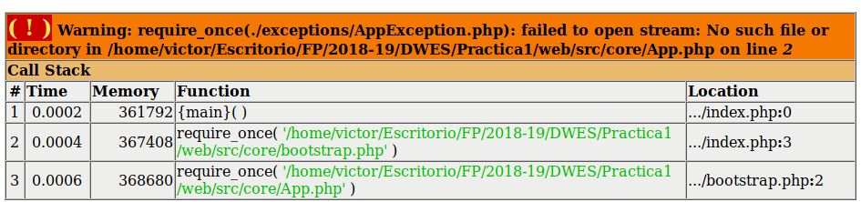
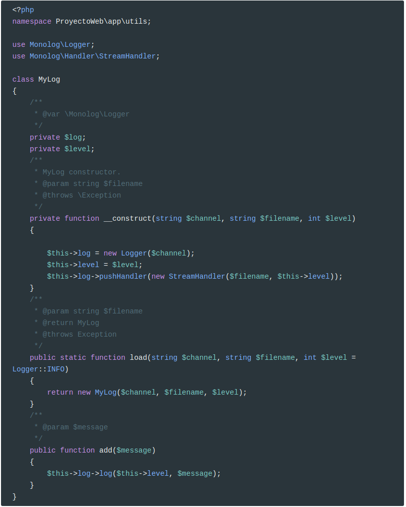
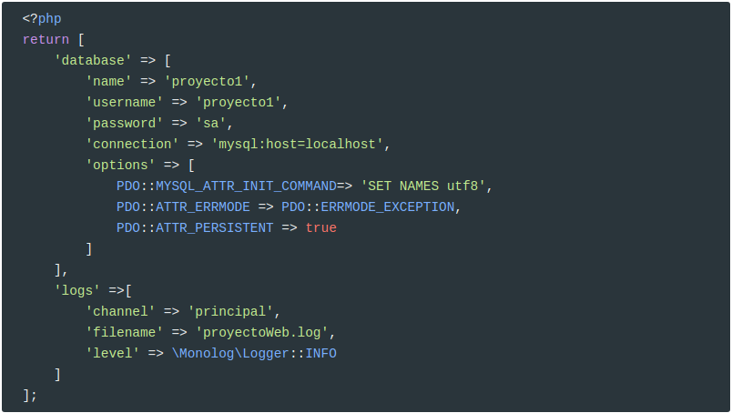
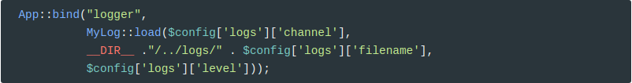
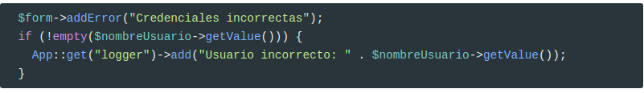

# Uso de **composer** en nuestro proyecto

Vamos a usar **composer** en nuestro proyecto. Para ello hemos de empezar a refactorizar código y directorios.

Lo habitual en una aplicación web es tener un directorio llamado `public` de donde cuelgan todos los archivos que son accesibles con un cliente web. En nuestro caso, este directorio sólo debe contener el archivo `index.php` y `.htaccess`. Además,  contendrá todas las carpetas que contengan css y javascript.

Todos los demás archivos no deben estar accesibles, por lo que se mueven a un directorio (`src`) a la misma altura que `public` y donde también estará ubicado el directorio `vendor`.

Por tanto, el primer paso es crear esta estructura. Para mover los archivos hacedlo con `git mv`.

Por ejemplo:

```bash
git mv js/ public/
git mv entity/ src/
```

La estructura final será como sigue:


Ahora viene el proceso más tedioso y es cambiar todos los `require_once` por `use`, además de agregar los espacios de nombres a nuestras clases.

A cada clase le hemos de añadir el *namespace* correspondiente y hemos de arreglar los scripts para que hagan `use`. En otro caso, saltarán mensajes como el siguiente:



# **IMPORTANTE**

Haced un salto de fe y descargaos la versión refactorizada desde [aquí](./assets/web refactorizada con use.zip).

Descomprimidla en vuestro proyecto, **sobrescribiendo todos** los archivos.

## Refactorización

Os voy a explicar los cambios que se han realizado.

### Incluir autoload

En  `index.php`

```php
<?php
session_start();
require __DIR__ . '/../vendor/autoload.php';
require_once __DIR__ . '/../src/core/bootstrap.php';
```

He incluido el archivo `autoload.php` para poder hacer la carga automática de clases. Como ahora todas las peticiones pasan por este script, no hace falta que lo hagamos en cada controlador. Esta es la ventaja de tener un controlador frontal: en él se delega la inicialización de la aplicación.

Además, también se inicia sesión para no hacerlo en todos los scripts.

### Namespaces

En todas las clases he añadido su `namespace` siguiendo la ruta en la que está almacenada la misma. Si está almacenada en `src/entity/Entity.php`, el `namespace` será  `ProyectoWeb\entity`. 

```php
<?php
namespace ProyectoWeb\entity;

abstract class Entity 
{
    public abstract function toArray():array;
 
}
```

Acordaos que en `composer.json` se fija que el directorio `src` se corresponde con el `namespace` `ProyectoWeb`.

```json
{
    "autoload": {
        "psr-4": {"ProyectoWeb\\": "src"}
    }
}
```

Sin embargo, la clase `EmailValidator` tiene como `namespace` `ProyectoWeb\Forms\Validator` porque está guardada en el directorio `src/Forms/Validator/EmailValidator.php`. 

```php
<?php
namespace ProyectoWeb\Forms\Validator;

use ProyectoWeb\Forms\Validator\Validator;

class EmailValidator extends Validator {
	//...git mv js/ public/
}
```

> **IMPORTANTE**:
>
> El `namespace` debe coincidir también con la capitalización de los directorios

Ahora también, cuando se usa una clase original del PHP se debe anteponer `\`para que sepa que está en el espacio de nombres raíz. Esto sólo ocurre cuando en el script definamos un `namespace`. En otro caso no encontrará la clase.

Por ejemplo, en `QueryBuilder.php`

```php
public function executeQuery($sql){
    try {
        $pdoStatement = $this->connection->prepare($sql);
        $pdoStatement->execute();
        $pdoStatement->setFetchMode(\PDO::FETCH_CLASS | \PDO::FETCH_PROPS_LATE, "ProyectoWeb\\entity\\" . $this->classEntity);
        return $pdoStatement->fetchAll();
    }catch(\PDOException $pdoException){
        throw new QueryException('No se ha podido ejecutar la consulta solicitada: ' . $pdoException->getMessage());
    }
}
```

Fijaos que ahora también hay que añadir el `namespace` de la entidad. Tiene dos `\`porque el carácter `\`es el carácter de escape en PHP.

### Cambiar `require` por `use`

Ahora ya no hace falta usar `requires`: sólo `use`.

Por ejemplo, en `galeria.php`

```php
use ProyectoWeb\core\App;
use ProyectoWeb\Forms\TextareaElement;
use ProyectoWeb\Forms\LabelElement;
use ProyectoWeb\Forms\ButtonElement;
```

> **IMPORTANTE**:
>
> No se puede hacer `use ProyectoWeb\Forms\*` en PHP

### Rutas a directorios

Otro cambio tiene que ver con la ruta a las imágenes. Al haber cambiado los directorios de lugar, ya no funciona 

```php
 $file->saveUploadedFile(ImagenGaleria::RUTA_IMAGENES_GALLERY); 
```

porque esta ruta es relativa al script. Para que funcione hace falta conocer la ruta donde está el controlador frontal, por eso en `index.php` añado una propiedad al contenedor de servicios.

```php
App::bind('rootDir', __DIR__ . '/');
```

que luego uso allí donde haga falta conocer dicha ruta:

```php
 $file->saveUploadedFile(APP::get('rootDir') . ImagenGaleria::RUTA_IMAGENES_GALLERY);  
```

## Monolog

Vamos a usar `monolog` en nuestro proyecto para poder tener un registro de eventos. Por ejemplo, cuando un usuario introduzca incorrectamente las credenciales de sesión, grabaremos un mensaje en el log.

Lo primero que hemos de hacer es hacer instalar `monolog` con `composer`.

```
composer require monolog/monolog
```

Ejemplo de uso:

```php
require_once('../vendor/autoload.php');
use Monolog\Logger;
use Monolog\HandlerStreamHandler;

$logger = new Logger('canal-de-logger');
$logger->pushHandler(new StreamHandler(DIR.'/test_app.log', Logger::DEBUG));
$logger->error('Logger is now Ready');
```

Pero vamos a encapsularlo en una clase que guardamos en `src/app/utils/` con el nombre `MyLog`



Esta clase anterior fijaos que **es un poco especial**, ya que es el método **estático** `load` quien se encarga de crear una instancia de sí misma!

Añadimos una nueva clave en nuestro archivo de configuración `config.php` (y en `config-sample.php`):



Y ahora lo creamos en `index.php`



Creamos la carpeta `logs` a la misma altura que `src` y `vendor` (cuidado que apache o php-cli han de tener permisos de escritura).

Y lo usamos donde queramos. Por ejemplo en el controlador `login.php`



Lo que genera los siguientes mensajes en el `proyectoWeb.log`:

```
[2018-12-04 20:11:59] principal.INFO: Usuario incorrecto: asdd [] []
[2018-12-04 20:15:05] principal.INFO: Usuario incorrecto: asd [] []
[2018-12-04 20:15:17] principal.INFO: Usuario incorrecto: sdfsfsfd [] []
```

Más información en:

* https://github.com/Seldaek/monolog
* https://stackify.com/php-monolog-tutorial/

## SimpleImage

La librería [SimpleImage](https://github.com/claviska/SimpleImage) que hemos usado para trabajar con imágenes, también se puede instalar mediante **composer**.

Es muy sencillo,

```php
composer require claviska/simpleimage
```

Y ahora la usamos allá donde haga falta, sin necesidad de hacer `require`.

Por tanto, eliminamos

```php
require_once __DIR__ . "/../../utils/SimpleImage.php";
```

de `asociados.php`, `galeria.php` y ahora no hace falta anteponer la `\`antes del nombre de la clase

```php
 $simpleImage = new claviska\SimpleImage();
```

Ya podemos eliminar `src/utils/SimpleImage.php`

## Utils.php

El único `require` que nos queda por quitar es `src/utils/utils.php`. Creamos una clase llamada `Utils` en `src/app/utils`

Vamos a moverla con git:

```bash
cd src
git mv utils/utils.php app/utils/Utils.php
```

Este es el resultado final de la nueva clase:

```php
<?php
namespace ProyectoWeb\app\utils;
class Utils {
    public static function esOpcionMenuActiva(string $option): bool{
        if (strpos($_SERVER["REQUEST_URI"], "/". $option) === 0 ){
            return true;
        }elseif ("/" === $_SERVER["REQUEST_URI"] && ("index" == $option)){
            //tal vez hayamos entrado de forma directa, sin index.php
            return true;
        }else   
            return false;
    }
    public static function  existeOpcionMenuActivaEnArray(array $options): bool{
        foreach ($options as $option){
            if (self::esOpcionMenuActiva($option)) {
                return true;
            }
        }
        return false;
    }
    public static function sanitizeInput(string $data): string {
        $data = trim($data);
        //Quitar las comillas escapadas \' y \ ""
        $data = stripslashes($data);
        //Prevenir la introducción de scripts en los campos
        $data = htmlspecialchars($data);
        return $data;
    }
    /**
     * Devuelve un máximo de tres elementos aleatorios del array $asociados
     *
     * @param array $asociados
     * @return array
     */
    public static function getAsociados(array $asociados): array{
        shuffle($asociados);
        return array_slice($asociados,0, 3);
    }
}
```

Ahora modificamos `index.php` (que hace uso de `getAsociados`).

```php
$asociados = ProyectoWeb\app\utils\Utils::getAsociados($asociados);
```

Y en `nav.part.php` ahora usamos `ProyectoWeb\app\utils\Utils::esOpcionMenuActiva` y `ProyectoWeb\app\utils\Utils::existeOpcionMenuActivaEnArray`

## Retoques finales

Ahora ya sólo falta que las imágenes de la portada junto con los asociados, no estén *hardcodeados*. Usad los repositorios para modificarlo.

## Credits.

Víctor Ponz victorponz@gmail.com

Este material está licenciado bajo una licencia [Creative Commons, Attribution-NonCommercial-ShareAlike](https://creativecommons.org/licenses/by-nc-sa/3.0/)


