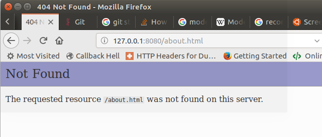
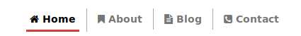
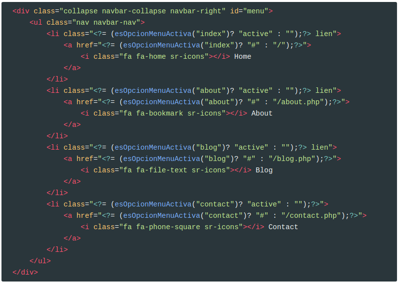

# MVC (Model View Controller)

Según la Wikipedia,

> Modelo-vista-controlador (MVC) es un **patrón de arquitectura de software**, que separa los datos y la lógica de negocio de una aplicación de su representación y el módulo encargado de gestionar los eventos y las comunicaciones. Para ello MVC propone la construcción de tres componentes distintos que son el **modelo**, la **vista** y el **controlador**, es decir, por un lado define componentes para la representación de la información, y por otro lado para la interacción del usuario. Este patrón de arquitectura de software se basa en las ideas de reutilización de código y la separación de conceptos, características que buscan facilitar la tarea de desarrollo de aplicaciones y su posterior mantenimiento


Básicamente:

* El modelo son los datos, que habitualmente estarán gestionados por un SGBD
* El controlador son todos aquellos procesos que manipulan los datos
* La vista, es el código HTML que recibe el agente de usuario

El proyecto, de momento, no tiene modelo ya que todos los datos son estáticos. En prácticas posteriores iremos incorporando el modelo.

Por tanto, el objetivo de esta primera práctica será separar el código HTML (**vista**) del código PHP (**controlador**)

## 1 Crear un directorio para las vistas

Para empezar a separar el modelo de la vista, creamos un directorio (`views`) para incluir en él todas las vistas HTML de nuestra aplicación.

En esta primera parte, sólo vamos a crear la estructura.

Vamos a mover todas las páginas HTML del `document root` de nuestro proyecto al directorio `views` y les cambiamos la extensión por `php`. 

Por ejemplo, `index.html` se convertirá en `views/index.view.php`

> **NOTA**
> Para no perder información en git acerca del archivo movido, usad
>
> ```
> git mv index.html views/index.view.php
> ```

<video src="./assets/views.m4v" />


## 2 Crear los controladores de las vistas

Para cada una de las vistas, creamos un archivo php que, de momento, lo único que hace es incluir el código definido en su vista correspondiente.

Por ejemplo, para la vista `views/index.view.php`, creamos el archivo `index.php` en document root:

```php
<?php
	include("./views/index.view.php");
```

Repetid este proceso para el resto de las vistas.

<video src="./assets/views-2.m4v" />
Si recargamos la página, vemos que ha quedado igual excepto que los enlaces del menú han dejado de funcionar porque apuntan a las versiones html.




Por tanto, hemos de refactorizar las vistas y cambiar los nombres de los archivos html por sus correspondientes en php

<video src="./assets/refac.m4v" />
También hemos de cambiar en la página `blog.view.php` las referencias a `single_post.html` y cambiarlas por `single_post.php`

## 3 Reestructurar las vistas

El código repetido en todas las vistas vamos a refactorizarlo. Lo único que varía en todas ellas es la **parte central**.

Por tanto, elegimos el código HTML desde el inicio del documento hasta el inicio de la parte central y lo guardamos dentro de `views/partials/` con el nombre `inicio-doc.part.php` y el código desde el fin de la parte central hasta el fin del documento lo guardamos en `views/partials/fin-doc.part.php`

<video src="./assets/partials.m4v" />
Una vez hemos guardado este código en la carpeta `partials`, modificamos el resto de las vistas para incluir este código.

Por ejemplo, en `index.view.php`

```php
<?php
  include __DIR__ . "/partials/inicio-doc.part.php";
?>
......    
El resto del HTML de la página
......
<?php
  include __DIR__ . "/partials/fin-doc.part.php";
?>    
```

Hay que seguir el mismo proceso con el resto de vistas.

## 4 Título de la página

Vamos a cambiar la etiqueta `<title>` para que cambie el título dependiendo de la página en la que estamos.

Creamos una variable en cada uno de los controladores. Por ejemplo en `index.php`

```php
<?php
    $title = "Home";
    include("./views/index.view.php");
```

Hay que hacer esta modificación en cada uno de los controladores, pero cambiando el valor de la variable `$title` (About | Blog | Contact)

Y modificamos  `views/partials/inidio-doc.part.php`

```php+HTML
<title>PhotographItem-Responsive Theme | <?=$title?> </title>
```

## 5 Refactorizar la barra de navegación

Si os fijáis, todas las páginas también tienen en común la barra de navegación (Navigation Bar).



Vamos a hacer otro partial para este código a partir de la vista `index.view.php`

<video src="./assets/nav.m4v" />
Ahora tendremos otro partial en `views/partials/nav.part.php`

Y ahora lo incluimos dentro de todas las vistas. Por ejemplo, la vista `index.view.php` quedará así:

```php+HTML
<?php
  include __DIR__ . "/partials/inicio-doc.part.php";
  include __DIR__ . "/partials/nav.part.php";
?>
<!-- Principal Content Start -->
   <div id="index">
   //Resto de HTML
<?php
  include __DIR__ . "/partials/fin-doc.part.php";
?>
```

Observarás que existen dos problemas:

* Siempre aparecerá seleccionada la opción de menú `Home`: Esto se produce porque hay que añadir la clase `active` al **li** de la opción de menú actual
* No podrás volver al `Home` desde otras páginas: Esto es porque la opción de menú actual tiene un símbolo **#** en el `href`

Para solucionar este problema sigue los siguientes pasos:

* Crea un directorio `utils`

* Dentro crea un archivo `utils.php`

* Dentro crea una función llamada `esOpcionMenuActiva` que reciba un string con el nombre de una opción de menú (contact, about, index o blog) y devuelva si es la opción activa. Para ello puedes verificar si la uri actual `$_SERVER["REQUEST_URI"]` contiene el nombre pasado. 

  ```php
  function esOpcionMenuActiva(string $option): bool
  ```

* Incluye el fichero `utils.php` en todos los php de la carpeta principal del proyecto (`index.php`, `contact.php`, ...) Por ejemplo en `index.php`

  ```php
  <?php
      $title = "Home";
      require_once "./utils/utils.php";
      include("./views/index.view.php");
  ```

* Utiliza esta función en el partial del nav para saber si hay que introducir el `class active` y el **href** correspondiente en cada opción de  menú.



Una vez hecho esto, todavía existirá un problema, y es que cuando entras en uno de los post de la opción de blog no aparecerá la opción blog del menú como activa.

Para solucionarlo sigue los siguientes pasos:

* Crea en `utils.php` una función llamada **existeOpcionMenuActivaEnArray** que reciba un array de opciones como parámetro

  ```php
  function  existeOpcionMenuActivaEnArray(array $options): bool
  ```

* Esta función devolverá true si una de las opciones que se le pasa en el array es la activa (puedes utilizar la función `esOpcionMenuActiva` para saber si cada una de las opciones del array es la activa)

* En la opción de menú **blog** utiliza la función `existeOpcionMenuActivaEnArray` pasando las opciones "blog" y "single_post" para saber si tienes que poner el `class` **active**. Para el href sigue manteniendo la función `esOpcionMenuActiva`, ya que nos interesa poder volver a la opción de blog.

  ```php+HTML
  <li class="<?= (existeOpcionMenuActivaEnArray(["blog", "single_post"])? "active" : "");?> lien">
  	<a href="<?= (esOpcionMenuActiva("blog")? "#" : "/blog");?>">
          <i class="fa fa-file-text sr-icons"></i> Blog
      </a>
  </li>
  ```


## Credits.

Víctor Ponz victorponz@gmail.com

Este material está licenciado bajo una licencia [Creative Commons, Attribution-NonCommercial-ShareAlike](https://creativecommons.org/licenses/by-nc-sa/3.0/)


Adaptado del curso [Desarrollo web con PHP y MVC](https://www.udemy.com/desarrollo-web-con-php-7-y-mysql-utilizando-mvc/), realizado en el Cefire, impartido por [**Alejandro Amat Reina**](https://www.udemy.com/user/alejandro-amat-reina/)


