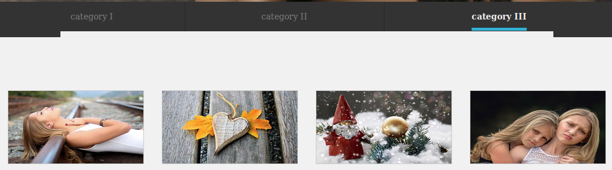
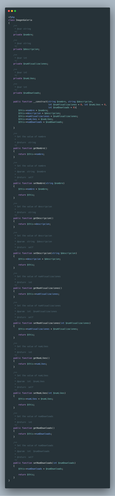
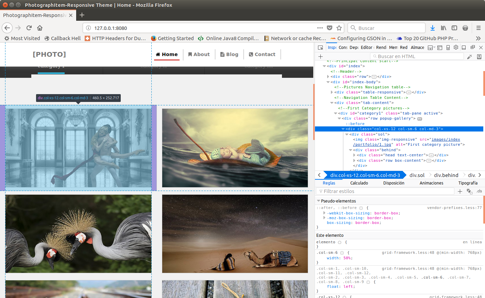
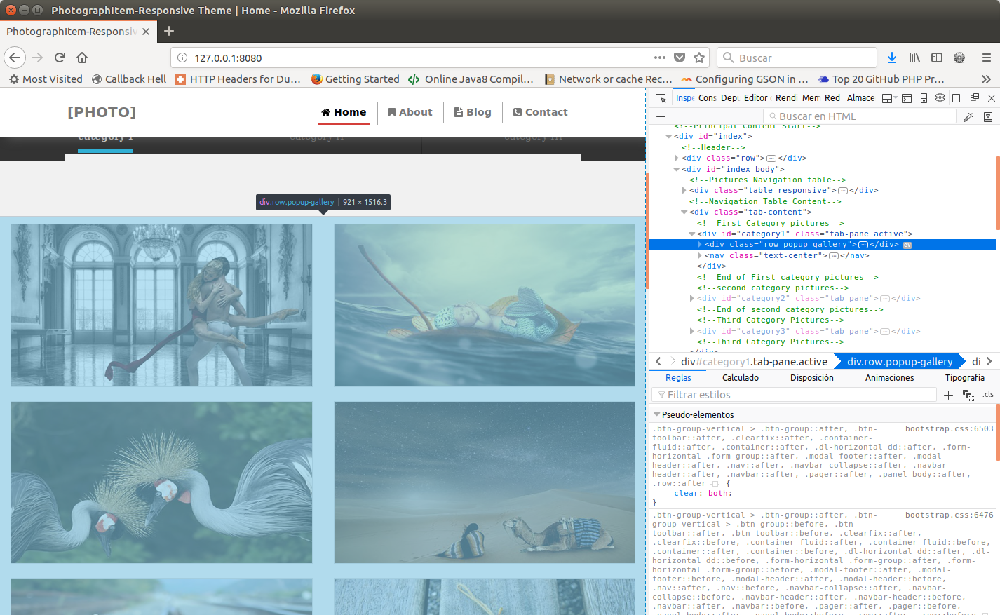
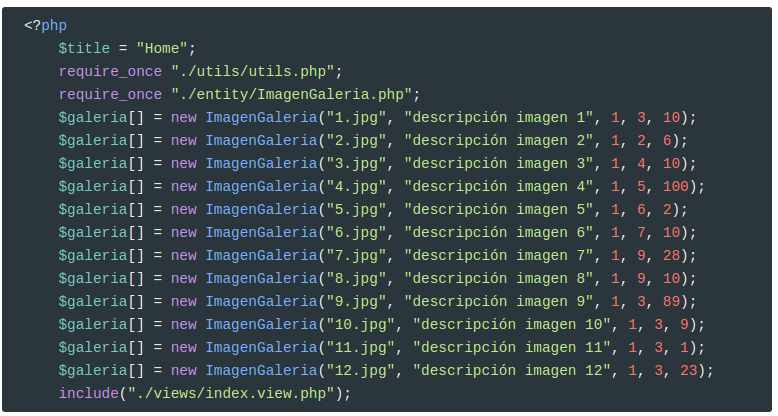
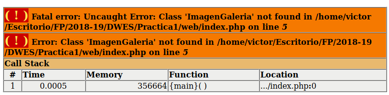

# POO

Vamos a implementar mediante objetos la parte de la galería de imágenes de la página de portada. Para cada imagen queremos almacenar:

* **nombre**
* **descripción**
* **numVisualizaciones**
* **numLikes**
* **numDownloads**

De momento **no vamos a conectarlo con ninguna base de datos**, pero luego será muy fácil añadir esta conexión.



## Crear la clase ` ImagenGaleria.php`

Esta clase va a ser la típica clase `POPO` (**Plain Old PHP Object**); 

Según la Wikipedia (aunque aplicado a Java)

> Ideally speaking, a POJO is a Java object not bound by any restriction other than those forced by the Java Language Specification; i.e. a POJO **should not** have to
>
> 1. Extend prespecified classes
> 2. Implement prespecified interfaces
> 3. Contain prespecified annotations

Las usaremos para implementar **entidades** (que más tarde estarán almacenadas en una BD).

Para mantener el código estructurado, creamos un directorio `entity` en `root` del proyecto y dentro crearemos tantas clases **POPO** como entidades tenga muestra aplicación.

> En el siguiente vídeo uso las extensiones [PHP DocBlocker](https://marketplace.visualstudio.com/items?itemName=neilbrayfield.php-docblocker) que permite autogenerar la documentación de nuestras clases y [PHP Getters & Setters](https://marketplace.visualstudio.com/items?itemName=phproberto.vscode-php-getters-setters) que permite autogenerar los setters y los getters.

<video src="./assets/ImagenGaleria.m4v" />
El código completo es el siguiente:




## Crear un partial

Nuestra tarea como programadores Web consiste en identificar las partes fijas y las repetitivas en una página HTML y crear plantillas para éstas.

**Ejemplo básico**

Suponed que tenemos el siguiente HTML:

```HTML
<div id='categoria-1'>
    <h1>Lista de fotos</h1>
    
    
    
    
    
</div>    
```

La parte repetitiva es:

```HTML

```

Y la parte fija es 

```HTML
<div id='categoria-1'>
    <h1>Lista de fotos</h1>
    <!-- Espacio para la parte repetitiva -->
</div>       
```

Lo habitual es que las partes repetitivas estén almacenadas en un array y las partes fijas en variables (o en un array asociativo)

Por ejemplo en `pruebas/imagenes.php`:

```php
<?php
    $idCategoria = 1;
    $imagenes = [
            ['nombre' => '1.jpg', 'alt' => 'Foto 1'],
            ['nombre' => '2.jpg', 'alt' => 'Foto 2'],
            ['nombre' => '3.jpg', 'alt' => 'Foto 3'],
            ['nombre' => '4.jpg', 'alt' => 'Foto 4'],
            ['nombre' => '5.jpg', 'alt' => 'Foto 5']
    ];
    include __DIR__ . "/imagenes.view.php";

```

Y en `pruebas/imagenes.view.php`:

```php+HTML
<div id='categoria-<?=$idCategoria?>'>
    <h1>Lista de fotos</h1>
    <?php foreach($imagenes as $imagen): ?>
    " alt="<?=$imagen["alt"]?>">
    <?php endforeach; ?>    
</div>    
```

## Crear un partial para las imágenes

En el caso de nuestra web, en `views/index.view.php` hemos de localizar el código HTML que sirve para mostrar cada una de las imágenes. 

> Con **Firebug** es muy sencillo descubrir cuál es el código repetitivo y cuál es el que lo engloba
>
> **Código repetitivo**
>
> 
>
> Y el **código que lo engloba**:
>
> 

Este código es el siguiente:

```html
<div class="col-xs-12 col-sm-6 col-md-3">
  <div class="sol">
      
      <div class="behind">
          <div class="head text-center">
          <ul class="list-inline">
            <li>
              <a class="gallery" href="images/index/gallery/4.jpg" data-toggle="tooltip" data-original-title="Quick View">
                <i class="fa fa-eye"></i>
              </a>
            </li>
            <li>
              <a href="#" data-toggle="tooltip" data-original-title="Click if you like it">
                <i class="fa fa-heart"></i>
              </a>
            </li>
            <li>
              <a href="#" data-toggle="tooltip" data-original-title="Download">
                <i class="fa fa-download"></i>
              </a>
            </li>
            <li>
              <a href="#" data-toggle="tooltip" data-original-title="More information">
                <i class="fa fa-info"></i>
              </a>
            </li>
          </ul>
          </div>
          <div class="row box-content">
          <ul class="list-inline text-center">
            <li><i class="fa fa-eye"></i> 1000</li>
            <li><i class="fa fa-heart"></i> 500</li>
            <li><i class="fa fa-download"></i> 100</li>
          </ul>
          </div>
      </div>
  </div>
</div> 
```

Además, cada una de las categorías tiene una cabecera y un pie:

```html
<div id="category1" class="tab-pane active" >
  <div class="row popup-gallery">
    <!-- HTML para cada una de las imágenes de esta categoría -->
      .....
      .....
      .....
    <nav class="text-center">
        <ul class="pagination">
          <li class="active"><a href="#">1</a></li>
          <li><a href="#">2</a></li>
          <li><a href="#">3</a></li>
          <li><a href="#" aria-label="suivant">
				<span aria-hidden="true">&raquo;</span>
			  </a>
		  </li>
        </ul>
    </nav>
  </div>
</div>   
```

## Tarea

<video src="./assets/partial.m4v" />
Vamos a utilizar la clase `ImagenGaleria` para la sección de galería de la página principal (`index.php`) de nuestro proyecto. Para ello debes seguir los siguientes pasos:

- Crea el directorio `entity`

- Dentro crea la clase `ImagenGaleria` que se ha explicado.

- En esta clase añade el siguiente código para poder acceder al nombre físico de las imágenes.

  ```php
  <?php
  class ImagenGaleria
  {
      const RUTA_IMAGENES_PORTFOLIO = 'images/index/portfolio/';
      const RUTA_IMAGENES_GALLERY = 'images/index/gallery/';
  	//....  
      /**
       * Devuelve el path a las imágenes del portfolio
       *
       * @return string
       */
      public function getUrlPortfolio() : string
      {
          return self::RUTA_IMAGENES_PORTFOLIO . $this->getNombre();
      }
  
      /**
       * Devuelve el path a las imágenes de la galería
       *
       * @return string
       */
      public function getUrlGallery() : string
      {
          return self::RUTA_IMAGENES_GALLERY . $this->getNombre();
      }
  }
  ```

- En el fichero `index.php` crea un array de 12 objetos `ImagenGaleria`.

- En cada objeto el nombre de la imagen será el nombre de la imagen correspondiente de la galería 1.jpg, 2.jpg, ..., y la descripción será *descripción imagen 1*, *descripción imagen 2*, .... Los valores de número de **likes**, número de **downloads** y **número de visualizaciones** os los podéis inventar.

  

  Si no hacéis `require_once "./entity/ImagenGaleria.php";` os dará el siguiente error:

  
  Este error os saldrá mucho al principio porque se os olvida incluir los archivos necesarios.

- Cread el partial `imagen-galeria.part.php` con el código para mostrar las imágenes:

  Dentro de este partial se usarán tres variables que tendréis que definir antes de llamar al partial:

  - **Id de la categoría** (category1, category2 o category3). Esto se usará para generar el id de la categoría en el div correspondiente.
  - Un booleano para indicar si es la **categoría activa**. Esto se usará para añadir el **class** `active` en el `div` de la categoría (ver código html).
  - **El array de objetos** `ImagenGallery`. Dentro del partial recorreremos el array y generaremos el código html de cada imagen a partir de los datos del mismo. Para ello utilizaremos los métodos implementados en la clase.
  - La descripción de la imagen la usaremos como texto alternativo de la imagen (atributo `alt`)
  - Usaremos los métodos `getUrlPotfolio` y `getUrlGallery` para obtener las urls de las imágenes. Más adelante está este código.

- En el fichero `index.view.php` borrad el código de la galería e incluid el partial `image-gallery.part.php` para cada una de las categorías de la galería de imágenes. 
  Para no tener el mismo orden en las imágenes de las tres categorías, antes de llamar al partial para generar la categoría llamaremos a la función `shuffle` pasando el array de imágenes para que nos cambie el orden de los elementos.

- La galería debe seguir funcionando correctamente, pero observaremos que el orden de las imágenes varía cada vez que actualizamos la página.

## Credits.

Víctor Ponz victorponz@gmail.com

Este material está licenciado bajo una licencia [Creative Commons, Attribution-NonCommercial-ShareAlike](https://creativecommons.org/licenses/by-nc-sa/3.0/)


Adaptado del curso [Desarrollo web con PHP y MVC](https://www.udemy.com/desarrollo-web-con-php-7-y-mysql-utilizando-mvc/), realizado en el Cefire, impartido por [**Alejandro Amat Reina**](https://www.udemy.com/user/alejandro-amat-reina/)

