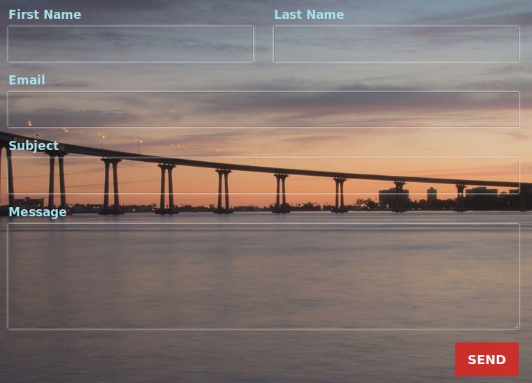
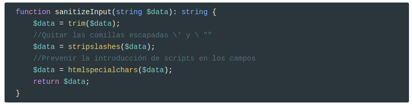
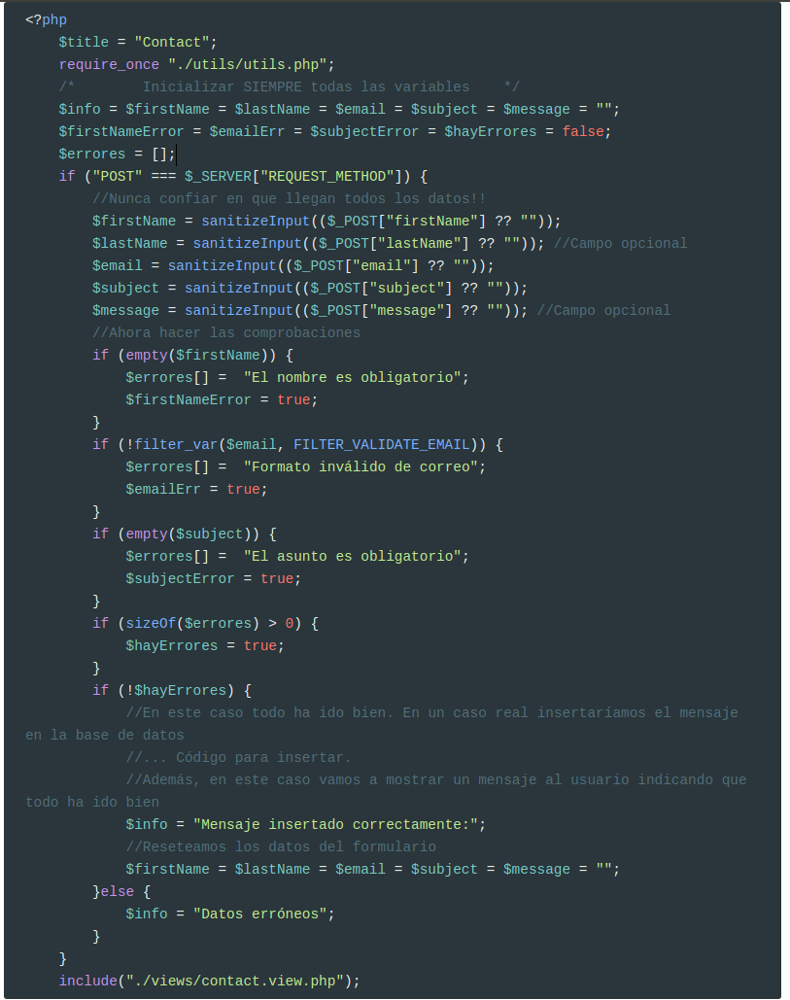
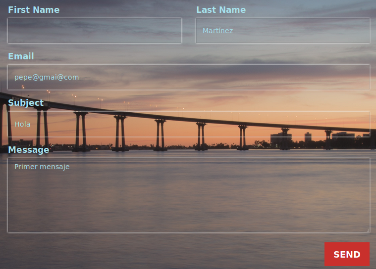
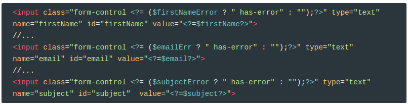
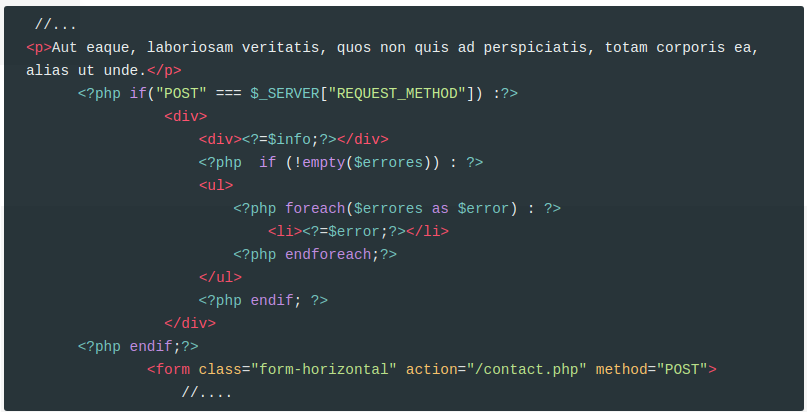
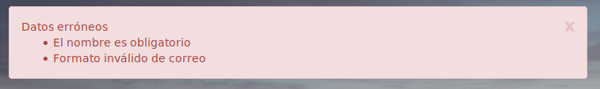
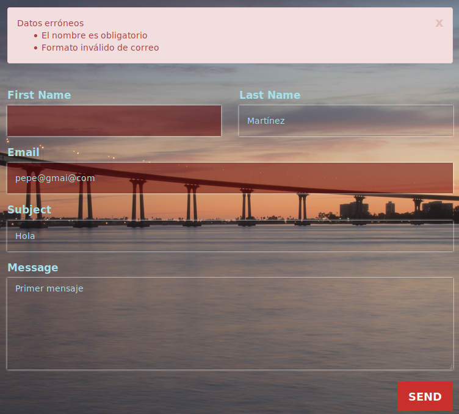
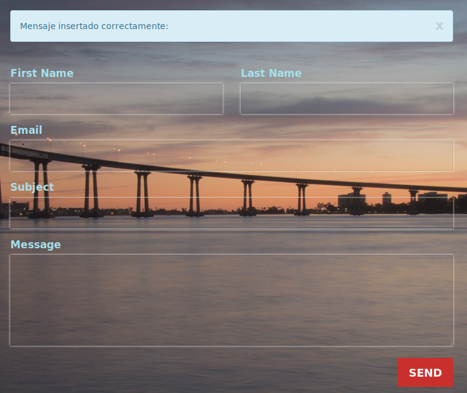

## Un formulario PHP sencillo

Los formularios que vamos a desarrollar en esta sección van a incluir la lógica, tanto de mostrarlo como de procesarlo, en un único archivo PHP.

* En el caso que la página sea pedida mediante un método `GET` mostramos el formulario.
* En el caso que sea pedida mediante un `POST`, porque el usuario ha hecho clic en el botón **Enviar**, procesamos la información. 
  * Si durante dicho proceso se produce algún tipo de error, se debe informar al usuario de que se han producido errores y además se debe mostrar el formulario de la misma forma que con `GET`, pero esta vez mostrando también los datos que ya había introducido el usuario \(no queremos que el usuario los vuelva a introducir!!!\)
  * Si no se produce ningún error, mostramos un mensaje de que todo ha ido bien.

<video src="./assets/forms.m4v" />

## Mostrar el form (view)

A continuación se muestra el código HTML básico para generar un formulario.

El archivo php se llama `contact.view.php`

```html
<form class="form-horizontal" action="/contact.php" method="POST">
  <div class="form-group">
  	<div class="col-xs-6">
  	    <label for="firstName" class="label-control">First Name</label>
  		<input class="form-control" type="text" name="firstName" id="firstName">
  	</div>
  	<div class="col-xs-6">
  	    <label for="lastName" class="label-control">Last Name</label>
  		<input class="form-control" type="text" name="lastName" id="lastName">
  	</div>
  </div>
  <div class="form-group">
  	<div class="col-xs-12">
  		<label for="email" class="label-control">Email</label>
  		<input class="form-control" type="text" name="email" id="email">
  	</div>
  </div>
  <div class="form-group">
  	<div class="col-xs-12">
  		<label for="subject" class="label-control">Subject</label>
  		<input class="form-control" type="text" name="subject" id="subject">
  	</div>
  </div>
  <div class="form-group">
  	<div class="col-xs-12">
  		<label for="message" class="label-control">Message</label>
  		<textarea class="form-control" name="message" id="message"></textarea>
  		<button class="pull-right btn btn-lg sr-button">SEND</button>
  	</div>
  </div>
</form>
```

Y esta sería su representación en el navegador: 


El atributo `action` le indica al navegador a qué url enviar la petición, en este caso a su controlador que está en  `/contact.php` , y el atributo `method` le indica si el método es `POST` o `GET`, aunque como esta acción puede producir una modificación en el servidor se recomienda **POST**. 


Cuando llega esta petición al servidor, PHP almacena estos valores en el array asociativo global `$_POST`. Por ejemplo, esto es lo que contiene este array para el formulario que acabamos de crear.

```php
Array
(
    [firstName] => Pepe
    [lastName] => Martínez
    [email] => pepe@gmail.com
    [subject] => Primer mensaje
    [message] => Este es el mensaje
)
```

## Validación del Form (controller)

Siempre hemos de comprobar los datos enviados con el formulario ya que, tal vez, no sean los esperados

```php
Array
(
    [firstName] => 
    [lastName] => Martínez
    [email] => pepe@gmail@com
    [subject] => Primer mensaje
    [message] => Este es el mensaje
)
```

Esta validación se debe hacer en el controlador `contact.php`. Hay que comprobar lo recibido en el array super global `$_POST`.

* El primer paso va a ser siempre inicializar las variables:

```php
$firstName = $lastName = $email = $subject = $message = "";
```

* Eliminamos todos los espacios en blanco al final y al principio de la cadena con `trim()`;
* Eliminamos los backslashes \(\\) que se hayan podido introducir mediante `stripslashes()`
* Eliminamos los caracteres propios de HTML \(para que no inyecten scripts\) mediante `htmlspecialchars()`;

Así que para cada variable hacemos el mismo proceso;

```php
$firstName = ($_POST["firstName"] ?? "");
$firstName = trim($firstName);
$firstName = stripslashes($firstName);
$firstName = htmlspecialchars($firstName);
```

Para hacerlo mejor, usamos una función propia que la guardamos en `utils.php`:



Por tanto, para procesar el formulario usaremos el siguiente código:



También hemos de comprobar que la información es coherente, por ejemplo, que el correo está bien formado. En este caso hemos usado la función `filter_var($email, FILTER_VALIDATE_EMAIL)`.

La función [filter\_var](http://php.net/manual/es/function.filter-var.php), permite realizar validaciones de enteros, booleanos, etc.  

Ya tenemos el controlador listo.

## Finalizar la vista

Ahora vamos a mejorar la vista.

Hay dos casos:

**1 El usuario ha introducido datos incorrectos.**

Por ejemplo, este debe ser el resultado cuando el usuario no introduce el first name e introduce un correo erróneo. 




En este caso se deben volver a mostrar los datos que ya había introducido. 

Es por este motivo que nos hemos creado una variable para cada dato del formulario, que contendrá el valor introducido en el mismo:

```php
 $lastName = sanitizeInput(($_POST["lastName"] ?? ""));
```

Ahora sólo falta que la vista  los muestre. Para ello usamos el atributo `value` de los campos `input`

```php+html
<input class="form-control" type="text" name="lastName" id="lastName" value="<?=$lastName?>">
```

En el caso campo `textarea`, es un poco distinto:

```php+HTML
<textarea class="form-control" name="message" id="message"><?= $message?></textarea>
```

Por tanto el código del formulario será el siguiente (está en formato **diff**):

```diff
   <div class="form-group">
   	<div class="col-xs-6">
   	    <label for="firstName" class="label-control">First Name</label>
-  		<input class="form-control" type="text" name="firstName" id="firstName">
+  		<input class="form-control" type="text" name="firstName" id="firstName" value="<?=$firstName?>">
   	</div>
   	<div class="col-xs-6">
   	    <label for="lastName" class="label-control">Last Name</label>
-  		<input class="form-control" type="text" name="lastName" id="lastName">
+  		<input class="form-control" type="text" name="lastName" id="lastName" value="<?=$lastName?>">
   	</div>
   </div>
   <div class="form-group">
   	<div class="col-xs-12">
   		<label for="email" class="label-control">Email</label>
-  		<input class="form-control" type="text" name="email" id="email">
+  		<input class="form-control" type="text" name="email" id="email" value="<?=$email?>">
   	</div>
   </div>
   <div class="form-group">
   	<div class="col-xs-12">
   		<label for="subject" class="label-control">Subject</label>
-  		<input class="form-control" type="text" name="subject" id="subject">
+  		<input class="form-control" type="text" name="subject" id="subject"  value="<?=$subject?>">
   	</div>
   </div>
   <div class="form-group">
   	<div class="col-xs-12">
   		<label for="message" class="label-control">Message</label>
-  		<textarea class="form-control" name="message" id="message"></textarea>
+  		<textarea class="form-control" name="message" id="message"><?= $message?></textarea>
   		<button class="pull-right btn btn-lg sr-button">SEND</button>
   	</div>
   </div>

```

Vamos a decorar con css los campos inválidos, añadiendo la clase `has-error` a los campos inválidos.



Una vez acabado el formulario, vamos a mostrar un mensaje de error:



Que podemos mejorar un poco usando bootstrap.



```php+HTML
<?php if("POST" === $_SERVER["REQUEST_METHOD"]) :?>
<div class="alert alert-<?=(empty($errores) ? 'info': 'danger');?> alert-dismissible" role="alert">
    <button type="button" class="close" data-dismiss="alert" aria-label="Close">
        <span aria-hidden="true">x</span>
    </button>
    <div><?=$info;?></div>
    <?php  if (!empty($errores)) : ?>
    <ul>
        <?php foreach($errores as $error) : ?>
        <li><?=$error;?></li>
        <?php endforeach;?>
    </ul>
    <?php endif; ?>
</div>
<?php endif;?>
```

>  **NOTA**. Hay que modificar el archivo `css/style.css` para añadir la siguiente regla
>
>  ```css
>  /* Estilos propios */
>  #contact input.has-error{
>  	background-color:rgba(100,0,0,0.5);
>  }
>  ```
>

Este será el resultado final:




**2 El usuario ha introducido datos correctos.**

En este caso, mostramos un mensaje y los datos los dejamos en blanco:




## Credits.

Víctor Ponz victorponz@gmail.com

Este material está licenciado bajo una licencia [Creative Commons, Attribution-NonCommercial-ShareAlike](https://creativecommons.org/licenses/by-nc-sa/3.0/)


Adaptado del curso [Desarrollo web con PHP y MVC](https://www.udemy.com/desarrollo-web-con-php-7-y-mysql-utilizando-mvc/), realizado en el Cefire, impartido por [**Alejandro Amat Reina**](https://www.udemy.com/user/alejandro-amat-reina/)

