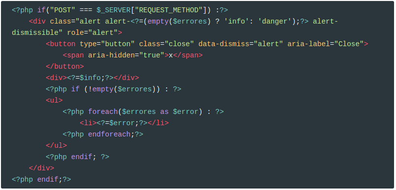

## Crear sección galería

Vamos a implementar la sección de galería, para que el usuario pueda modificar las imágenes que aparecen en la página de portada.

De momento sólo implementaremos la subida de los archivos. Más adelante ya implementaremos la funcionalidad completa.

<video src="./assets/galeria.m4v">

El funcionamiento básico va a ser el mismo que en el formulario de contacto, pero añadiendo un campo `input` de tipo **file**.

## Vista

Creamos la vista `galeria.view.php` para esta página. Podemos usar como plantilla `contact.view.php` modificando lo que sea necesario. El formulario sólo debe tener dos campos:

1. Imagen

2. Descripción

Si os fijáis en el vídeo, cuando la inserción es correcta muestro un enlace para ver la imagen.

Por tanto la vista quedará algo parecido a esto:

Hay una variable, `$urlImagen` que la informaremos en el controlador. Hay que hacer notar que si el usuario envía datos erróneos, **la imagen seleccionada antes no se puede volver a recuperar**.

Como podéis comprobar, la vista es igual de sencilla que en `contact.view.php`

## Controlador

Creamos `galeria.php` en `document root`. El proceso va a ser el mismo que en el formulario de contacto:

1. Inicializar variables
2. Si el método es `GET`, mostrar el formulario.
3. Si el método es `POST`, realizar comprobaciones
   1. Si todo va bien, mover la imagen al directorio `/images/index/gallery/`, informar al usuario y mostrar un enlace a la nueva imagen subida.
   2. En otro caso, mostrar mensajes de error. De momento serán simples (ya los mejoraremos en otras prácticas)

Las variables serán las siguientes:

Debemos comprobar que no ha habido problemas al enviar el formulario, como que la imagen sea demasiado grande, en cuyo caso `$_POST` estará vacío:

Los archivos enviados mediante un formulario se almacenan en PHP en el array  super global [$_FILES](https://www.php.net/manual/en/reserved.variables.files.php).

En este array podemos comprobar que se ha seleccionado una imagen y que no ha habido ningún problema al procesar la misma:

Después podemos realizar otras comprobaciones, por ejemplo, que la imagen no exceda un tamaño especificado, que sea de un tipo mime ([Mime Type](https://developer.mozilla.org/es/docs/Web/HTTP/Basics_of_HTTP/MIME_types/Lista_completa_de_tipos_MIME)) concreto, etc (esta parte ya depende del proceso que queramos aplicar al archivo subido).

Si todo va bien, movemos la imagen temporal al directorio `images/index/gallery/`

El código resultante del controlador es el siguiente:

## Crear una entrada en el menú

- El texto del menú será `galería`
- El icono se mostrará con la clase `fa-image` de Font-awesome
- El enlace apuntará al fichero `galería.php`

## Crear un partial para los mensajes

Como podéis ver, la parte de los mensajes es la misma en ambas vistas (`galeria.view.php` y `contact.view.php`). Por lo tanto vamos a **refactorizar** y crear un partial. De esta forma lo podemos incluir en todas aquellas vistas que necesiten mensajes.

El partial lo llamaremos, `/views/partials/show-messages.part.php`

Y modificamos las dos vistas para que incluyan este partial. 

Por ejemplo, en `galeria.view.php`:

------

## Credits.

Víctor Ponz victorponz@gmail.com

Este material está licenciado bajo una licencia [Creative Commons, Attribution-NonCommercial-ShareAlike](https://creativecommons.org/licenses/by-nc-sa/3.0/)

Adaptado del curso [Desarrollo web con PHP y MVC](https://www.udemy.com/desarrollo-web-con-php-7-y-mysql-utilizando-mvc/), realizado en el Cefire, impartido por [**Alejandro Amat Reina**](https://www.udemy.com/user/alejandro-amat-reina/)

