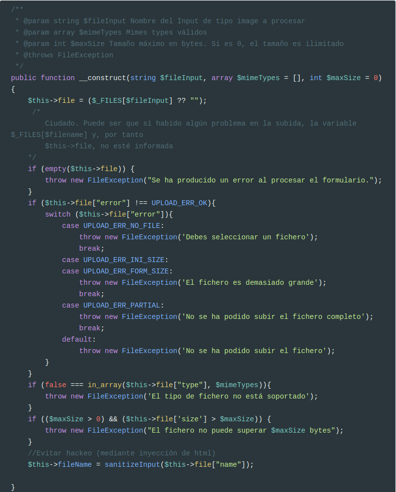
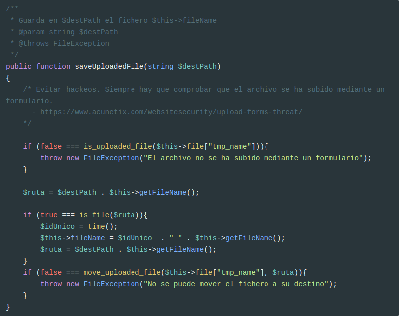
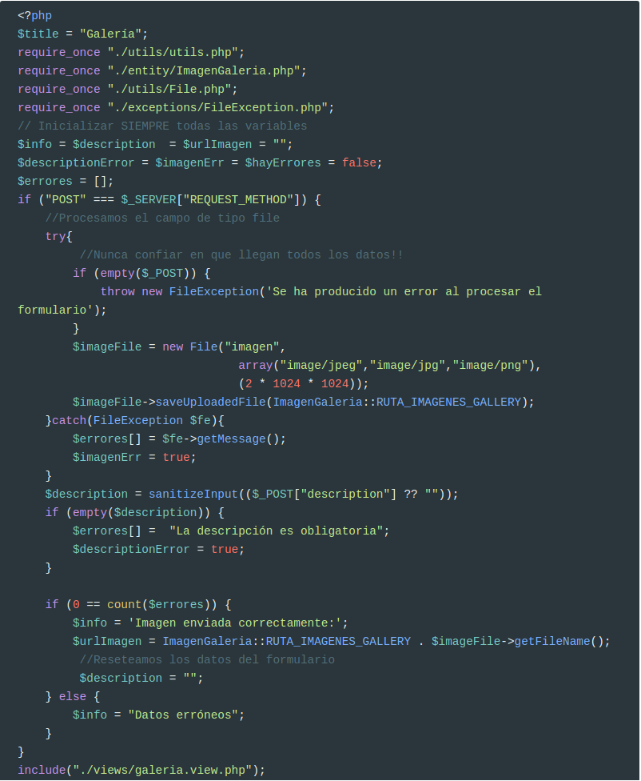

# Excepciones

El procesado del campo de tipo `image` se ha hecho con estilo procedural, lleno de if's para comprobar si ha php ha devuelto algún error.

Vamos a mejorarlo usando **Excepciones y Clases**.

Aunque no es necesario, se suelen crear excepciones para mejorar la usabilidad de nuestro código y no depender tanto de la clase genérica `Exception`.

Creamos el archivo `/exceptions/FileException.php`

```php
<?php
class FileException extends Exception
{
    public function __construct(string $message){
        parent::__construct($message);
    }
}
```

Esta excepción propia sólo tiene que extender la clase base `Exception` e implementar el método `__construct`. Se pueden hacer más cosas, como generar un mensaje de error con **Monolog** (que ya veremos más adelante).

## Clase File

El código original del controlador tiene dos partes (en lo relativo al `input` de tipo `file`):

1. Realizar comprobaciones
2. Mover el fichero subido a una ruta en `document root` si todo ha ido bien.

Pues bien, la parte 1 la vamos a pasar al constructor de la clase y la parte 2 la vamos a implementar en un método llamado `saveUploadedFile()`.

El **stub** de la clase `/utils/File.php` es el siguiente:

```php
<?php
require_once __DIR__ . "/../exceptions/FileException.php";
require_once __DIR__ . "/utils.php";

class File
{
    /**
     * Representa a un único campo file de un formulario
     *
     * @var [string]
     */
    private $file;
    /**
     * Nombre del fichero generado en document root
     *
     * @var [string]
     */
    private $fileName;
    
    /**
     * @param string $fileInput Nombre del Input de tipo image a procesar
     * @param array $mimeTypes Mimes types válidos
     * @param int $maxSize Tamaño máximo en bytes. Si es 0, el tamaño es ilimitado
     * @throws FileException
     */
    public function __construct(string $fileInput, 
                                array $mimeTypes = [], 
                                int $maxSize = 0)
    {
        // Constructor
    }
    
    /**
     * Devuelve el nombre del fichero creado
     *
     * @return string
     */
    public function getFileName(): string
    {
        return $this->fileName;
    }
     /**
     * Guarda en $desPath el fichero $this->fileName
     * @param string $destPath
     * @throws FileException
     */
    public function saveUploadedFile(string $destPath)
    {
        // ....
    }
}    
```

### Constructor

El **constructor** va a ser quien implemente todo el tratamiento de errores, pero cuando encuentre uno, va a lanzar una excepción de tipo `FileException`, que capturaremos en `galeria.php`.



### `saveUploadedFile`

El método `saveUploadedFile` va a ser el encargado de mover el fichero temporal a la ruta que le especifiquemos. También se encarga de generar un nombre único en caso de que ya exista un archivo con dicho nombre.




No debería ser esta clase quien creara un nuevo nombre para el archivo ya que estamos incumpliendo el principio **Single Responsibility ** de los principios **SOLID**. Pero lo dejo así para que sea más sencillo.

Más información en https://blog.bitsrc.io/solid-principles-every-developer-should-know-b3bfa96bb688

## Controlador `galeria.php`

Por último, ya sólo nos queda modificar el controlador para que haga uso de la nueva excepción y la nueva clase.



## Redimensionar imágenes

Las imágenes de la galería están en dos directorios `images/index/gallery/` e `images/index/portfolio`. Ambas tienen la misma resolución (650 x 350 píxeles).

Pero las imágenes que estamos subiendo no cumplen estas restricciones, por lo que vamos a utilizar una librería de terceros para redimensionarlas.

Esta librería es https://github.com/claviska/SimpleImage y es muy fácil de utilizar.

Descargadla y guardadla en `/utils/SimpleImage.php`

Y ahora modificad el controlador para usar esta clase. La nueva imagen del directorio `portfolio` tendrá 975 x 525 píxeles.

```diff
     require_once "./entity/ImagenGaleria.php";
     require_once "./utils/File.php";
     require_once "./exceptions/FileException.php";
-   /*
+    require_once "./utils/SimpleImage.php";
+    /*
         Inicializar SIEMPRE todas las variables
     */
     $info = $description  = $urlImagen = "";
@@ -22,6 +23,20 @@
                                     array("image/jpeg","image/jpg","image/png"),                                     (2 * 1024 * 1024));
             $imageFile->saveUploadedFile(ImagenGaleria::RUTA_IMAGENES_GALLERY);
+            try {
+                // Create a new SimpleImage object
+                $simpleImage = new \claviska\SimpleImage();
+
+                $simpleImage
+                ->fromFile(ImagenGaleria::RUTA_IMAGENES_GALLERY . $imageFile->getFileName())
+                ->resize(975, 525)
+                ->toFile(ImagenGaleria::RUTA_IMAGENES_PORTFOLIO . $imageFile->getFileName())
+                ->resize(650, 350)
+                ->toFile(ImagenGaleria::RUTA_IMAGENES_GALLERY . $imageFile->getFileName());
+            }catch(Exception $err) {
+                $errores[]= $err->getMessage();
+                $imagenErr = true;
+            }
         }catch(FileException $fe){
             $errores[] = $fe->getMessage();
             $imagenErr = true;

```


------

## Credits.

Víctor Ponz victorponz@gmail.com

Este material está licenciado bajo una licencia [Creative Commons, Attribution-NonCommercial-ShareAlike](https://creativecommons.org/licenses/by-nc-sa/3.0/)


Adaptado del curso [Desarrollo web con PHP y MVC](https://www.udemy.com/desarrollo-web-con-php-7-y-mysql-utilizando-mvc/), realizado en el Cefire, impartido por [**Alejandro Amat Reina**](https://www.udemy.com/user/alejandro-amat-reina/)
