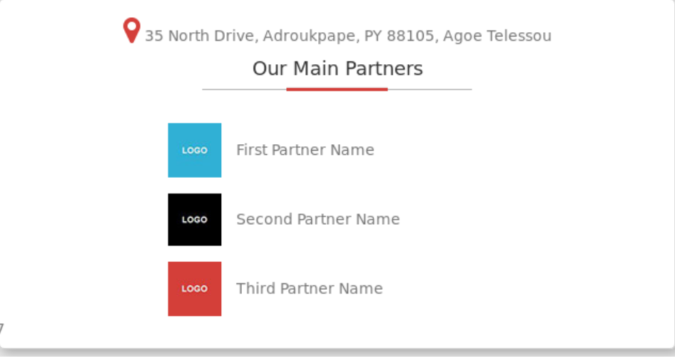

# Asociados

Vamos a implementar la sección de asociados de la página



Para ello debes completar los siguientes pasos:

* Crea una clase llamada `Asociado` que contenga los siguientes campos:

  * **Nombre**: guardará el nombre del asociado
  * **Logo**: guarda el nombre de la imagen del logo
  * **Descripción**: Esta descripción se pondrá en el texto alternativo de la imagen (atributo `alt`) y en el título de la imagen (atributo `title`).

* Crea un partial, `asociado.part.php`, para la sección de asociados y utiliza la clase anterior para generar el HTML de los asociados.

* Debes tener un array de asociados en la página `index.php`, si el número de asociados es menor o igual a 3 se mostrarán todos los asociados, si es mayor, se obtendrán tres asociados de forma aleatoria y se mostrarán esos tres asociados. Para ello, crea una función de utilidad, `getAsociados`,  dentro del fichero `utils.php` para extraer tres elementos aleatorios de un array recibido como parámetro. 

  ```php
  function getAsociados(array $asociados): array{
      //....
  }
  ```

* En la vista `index.view.php` haz uso del partial `asociado.part.php`

* Crea una nueva sección en el menú principal para introducir los asociados:

  * El texto del menú será *Asociados*
  * El icono se mostrará con la clase `fa-hand-o-right` de Font-awesome
  * El enlace apuntará al fichero `asociados.php`
  * El menú debe seguir manteniendo el mismo aspecto que tenía anteriormente, pero con una opción más

* Debes crear dos ficheros:

  * `asociados.php`: Contendrá la lógica necesaria para crear asociados. Tendrás un formulario para introducir los datos de un asociado y subir la imagen del logo, utiliza la clase `File` para gestionar la subida del fichero. El nombre es obligatorio, la descripción es opcional. La imagen se debe redimensionar a 50 x 50 píxeles.
  * `asociados.view.php`: Contendrá la vista de la sección asociados.


------

## Credits.

Víctor Ponz victorponz@gmail.com

Este material está licenciado bajo una licencia [Creative Commons, Attribution-NonCommercial-ShareAlike](https://creativecommons.org/licenses/by-nc-sa/3.0/)


Adaptado del curso [Desarrollo web con PHP y MVC](https://www.udemy.com/desarrollo-web-con-php-7-y-mysql-utilizando-mvc/), realizado en el Cefire, impartido por [**Alejandro Amat Reina**](https://www.udemy.com/user/alejandro-amat-reina/)
