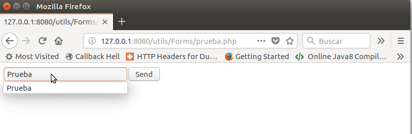
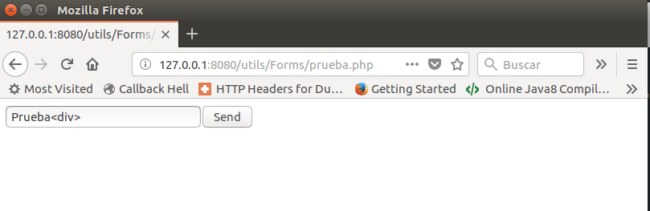
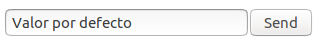
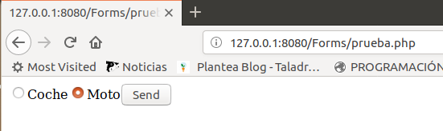
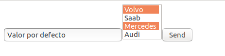
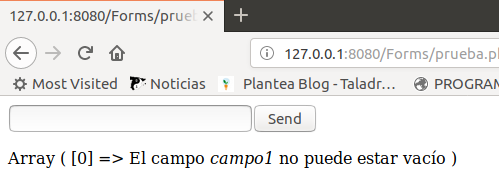
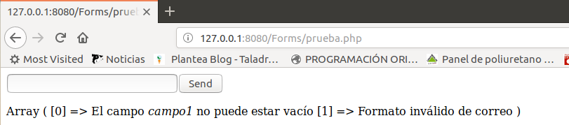
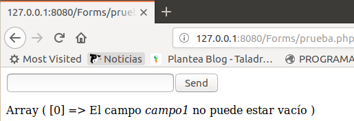
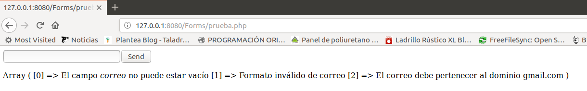
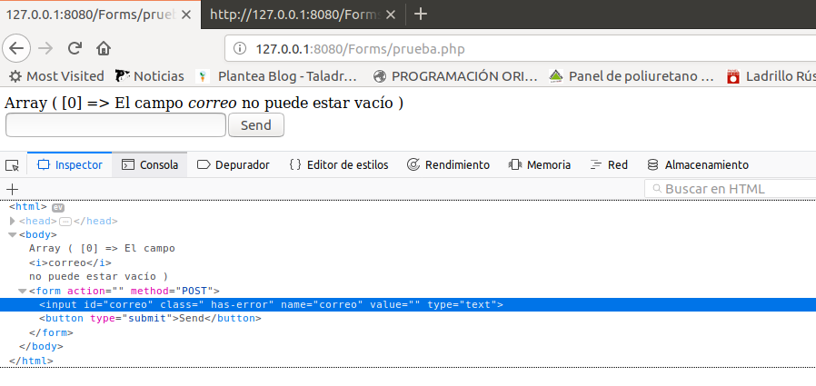

Hemos hecho hasta ahora varios formularios y visto cómo el proceso es siempre el mismo:

1. Inicializar variables
2. Si el método es `POST`, hacer comprobaciones y procesar los datos si no hay errores
3. Mostrar errores/información junto con el formulario

Cuando empieces a hacer muchos formularios, descubrirás que ya te parece un proceso aburrido, que no te aporta nada y, además, es propenso a tener errores pues, al copiar y pegar para empezar un nuevo formulario, es bastante frecuente *olvidarnos* de modificar ciertas partes. 

Aquí es cuando entra en juego la POO (de hecho, siempre debe ser lo primero que hagamos).

En la siguiente práctica, vamos a convertir este modelo actual de programación de tipo procedimental a un modelo totalmente orientado a objetos y, de paso, nuestra programación se convertirá en declarativa: qué hacer en vez de cómo hacerlo.

El primer paso es **analizar** e intentar descubrir cuál es el mejor modelo para nuestra aplicación. Es un **proceso iterativo** pues en un momento piensas que has dado con el mejor modelo, pero en un paso posterior, tal vez, descubras que ahora es mejor otro modelo. Esto es lo más frecuente: nadie hace un modelo orientado a objetos a la primera!

## Análisis

Podemos identificar dos fases para tratar los formularios:

1. La fase que muestra el formulario
2. La fase que procesa el formulario

Como hemos de empezar por algo, elegimos la fase 1 (pues para la 2 debe haberse completado la 1).

## Mostrar el formulario

Analicemos el código `HTML` que muestra un formulario:

```html
<form action="/galeria.php" method="POST">
    <div  class="" style="" >
        <div class="" style="" >
            <label class="" style="" for="text">Imagen</label>
            <input  class="" style="" type="text" id="text" name="text">
        </div>
    </div>
    <div  class="" style="" >
        <div class="" style="" >
            <label  class="" style="" for="description">Descripción</label>
            <textarea  class="" style="" name="description" id="description"></textarea>
            <button type="submit" class="" style="" >ENVIAR</button>
        </div>
    </div>
</form>
```

A partir de este código observamos:

* Hay atributos compartidos por varios elementos (`class`, `style`, `id`)
* Hay algunos elementos que tienen el atributo `name` (justamente los campos del formulario)
* Algunos elementos contienen a otros (`form` y `div`)

### Clase `Element`

Vamos a crear una clase abstracta base (`/Forms/Element.php`) con todos los **atributos compartidos** y que tenga un método abstracto, `render()`, que permita *pintar* el elemento. Es abstracto porque cada elemento se pinta de una manera distinta.

```php
<?php

abstract class Element
{
    
    /**
     * Id del Elemento
     * @var string
     */
    private $id;

    /**
     * Clase css del Elemento
     * @var string
     */
    private $cssClass;
    /**
     * @var string
     */
    private $style;
   
     /**
     * Tipo del input
     *
     * @var string
     */
    private $type;
    
    public function __construct(string $type, string $id = '', string $cssClass  = '', string $style = '')
    {
        $this->type = $type;
        $this->id = $id;
        $this->cssClass = $cssClass;
        $this->style = $style;
    }
    /**
     * Get the value of id
     *
     * @return  string
     */ 
    public function getId()
    {
        return $this->id;
    }

    /**
     * Set the value of id
     *
     * @param  string  $id
     *
     * @return  self
     */ 
    public function setId(string $id): Element
    {
        $this->id = $id;

        return $this;
    }

    /**
     * Get the value of cssClass
     *
     * @return  string
     */ 
    public function getCssClass()
    {
        return $this->cssClass;
    }
    /**
     * Set the value of class
     *
     * @param  string  $class
     *
     * @return  self
     */ 
    public function setCssClass(string $cssClass): Element
    {
        $this->cssClass = $cssClass;

        return $this;
    }

    /**
     * Get the value of style
     *
     * @return  string
     */ 
    public function getStyle()
    {
        return $this->style;
    }
    
    /**
     * Set the value of style
     *
     * @param  string  $style
     *
     * @return  self
     */ 
    public function setStyle(string $style): Element
    {
        $this->style = $style;

        return $this;
    }

    /**
     * Get tipo del input
     *
     * @return  string
     */ 
    public function getType()
    {
        return $this->type;
    }
    
    /**
     * Genera el código HTML del elemento
     *
     * @return string
     */
    abstract public function render(): string;
 
}
```

### Clase `DataElement`

Ahora creamos una clase con tres atributos más (`name` y `value`) para aquellos elementos que forman parte del formulario (sigue siendo abstracta). 

```php
<?php
require_once __DIR__ . "/Element.php";

abstract class DataElement extends Element
{
    /**
     * Nombre del campo en el formulario
     *
     * @var string
     */
    private $name;

    /**
     * Valor del campo
     *
     * @var string
     */
    private $value;
    
    public function __construct(string $name, string $type, string $id = '', string $cssClass  = '', string $style = '')
    {
        $this->name = $name;
        parent::__construct($type, $id, $cssClass, $style);
    }

    /**
     * Set the value of name
     *
     * @param string $name
     * @return self
     */
    public function setName(string $name): Element
    {
        $this->name = $name;

        return $this;
    }

    /**
     * Get nombre del campo en el formulario
     *
     * @return  string
     */ 
    public function getName()
    {
        return $this->name;
    }

    /**
     * Get valor del campo
     *
     * @return  string
     */ 
    public function getValue()
    {
        //En algunos casos el navegador no envía el campo del form si éste está vacío
        return ($_POST[$this->getName()] ?? "");
    }
    
     /**
     * Set valor del campo después del post
     *
     * @param  string  $value  Valor del campo
     *
     * @return  self
     */ 
    public function setValue(string $value)
    {
        $this->value = $value;

        return $this;
    }
    
}
```

### Clase `InputElement`

Esta va a ser la primera **clase no abstracta** que nos permita pintar un elemento de tipo `input`. Este tipo de campo tiene un atributo, llamado `type` que sólo se aplica a este tipo de campo. Por tanto deberá extender la clase `DataElement` para añadir este atributo e implementar el método `render()`:

```php
<?php
require_once __DIR__ . "/DataElement.php";

class InputElement extends DataElement
{
    
    public function __construct(string $name, string $type, string $id = '', string $cssClass  = '', string $style = '')
    {
        parent::__construct($name, $type, $id, $cssClass, $style);
    }

    /**
     * Genera el HTML del elemento
     *
     * @return string
     */
    public function render(): string
    {
        $html = "<input type='{$this->getType()}' name='{$this->getName()}'" ; 
      	$html .= (!empty($this->getId()) ? " id='{$this->getId()}'" : '');
        $html .= (!empty($this->getCssClass()) ? " class='{$this->getCssClass()}'" : '');
        $html .= (!empty($this->getStyle()) ? " style='{$this->getStyle()}'" : '');
        $html .= '>';
        return $html;
    }

}
```

Como esta clase no es abstracta, debe implementar el método `render()`.

Ahora es el momento de empezar a probar nuestro modelo. 

Creamos un página `/Forms/prueba.php` con el siguiente código:

```php
<?php
require_once "./InputElement.php";

$a = new InputElement('campo1', 'text', 'id1', 'claseCss', 'background-color:red');
echo $a->render();
```

Y el HTML resultante es el siguiente:

```html
<input type='text' name='campo1' id='id1' class='claseCss' style='background-color:red'>
```

Si se hubiera producido una salida distinta a la esperada, modificaríamos el código de la clase. Si todo va bien, continuamos con el siguiente paso.

### Clase `ButtonElement`

Para poder probar el funcionamiento del **Form**,  hace falta un botón que haga el **submit**. Este botón, además, tiene un **texto**:

```php
<?php
require_once __DIR__ .  "/DataElement.php";

class ButtonElement extends DataElement
{
    /**
     * Texto del botón
     *
     * @var string
     */
    private $text;
    
    public function __construct(string $text, string $name, string $id = '', string $cssClass  = '', string $style = '')
	{
        $this->text = $text;
        parent::__construct($name, 'button', $id, $cssClass, $style);
    }

    public function render(): string
    {
       return 
            "<button type='submit'" . 
            (!empty($this->getName()) ? " name='{$this->getName()}' " : '') .
            (!empty($this->getId()) ? " id='{$this->getId()}'" : '') .
       		(!empty($this->getCssClass()) ? " class='{$this->getCssClass()}'" : '') .
        	(!empty($this->getStyle()) ? " style='{$this->getStyle()}'" : '') .
            ">{$this->text}</button>";  
    }
}
```

Seguimos con las pruebas:

```php
<?php
require_once "./InputElement.php";
require_once "./ButtonElement.php";

$a = new InputElement('campo1', 'text', 'id1', 'claseCss', 'background-color:red');
echo $a->render();
$b = new ButtonElement('Send', '');
echo $b->render();
```

Y este es el resultado:

```html
<input type='text' name='campo1' id='id1' class='claseCss' style='background-color:red'><button type='submit'>Send</button>
```

### Clase `CompoundElement`

Y finalmente, hace falta un elemento de tipo **form** para poder enviar el formulario. Este tipo es especial ya que es un contenedor de otros elementos. 

Creamos otra clase llamada `CompoundElement` que permita añadir hijos.

```php
<?php
require_once __DIR__ .  "/DataElement.php";

class CompoundElement extends DataElement
{
    /**
     * Hijos del elemento
     *
     * @var array
     */
    private $children;

    public function __construct(string $name, string $type, string $id = '', string $cssClass  = '', string $style = '')
	{
        $this->children = [];
        parent::__construct($name, $type, $id, $cssClass, $style);
    }

    /**
     * @param Element $child
     * @return void
     */
    public function appendChild(Element $child){
        $this->children[] = $child;
        return $this;
    }
    /**
     *
     * @return array
     */
    public function getChildren(): array{
        return $this->children;
    }

    /**
     * Recorre todos los hijos, generando su HTML
     *
     * @return El HTMl de todos los hijos
     */
    protected function renderChildren(): string{
        $html = '';
        foreach ($this->getChildren() as $child) {
            $html .= $child->render();
        }
        return $html;
    }
    
    /**
     * Renderizamos el elemento y todos sus hijos
     *
     * @return string
     */
    public function render(): string
    {
        $html = 
            "<{$this->getType()} " . 
            (!empty($this->getId()) ? " id='{$this->getId()}'" : '') .
       		(!empty($this->getCssClass()) ? " class='{$this->getCssClass()}'" : '') .
        	(!empty($this->getStyle()) ? " style='{$this->getStyle()}'" : '') .
            ">";
                $html .= $this->renderChildren();
             
        $html .= "</{$this->getType()}>"; 
        return $html;
    }   
}
```

### Clase `FormElement`

Y ahora la clase `FormElement` que extiende a la anterior. Tiene dos atributos nuevos (`action` y `enctype`) e implementa el método `render()`

```php
<?php
require_once __DIR__ . "/CompoundElement.php";

class FormElement extends CompoundElement
{
    /**
     * @var string
     *      
    **/
    private $action;
    
    /**
     * @var string
     *      
    **/
    private $enctype;
    
    public function __construct(string $action = '', string $enctype = '', string $name = '', string $id = '', string $cssClass  = '', string $style = '')
	{
        $this->action = $action;
        $this->enctype = $enctype;
        parent::__construct($name, 'form', $id, $cssClass, $style);
    }

    public function render(): string
    {
        $html = 
            "<form action='{$this->action}' method='POST'" .
            (!empty($this->enctype) ? " enctype='$this->enctype' " : '') .  
            (!empty($this->getId()) ? " id='{$this->getId()}'" : '') .
       		(!empty($this->getCssClass()) ? " class='{$this->getCssClass()}'" : '') .
        	(!empty($this->getStyle()) ? " style='{$this->getStyle()}'" : '') .
            ">";
            $html .= $this->renderChildren();
            
        $html .= '</form>'; 
        return $html;
    }
}
```

Vamos a probarlo:

```php
<?php
require_once "./InputElement.php";
require_once "./ButtonElement.php";
require_once "./FormElement.php";

$a = new InputElement('campo1', 'text', 'id1', 'claseCss', 'background-color:red');

$b = new ButtonElement('Send', '');

$form = new FormElement();

echo $form
  ->appendChild($a)
  ->appendChild($b)
  ->render();
```

Y este es el HTML generado:

```html
<form action='' method='POST'><input type='text' name='campo1' id='id1' class='claseCss' style='background-color:red'><button type='submit'>Send</button></form>
```

> **NOTA**: También se puede generar el código de la siguiente forma.
>
> ```php
> echo (new FormElement())
>     ->appendChild($a)
>     ->appendChild($b)
>     ->render();
> ```
>
> En este caso estamos creando un objeto y llamando a sus métodos sin necesidad de usar ninguna variable. Fijaos en `(new FormElement())`. Sin los paréntesis externos no compilaría.
>
> Este tipo de construcciones se pueden usar cuando los métodos son de tipo [fluent](https://en.wikipedia.org/wiki/Fluent_interface)

Más adelante, implementaremos clases para otros tipos de elementos.

## Mostrar el valor del POST

En los formularios que hemos creado en las secciones (Asociados y Galería) hemos mostrado el valor de los campos del formulario cuando había errores en el mismo. Por ejemplo,

```php
<input type="text" name="lastName" id="lastName" value="<?=$lastName?>">
```

La variable `$lastName`, la inicializábamos en el controlador y la informábamos en el caso de que el `request method` sea `POST`.

Vamos a implementar esta funcionalidad en nuestras clases.

Es muy sencillo: sólo cambiamos el método `render()` en la clase `InputElement`.

```php
public function render(): string
{
    $html = "<input type='{$this->getType()}' name='{$this->getName()}'" ;

    if ('POST' === $_SERVER['REQUEST_METHOD']) {
        $html .= " value='{$_POST[$this->getName()]}'";
    }
    $html .= (!empty($this->getId()) ? " id='{$this->getId()}'" : '');
    $html .= (!empty($this->getCssClass()) ? " class='{$this->getCssClass()}'" : '');
    $html .= (!empty($this->getStyle()) ? " style='{$this->getStyle()}'" : '');
    $html .= '>';
    return $html;
}
```

Todavía no lo estamos sanitizando. Luego lo haremos (recordad que las cosas se hacen paso a paso).




Como todos los campos los tenemos que [sanitizar](https://stackoverflow.com/questions/129677/how-can-i-sanitize-user-input-with-php), vamos a mover la función `sanitizeInput` de `utils.php` a la clase `DataElement`.

```php
/**
 * Protección ante hackeos del campo del POST
 *
 * @return mixed
 */
protected function sanitizeInput() {
    if (isset($_POST[$this->name])){
        $_POST[$this->name] =  $this->sanitize($_POST[$this->name]);
        return $_POST[$this->name];
    }
    return "";
}

/**
 * Protección básica ante hackeos
 *
 * @return mixed
 */
protected function sanitize($data) {
    if (isset($data)){
       return htmlspecialchars(stripslashes(trim($data)));
    }
    return "";
}
```

Y modificamos el método `render` de la clase `InputElement`

```php
public function render(): string
{
    $html = "<input type='{$this->getType()}' name='{$this->getName()}'" ;

    if ('POST' === $_SERVER['REQUEST_METHOD']) {
   		$html .= " value='" . $this->sanitizeInput() . "'";
    }
    $html .= (!empty($this->getId()) ? " id='{$this->getId()}'" : '');
    $html .= (!empty($this->getCssClass()) ? " class='{$this->getCssClass()}'" : '');
    $html .= (!empty($this->getStyle()) ? " style='{$this->getStyle()}'" : '');
    $html .= '>';
    
    return $html;
}
```



Ya tenemos implementada una primera versión.

## Mostrar un valor por defecto

Vamos a añadir un valor por defecto al campo. De esta forma también podremos mostrar datos en el formulario, no sólo recibirlos. Como este nuevo atributo va a ser común a todos los campos del formulario, lo añadimos a `DataElement`. Así que añadimos a esta clase el atributo `$defaultValue` (junto son su setter y getter)

```php
/**
* Valor por defecto
*
*/ 
protected $defaultValue;
//Setter y getter
```
Y modificamos `InputElement` para que muestre este valor en el caso que `request method` sea `GET`

```php
public function render(): string
{
    $html = "<input type='{$this->getType()}' name='{$this->getName()}'" ;

    if ('POST' === $_SERVER["REQUEST_METHOD"]) {
        $html .= " value='" . $this->sanitizeInput() . "'";
    } else {
        $html .= " value='{$this->defaultValue}'";
    }
    $html .= (!empty($this->getId()) ? " id='{$this->getId()}'" : '');
    $html .= (!empty($this->getCssClass()) ? " class='{$this->getCssClass()}'" : '');
    $html .= (!empty($this->getStyle()) ? " style='{$this->getStyle()}'" : '');
    $html .= ">";
    return $html;
}
```

Vamos a probar que funciona:

```php
<?php
require_once "./InputElement.php";
require_once "./ButtonElement.php";
require_once "./FormElement.php";

$a = new InputElement('campo1', 'text', 'id1', 'claseCss', '');
$a->setDefaultValue('Valor por defecto');

$b = new ButtonElement('Send', '');

echo (new FormElement())
    ->appendChild($a)
    ->appendChild($b)
    ->render();
```



Ahora podemos implementar otra serie de controles. Empecemos por un `radio`


## Clase `RadioElement`

En esta clase, hace falta el **texto** del check y si está **seleccionado** o no por defecto (no confundir con el valor por defecto)

La [comprobación](https://gist.github.com/victorponz/7529bef00fa1dcff2debda184f2bab3c) para saber si ha sido seleccionado es sencilla, tal como ya vimos.

```php
<?php
require_once  __DIR__ . "/InputElement.php";

class RadioElement extends InputElement
{
    /**
     * Texto de la opción
     *
     * @var string
     */
    private $text;

    /**
     * Seleccionado por defecto?
     *
     * @var bool
     */
    private $checked;

    public function __construct(string $name, string $text, bool $checked = false, string $id = '', string $cssClass  = '', string $style = '')
	{
       $this->text = $text;
       $this->checked = $checked;
       parent::__construct($name, 'radio', $id, $cssClass, $style);
    }

    public function isChecked(){
        if ('POST' === $_SERVER['REQUEST_METHOD']) {
            return ($this->getValue() == $this->getDefaultValue());
        } else {
            return $this->checked;
        }
	}

    /**
     * Genera el HTML del elemento
     *
     * @return string
     */
    public function render(): string
    {
        $html = "<input type='radio' name='{$this->getName()}' " ;
        $html .= " value='{$this->getDefaultValue()}'";
        $html .= (!empty($this->getId()) ? " id='{$this->getId()}'" : '');
        $html .= (!empty($this->getCssClass()) ? " class='{$this->getCssClass()}'" : '');
        $html .= (!empty($this->getStyle()) ? " style='{$this->getStyle()}'" : '');
        $html .= ($this->isChecked() ? ' checked' : '');
        $html .= '>' . $this->text;
        return $html;
    }


}
```

Y la comprobación:

```php
<?php
require_once "./RadioElement.php";
require_once "./ButtonElement.php";
require_once "./FormElement.php";


$b = new ButtonElement('Send', '');

$coche = new RadioElement("vehiculo", "Coche");
$coche
  ->setDefaultValue("C");

$moto = new RadioElement("vehiculo", 'Moto', true);
$moto
  ->setDefaultValue("M");


echo (new FormElement())
    ->appendChild($coche)
    ->appendChild($moto)
    ->appendChild($b)
    ->render();
```



## Clase `SelectElement`

Este tipo de elemento hereda de `CompoundElement` ya que tiene hijos:

```html
<select name="coche">
  <option value="volvo">Volvo</option>
  <option value="saab">Saab</option>
  <option value="mercedes">Mercedes</option>
  <option value="audi">Audi</option>
</select> 
```

Y un `select` múltiple tiene el atributo `multiple`. En este caso, se debe añadir al nombre del campo "[]"

Por tanto, la clase queda de la siguiente forma:

```php
<?php
require_once  __DIR__ . "/CompoundElement.php";

class SelectElement extends CompoundElement
{
    /**
     * Es un select múltiple?
     * @var bool
     */
    private $multiple;
    
    public function __construct(string $name, bool $multiple = false, string $id = '', string $cssClass  = '', string $style = '')
	{
       $this->multiple = $multiple;
       parent::__construct($name, 'select', $id, $cssClass, $style);
    }
    /**
     *
     * @return boolean
     */
    public function isMultiple(): bool
    {
        return ($this->multiple === true);
    }
     /**
     * Protección ante hackeos
     *
     * @return mixed
     */
    public function sanitizeInput() {
       
        if ($this->isMultiple()) {
            //En este caso es un array
            if (!empty($_POST[$this->getName()])){
                foreach ($_POST[$this->getName()] as $key => $data){
                    $_POST[$this->getName()][$key] = htmlspecialchars(stripslashes(trim($data)));
                }
                return $_POST[$this->getName()];
            }
        }else{
            return parent::sanitizeInput();
        }
        return "";
    }
    
    public function render(): string
    {
        //Si es múltiple, hemos de añadir [] para que el valor del POST sea un array
        $html = "<select name='{$this->getName()}" . ($this->isMultiple() ? '[]' : '') . "'" ;
        $html .= (!empty($this->getId()) ? " id='{$this->getId()}'" : '');
        $html .= (!empty($this->getCssClass()) ? " class='{$this->getCssClass()}'" : '');
        $html .= (!empty($this->getStyle()) ? " style='{$this->getStyle()}'" : '');
        $html .= ($this->isMultiple() ? " multiple " : '');
        $html .= ">";
        $html .= $this->renderChildren();
        $html .= '</select>';  
        return $html;
    }
}
```

Y ahora implementamos la clase `OptionElement`.

## Clase `OptionElement`

En este caso nos hacen faltan dos atributos: el **select** al que está asociada la opción y el **texto** de la opción.

El proceso para mostrar el valor del POST, es un poco más complejo, porque realmente está asociado al `select` del que depende y, además tal como vimos en un apartado anterior, la comprobación de [si está seleccionado](https://gist.github.com/victorponz/46b3769242fcf3e08dfee2e1e6918b01) es algo más compleja.

```php
<?php
require_once  __DIR__ . "/DataElement.php";
require_once  __DIR__ . "/SelectElement.php";

class OptionElement extends DataElement
{
    /**
     * Campo Select del que depende
     * @var SelectElement
     */
    private $parent;

    /**
     * Texto de la opción
     * @var string
     */
    private $text;

    public function __construct(SelectElement $parent, string $text, string $id = '', string $cssClass  = '', string $style = '')
    {
        $this->parent = $parent;
        $this->text = $text;
        parent::__construct('', 'option', $id, $cssClass, $style);
    }

    private function isSelected(): bool
    {
        if ('POST' === $_SERVER['REQUEST_METHOD']) {
            //Puede ser un array si es multiple
            if ($this->parent->isMultiple()) {
                if (!empty($this->parent->getValue())) {
                    foreach ($this->parent->getValue() as $chkval) {	
                        if ($chkval == $this->getDefaultValue()) {
                            return true;
                        }
                    }
                }
            } else {
                return ($this->parent->getValue() == $this->getDefaultValue());   
            }
        } else {
            if ($this->parent->isMultiple()) {
                if (is_array($this->parent->getDefaultValue())) {
                    return in_array($this->getDefaultValue(), $this->parent->getDefaultValue());
                }
            } else {
                return $this->parent->getDefaultValue() == $this->getDefaultValue();
            }
        }
        return false;
    }
    
    
    public function render(): string
    {
        $html = '<option ' ;
        $html .= " value='{$this->getDefaultValue()}'";
        $html .= (!empty($this->getId()) ? " id='{$this->getId()}'" : '');
        $html .= (!empty($this->getCssClass()) ? " class='{$this->getCssClass()}'" : '');
        $html .= (!empty($this->getStyle()) ? " style='{$this->getStyle()}'" : '');
        $html .= ($this->isSelected() ? " selected" : "");  
        $html .= ">" . $this->text;
        $html .= "</option>";
        return $html;
    }
}
```

Una vez implementada esta clase, vamos a modificar `SelectElement` para que se pueda acceder a las opciones seleccionadas:

```php
 //SelectElement.php
/**
  * Devuelve los options seleccionados
  *
  * @return array
 */
public function getSelected(): array{
    $values = [];
    foreach ($this->getChildren() as $child) {
        if ($child->isSelected()) {
            $values[] = $child->getDefaultValue();
        }

    }  
    return $values;
}
   
```

Vamos a comprobar que funciona:

```php
<?php
require_once "./InputElement.php";
require_once "./ButtonElement.php";
require_once "./SelectElement.php";
require_once "./OptionElement.php";
require_once "./FormElement.php";
$b = new ButtonElement('Send', '');

//.....
$select = new SelectElement('coche', false);
$select
 ->setDefaultValue('mercedes');

$option = new OptionElement($select, 'Volvo');
$option->setDefaultValue('volvo');
$select->appendChild($option);

$option = new OptionElement($select, 'Saab');
$option->setDefaultValue('saab');
$select->appendChild($option);

$option = new OptionElement($select, 'Mercedes');
$option->setDefaultValue('mercedes');
$select->appendChild($option);

$option = new OptionElement($select, 'Audi');
$option->setDefaultValue('audi');
$select->appendChild($option);

$form = new FormElement();
echo $form
  ->appendChild($select)
  ->appendChild($b)  
  ->render();
```


Falta comprobar que funciona también cuando es múltiple (`$select = new SelectElement('coche', true);`)

```php
$select = new SelectElement('coche', true);
$select
  ->setName("coche")
  ->setDefaultValue(['mercedes', 'volvo']);
```




## Refactorizar `render()` en Element

Como véis, todos los métodos `render` tienen un código en común que podemos refactorizar.

```php
$html .= (!empty($this->getId()) ? " id='{$this->getId()}'" : '');
$html .= (!empty($this->getCssClass()) ? " class='{$this->getCssClass()}'" : '');
$html .= (!empty($this->getStyle()) ? " style='{$this->getStyle()}'" : '');
```

Vamos a pasar este código a un método en la clase `Element` llamado `renderAttributes()`:

```php
/**
 * Genera el HTML para los atributos comunes
 *
 * @return string
*/
protected function renderAttributes(): string
{
    $html = (!empty($this->id) ? " id='$this->id' " : '');
    $html .= (!empty($this->cssClass) ? " class='$this->cssClass' " : '');
    $html .= (!empty($this->style) ? " style='$this->style' " : '');
    return $html;
}
```

Y ahora, sólo hay que modicar el método `render()` de cada una de las clases hijas. Por ejemplo, la clase `InputElement` quedará así:

```php
public function render(): string
{
	$html = "<input type='{$this->type}' name='{$this->name}'" ; 
	if ('POST' === $_SERVER['REQUEST_METHOD']) {
		$html .= " value='" . $this->sanitizeInput() . "'";
	} else {
		$html .= " value='{$this->defaultValue}'";
	}
	$html .= $this->renderAttributes();
	$html .= '>';
	return $html;
}
```

De esta forma, nos evitamos escribir código. Además, si más tarde creamos nuevos atributos comunes (como por ejemplo, `placeholder`, sólo habrá que modificar la clase `Element`)

Os dejo para vosotros refactorizar las clases: `ButtonElement`, `FormElement`, `OptionElement` y `SelectElement`.

Como siempre que refactorizamos código, probamos que funciona como antes.

## Refactorizar `render()` en DataElement

`DataElement` tiene un nuevo atributo llamado `name`  y en cada clase descendiente estamos escribiendo el siguiente código:

```php
 (!empty($this->getName()) ? " name='{$this->getName()}' " : '')
```

Vamos a refactorizar este código, creando un nuevo método en `DataElement` que sobrescriba el método `renderAttributes()` de `Element`.

```php
/**
* Genera el HTML para los atributos comunes
*
* @return string
*/
protected function renderAttributes(): string
{
    $html = (!empty($this->name) ? " name='$this->name' " : '');
    $html .= parent::renderAttributes();
    return $html;
}
```

Y modificamos aquellas clases que heredan de `DataElement`.

`ButtonElement`

```php
public function render(): string
{
    return 
        "<button type='submit' " . 
        $this->renderAttributes() . 
   		">{$this->text}</button>";  
}
```

`InputElement`

```php
/**
 * Genera el HTML del elemento
 *
 * @return string
 */
public function render(): string
{
    $html = "<input type='{$this->getType()}' " ; 
    $html .= $this->renderAttributes();
    if ('POST' === $_SERVER['REQUEST_METHOD']) {
        $html .= " value='" . $this->getValue() . "'";
    } else {
        $html .= " value='{$this->getDefaultValue()}'";
    }
   
    $html .= '>';
    return $html;
}
```

`RadioElement`

```php
/**
 * Genera el HTML del elemento
 *
 * @return string
 */
public function render(): string
{
    $html = "<input type='radio' " ;
    $html .= $this->renderAttributes(); 
    $html .= " value='{$this->getDefaultValue()}'";
    $html .= ($this->isChecked() ? ' checked' : '');
    $html .= '>' . $this->text;
    return $html;
}
```

El único elemento que es más complejo es `SelectElement` ya que en este caso hemos de añadir "[]" al atributo `name` en el caso que se `multiple`. En este caso, sobrescribimos `renderAttributes()`

`SelectElement`

```php
/**
 * Genera el HTML para los atributos comunes
 *
 * @return string
 */
protected function renderAttributes(): string
{
    $html = (!empty($this->getName()) ? " name='{$this->getName()}" . ($this->isMultiple() ? "[]'" : "'") :  "");
    $html .= Element::renderAttributes();
    return $html;
}

public function render(): string
{
    //Si es múltiple, hemos de añadir [] para que el valor del POST sea un array
    $html = "<select " ;
        $html .= $this->renderAttributes(); 
        $html .= ($this->isMultiple() ? " multiple " : '');
        $html .= ">";
        $html .= $this->renderChildren();
    $html .= '</select>';  
    return $html;
}
```


## Clase `CheckboxElement`

En este caso nos hace falta el **texto** del checkbox y si está **seleccionado** o no por defecto (no confundir con el valor por defecto)

En este caso, la [comprobación](https://gist.github.com/victorponz/cb3d774895858b6c44d31ee0df2592b9) en el POST también es algo más compleja, tal como vimos. Recordad que para que varios checkbox envíen los datos como un array, el nombre del campo debe tener "[]". Por eso hace falta para la comprobación saber si es un array o no. 

```php
<?php
require_once __DIR__ . "/DataElement.php";

class CheckboxElement extends DataElement
{
    /**
     * Texto de la opción
     *
     * @var string
     */
    private $text;
    
    /**
     * Marcado por defecto?
     *
     * @var bool
     */
    private $checked;


    public function __construct(string $text, bool $checked = false, string $id = '', string $cssClass  = '', string $style = '')
    {
        $this->text = $text;
        $this->checked = $checked;
        parent::__construct('', 'checkbox', $id, $cssClass, $style);
    }

    /**
     * Devuelve true si el campo es un array
     *
     * @return boolean
     */
    private function isInputArray(): bool
    {
        return (substr($this->getName(), strlen($this->getName()) - strlen('[]') ) === '[]');
    }

    /**
     * Devuelve el mombre real del campo (sin [])
     *
     * @return string
     */
    private function getRealName(): string
    {
        if ($this->isInputArray())
            return substr($this->getName(), 0, strlen($this->getName()) - 2);
        else
            return $this->getName();
    }

    /**
     * Si es un array, sanitiza todas las opciones del checkbox
     *
     * @return void
     */
    protected function sanitizeInput() {
        if ($this->isInputArray()) {
            $realName = $this->getRealName();
            if (!empty($_POST[$realName])){
                foreach ($_POST[$realName] as $key => $data){
                    $_POST[$realName][$key] = $this->sanitize($data);
                }
                return $_POST[$realName];
            }
        } else {
            return parent::sanitizeInput();
        }
        return "";
    }
    
    /**
     * Comprueba si un checkbox ha sido seleccionado por el usuario.
     * En el caso de que sea un array, comprueba si alguna opción lo está.
     *
     * @return boolean
     */
    public function isChecked(): bool
    {
        if ('POST' === $_SERVER['REQUEST_METHOD']) {
            if ($this->isInputArray()) {
                $realName =  $this->getRealName();
                if (!empty($_POST[$realName])) {
                    foreach ($_POST[$realName] as $chkval) {	
                        if ($chkval == $this->getDefaultValue()) {
                            return true;
                        }
                    }
                }
            } else if (isset($_POST[$this->getName()])) {
                return ($_POST[$this->name] == $this->getDefaultValue());
            }
        } else {
            return $this->checked;
        }
        return false;
    }

    /**
     * Genera el HTML del elemento
     *
     * @return string
     */
    public function render(): string
    {
        $html = "<input type='checkbox' " ;
        $html .= $this->renderAttributes();
        $html .= " value='{$this->getDefaultValue()}'";
        $html .= ($this->isChecked() ? ' checked' : '');
        $html .= '>' . $this->text;
        return $html;
    }

}
```

Como siempre hay que probar. Los posibles casos son: que sea una array, que no lo sea y que algún check esté marcado por defecto.

```php
<?php
require_once "./ButtonElement.php";
require_once "./FormElement.php";
require_once "./CheckboxElement.php";

$b = new ButtonElement('Send', '');

$mercedes = new CheckboxElement("Mercedes", true);
$mercedes
  ->setName("coche[]")
  ->setDefaultValue("mercedes");

$audi = new CheckboxElement("Audi", false);
$audi
  ->setName("coche[]")
  ->setDefaultValue("audi");

echo (new FormElement())
  ->appendChild($mercedes)  
  ->appendChild($audi)  
  ->appendChild($b) 
  ->render();

```

Y este es el resultado:

```html
<form action='' method='POST'>
    <input type='checkbox' name='coche[]'  value='mercedes'>Mercedes
    <input type='checkbox' name='coche[]'  value='audi'>Audi
    <button type='submit'>Send</button>
</form>
```


## Clase `TextareaElement`

Esta clase no tiene ningún atributo añadido.

```php
<?php
include_once __DIR__ . "/DataElement.php";

class TextareaElement extends DataElement
{
    public function __construct(string $name,  string $id = '', string $cssClass  = '', string $style = '')
    {
        parent::__construct($name, "textarea", $id, $cssClass, $style);
    }
    public function render(): string
    {
        $html = "<textarea ";
        $html .= $this->renderAttributes();
        if ('POST' === $_SERVER['REQUEST_METHOD']) {
            $html .= '>' . $this->sanitizeInput();
        } else {
            $html .= ">{$this->getDefaultValue()}";
        }
        $html .= '</textarea>';

       return $html;
    
    }
}
```

Y la prueba:

```php
<?php
require_once "./ButtonElement.php";
require_once "./FormElement.php";
require_once "./TextareaElement.php";

$b = new ButtonElement('Send', '');

$texto = new TextareaElement('texto');
$texto
  ->setDefaultValue("Este es el texto por defecto");


echo (new FormElement())
  ->appendChild($texto) 
  ->appendChild($b) 
  ->render();

```

Y este es el HTML generado

```html
<form action='' method='POST'>
    <textarea name='texto'>Este es el texto por defecto</textarea>
    <button type='submit'>Send</button>
</form>
```

## Clase `LabelElement`

Esta clase no está asociada a datos, por lo que hereda de `Element`. Pero se le debe pasar al constructor el elemento al que está asociado. 

```php
<?php
require_once __DIR__ . "/CompoundElement.php";
require_once __DIR__ . "/DataElement.php";

class LabelElement extends CompoundElement
{
    /**
     * Texto de la etiqueta
     *
     * @var string
     */
    private $text;
    
    /**
     * Elemento del form al que va asociado la etiqueta
     *
     * @var Element
     */
    private $for;
    
    /**
     * Si es verdadero, renderizamos el elemento asociado en $for
     * @link https://developer.mozilla.org/es/docs/Web/HTML/Elemento/label
     * 
     * @var bool
     */
    private $renderElement;

    public function __construct(string $text, DataElement $for, bool $renderElement = false, string $id = '', string $cssClass  = '', string $style = '')
    {
        $this->text = $text;
        $this->for = $for;
        $this->renderElement = $renderElement;
        parent::__construct('label', $id, $cssClass, $style);
        if ($renderElement) {
            $this->appendChild($for);
        }
    }
    /**
     * Además de renderizar el label, también renderiza el elemento asociado
     *
     * @return string
     */
    public function render(): string
    {
      return 
            "<label " . 
            (!empty($this->for) ? " for='{$this->for->getId()}' " : '') .
            $this->renderAttributes() .
            ">{$this->text} " . "</label>" . $this->renderChildren();
    
    }
}
```

Y la prueba:

```php
<?php
require_once "./TextareaElement.php";
require_once "./ButtonElement.php";
require_once "./FormElement.php";
require_once "./LabelElement.php";


$texto = new TextareaElement('texto', 'texto');
$texto
  ->setDefaultValue("Este es el texto por defecto");
$b = new ButtonElement('Send', '');

$label = new LabelElement("Texto", $texto, true);

echo (new FormElement())
  ->appendChild($label) 
  ->appendChild($b) 
  ->render();
```


## Mejoras

Primero vamos a refactorizar un poco la clase `DataElement`, porque queremos tener un método `getValue()` que nos devuelva el valor del dato en el POST. Sin embargo, ahora mismo no lo estamos fijando en ninguna parte en la clase `DataElement`.

Eliminamos el método `setValue($value)` y creamos el método `setPostValue()` ya que es un caso especial al obtener siempre los datos del POST.

```php
//Demás código

/**
 * Bandera para indicar que ya se han fijados los datos del POST
 *
 * @var bool
 */
private $donePostValue;

    protected $donePostValue;

    public function __construct(string $name, string $type, string $id = '', string $cssClass  = '', string $style = '') {
        $this->name = $name;
        $this->donePostValue = false;
        parent::__construct($type, $id, $cssClass, $style);
    }

    /**
     * Set valor del campo en el POST
     *
     * @param  string  $value  Valor del campo en el POST
     *
     * @return  self
     */ 
    public function setPostValue()
    {
        //Sólo se debe hacer una vez!
        if (!$this->donePostValue) {
            if ('POST' === $_SERVER['REQUEST_METHOD']) { 
                $this->value = $this->sanitizeInput();
                $this->donePostValue = true;
            }
        }
    
        return $this;
    }
```

Y finalmente, refactorizamos los métodos `render()`, para que antes de mostrar el valor en el POST, lo fijen y saniticen:

`InputElement`

```php
public function render(): string
{
    $this->setPostValue();
    $html = "<input type='{$this->getType()}' " ; 
    $html .= $this->renderAttributes();
    if ('POST' === $_SERVER['REQUEST_METHOD']) {
        $html .= " value='" . $this->getValue() . "'";
    } else {
        $html .= " value='{$this->getDefaultValue()}'";
    }
   
    $html .= '>';
    return $html;
}
```

`RadioElement`

```php
public function render(): string
{
    $this->setPostValue();
    $html = "<input type='radio' " ;
    $html .= $this->renderAttributes(); 
    $html .= " value='{$this->getDefaultValue()}'";
    $html .= ($this->isChecked() ? ' checked' : '');
    $html .= '>' . $this->text;
    return $html;
}
```

`ChekboxElement`

```php
public function render(): string
{
    $this->setPostValue();
    $html = "<input type='checkbox' " ;
    $html .= $this->renderAttributes();
    $html .= " value='{$this->getDefaultValue()}'";
    $html .= ($this->isChecked() ? ' checked' : '');
    $html .= '>' . $this->text;
    return $html;
}
```

`SelectElement`

```php
public function render(): string
{
    $this->setPostValue();
    //Si es múltiple, hemos de añadir [] para que el valor del POST sea un array
    $html = "<select " ;
        $html .= $this->renderAttributes(); 
        $html .= ($this->isMultiple() ? " multiple " : '');
        $html .= ">";
        $html .= $this->renderChildren();
    $html .= '</select>';  
    return $html;
}
```

## Clase `FileElement`

En este caso hemos refactorizado la subida de archivos en una nueva clase.

```php
<?php
require_once __DIR__ . "/InputElement.php";

class FileElement extends InputElement
{
    /**
     * Nombre del fichero una vez movido a su destino
     *
     * @var string
     */
    private $fileName;
    
    /**
     * Posibles errores al procesar el campo 
     * 
     * @var array
     */
    protected $errors;

    public function __construct(string $name, string $id = '', string $cssClass  = '', string $style = '')    {
        $this->fileName = "";
        $this->errors = [];
        parent::__construct($name, 'file', $id, $cssClass, $style);
    }

     /**
     * Protección ante hackeos del campo del POST
     *
     * @return mixed
     */
    protected function sanitizeInput()
    {
        if (isset($_FILES[$this->getName()])){
            $_FILES[$this->getName()]['name'] =  $this->sanitize($_FILES[$this->getName()]['name']);
            return $_FILES[$this->getName()];
        }
        return "";
    }
     /**
     * Valida el campo según los criterios del validador
     *
     * @return void
     */
    public function validate()
    {
        //Los posibles errores de subida de archivos se contemplan en FormElement
        //See http://www.php.net/manual/en/ini.core.php#ini.post-max-size
        if ($_FILES[$this->getName()]["error"] !== UPLOAD_ERR_OK){
            switch ($_FILES[$this->getName()]["error"]){
                case UPLOAD_ERR_NO_FILE:
                    $this->errors[] = 'Debes seleccionar un fichero';
                    break;
                case UPLOAD_ERR_INI_SIZE:
                case UPLOAD_ERR_FORM_SIZE:
                    $this->errors[] = 'El fichero es demasiado grande';
                    break;
                case UPLOAD_ERR_PARTIAL:
                    $this->errors[] = 'No se ha podido subir el fichero completo';
                    break;
                default:
                   $this->errors[] = 'No se ha podido subir el fichero';
            }
          
        }

        if ((!empty($_FILES[$this->getName()]["tmp_name"])) && (false === is_uploaded_file($_FILES[$this->getName()]["tmp_name"]))){
            $this->errors[] = 'El archivo no se ha subido mediante un formulario';
        }

        $this->setPostValue();
        // Si no pasa esta validación no continuamos validando
        if (!($this->hasError()) && !empty($this->getValidator())) {
            $this->getValidator()->setData($this->getValue());
            $this->getValidator()->validate();
            $this->errors = array_merge($this->errors, $this->getValidator()->getErrors());
        }
        if (!($this->hasError())) {
            //Evitar hackeo (mediante inyección de html)
            $this->fileName = $this->sanitize($_FILES[$this->getName()]["name"]);
        }
    }
    public function hasError(): bool
    {
        return (count($this->errors) > 0);
    }
    public function getErrors(): array
    {
        return $this->errors;
    }

    /**
     * Get nombre del fichero una vez movido a su destino
     *
     * @return  string
     */ 
    public function getFileName()
    {
        return $this->fileName;
    }

    /**
     * Undocumented function
     *
     * @return void
     */
    public function getValue()
    {
        //En algunos casos el navegador no envía el campo del form si éste está vacío
        return ($_FILES[$this->getName()] ?? []);
    }
     /**
     * Guarda en $desPath el fichero $this->fileName
     * @param string $destPath
     * @throws FileException
     */
    public function saveUploadedFile(string $destPath)
    {
        $ruta =  $destPath . $this->fileName;

        if (true === is_file($ruta)){
            $idUnico = time();
            $this->fileName = $idUnico  . "_" . $this->fileName;
            $ruta =  $destPath . $this->fileName;
        }
        if (false === @move_uploaded_file($_FILES[$this->getName()]["tmp_name"], $ruta)){
            throw new FileException("No se puede mover el fichero a su destino");
        }
    }

    /**
     * Genera el HTML del elemento
     *
     * @return string
     */
    public function render(): string
    {
        $this->setPostValue();
        $html = "<input type='{$this->getType()}' " ; 
        $html .= $this->renderAttributes();
        $html .= '>';
        return $html;
    }
}
```

> **IMPORTANTE**
>
> **Por si alguien se ha perdido, os dejo un [zip](/assets/Forms.zip) con esta primera versión.**


# Validación

Para la validación vamos a usar interfaces y a implementar un patrón de diseño de software llamado [**Cadena de Responsabilidad**](https://en.wikipedia.org/wiki/Chain-of-responsibility_pattern).

Mediante este patrón, queremos validar los datos del formulario de tal forma que a cada campo se le puedan pasar uno o más validadores. Pero en vez de pasarlos como un array, lo que hace este patrón es definir cuál es el siguiente validador a aplicar en el propio validador.

De esta forma podemos tener implementados **n** validadores y crear una cadena para un caso concreto. Por ejemplo, podemos tener un validador que valide enteros y otro que valide rangos de enteros. Y en la cadena de validación concatenamos ambos.

## Clase abstracta `Validator`

Lo primero que vamos a hacer es implementar la clase  `Validator` dentro de `Forms/Validator/`. El único método `abstract` es `doValidate()`

```php
<?php
abstract class Validator{

    /**
     * Texto del mensaje de error de validación
     *
     * @var string
     */
    private $message;

    /**
     * Siguiente elemento en la cadena de responsabilidad
     *
     * @var Validator
     */
    private $nextValidator;
    

    /**
     * Si es true, se para la cadena de responsabilidad
     *
     * @var bool
     */
    private $last;

    /**
     * Datos a los que aplicar la validación
     *
     * @var string
     */
    private $data;

    /**
     * Errores de validación
     *
     * @var array
     */
    private $errors;
    
    /**
     * @param string $message Mensaje que muestra si no pasa la validación
     * @param boolean $last Si es true, no llama al siguiente validador
     */
    public function __construct(string $message, bool $last = false) {
        $this->message = $message;
        $this->last = $last;
        $this->errors = [];
    }

    /**
     * Get datos a los que aplicar la validación
     *
     * @return  string
     */ 
    public function getData()
    {
        return $this->data;
    }

    /**
     * Set the value of data
     *
     * @return  self
     */ 
    public function setData($data) {
        $this->data = $data;

        return $this;
    }
    
    /**
     * Fija el siguiente validador en la cadena de validación
     * @param AbstractValidator
     */
    public function setNextValidator(Validator $nextValidator) {
        $nextValidator->setData($this->data);
        $this->nextValidator = $nextValidator;
        return $this;
    }

    /**
     * Implementa la cadena de validación y fija los errores de validación
     *
     * @return void
     */
    public function validate() {
        $this->doValidate();
        //Debemos continuar la cadena?
        if ((!($this->last && $this->hasError())) 
            && $this->nextValidator != null){
            $this->nextValidator->setData($this->data);
            $this->nextValidator->validate();
            if ($this->nextValidator->hasError()) {
                $this->errors = array_merge($this->errors, $this->nextValidator->getErrors());
            }
            
        }
 
    }

    /**
     * Tiene errores?
     *
     * @return boolean
     */
    public function hasError(): bool {
        return (count($this->errors) > 0);
    }

    /**
     * Devuelve los errores de validación
     *
     * @return array
     */
    public function getErrors(): array{
        return $this->errors;
    }
    
    /**
     * Añade el mensaje de error al array
     *
     * @return void
     */
    public function appendError() {
        $this->errors[] = $this->message;
    }
    /**
     * Devuelve true si pasa la validación. False en caso contrario
     * Este método es el único que deben implementar todos los validadores.
     *
     * @return boolean
     */
    abstract public function doValidate(): bool;
    
}
```

## Interface `IValidator`

Ahora implementamos un Interface llamado `IValidator` en `/Forms/Validator/` para que lo implementen todas aquellas clases que necesiten validadores.

```php
<?php
require_once "./Validator.php";

interface IValidator
{
    public function getValidator();

    public function setValidator(Validator $validator);
  
    public function validate();

    public function hasError(): bool;
    
    public function getErrors(): array;
}
```

Y modicamos la clase `DataElement` para que implemente este interfaz.

```php
<?php
require_once "./Element.php";
require_once __DIR__ . "/../Validator/Validator.php";
require_once __DIR__ . "/../Validator/IValidator.php";

abstract class DataElement extends Element implements IValidator
{
	//Demás campos
    //.....
  
    protected $validator;
	
	//Demás métodos
    //.....
    
    /**
     * Get the value of validator
     *
     */ 
    public function getValidator(){
        return $this->validator;
    }
    
    /**
     * Set the value of validator
     *
     * @param  Validator  $validator
     *
     * @return  self
     */ 
    public function setValidator(Validator $validator)
    {
        
        $this->validator = $validator;
        $this->setPostValue();
        $this->validator->setData($this->getValue());
       
        return $this;
    }

    public function validate(){
        if (!empty($this->getValidator())) {
            $this->validator->validate();
        }
    }

    public function hasError(): bool{
        if (!empty($this->getValidator())) {
            return $this->validator->hasError();
        } else {
            return false;
        }
    }
    
    public function getErrors(): array{
        return $this->validator->getErrors();
    }
}
```

Modificamos también `CompoundElement` para que valide a todos los hijos:

```php
<?php
require_once "./DataElement.php";

abstract class CompoundElement extends DataElement
{
    /**
     * Hijos del elemento
     *
     * @var array
     */
    private $children;

    /**
     * Errores de validación del elemento
     *
     * @var array
     */
    private $errors;

    public function __construct(string $name, string $type, string $id = '', string $cssClass  = '', string $style = '')
	{
        $this->children = [];
        $this->errors = [];
        parent::__construct($name, $type, $id, $cssClass, $style);
    }

    /**
     * @param Element $child
     * @return void
     */
    public function appendChild(Element $child){
        $this->children[] = $child;
        return $this;
    }
    /**
     *
     * @return array
     */
    public function getChildren(): array{
        return $this->children;
    }

    /**
     * Recorre todos los hijos, generando su HTML
     *
     * @return El HTMl de todos los hijos
     */
    protected function renderChildren(): string{
        $html = '';
        foreach ($this->getChildren() as $child) {
            $html .= $child->render();
        }
        return $html;
    }

    /**
     * Valida todos los elementos hijos
     *
     * @return void
     */
    public function validate()
    {
        foreach ($this->getChildren() as $child) {
            if (is_subclass_of($child, "DataElement")) {
                $child->validate();
                if ($child->hasError()){
                    $this->errors = array_merge($this->errors, $child->getErrors());
                }	
            }
        } 
    }

    public function hasError(): bool
    {
        return (count($this->errors) > 0);
    }
    public function getErrors(): array
    {
        return $this->errors;
    }

    /**
     * Permite añadir un error programáticamente
     *
     * @param string $error
     * @return void
     */
    public function addError(string $error){
        $this->errors[] = $error;
    }
}
```

## Clase `NotEmptyValidator`

Ahora que tenemos las bases, vamos a implementar un validador llamado `NotEmptyValidator` para comprobar que un campo no esté vacío. Es muy sencillo:

```php
<?php
require_once __DIR__ . "/Validator.php";

class NotEmptyValidator extends Validator {
    public function doValidate(): bool{
        $ok = !empty($this->getData());
        if (!$ok) {
            $this->appendError();
        }
        return $ok;
    } 
}
```

Y usarlo también es muy sencillo:

```php
<?php
require_once "./InputElement.php";
require_once "./ButtonElement.php";
require_once "./FormElement.php";

require_once __DIR__ . "/Validator/NotEmptyValidator.php";

$notEmptyValidator = new NotEmptyValidator('El campo <i>campo1</i> no puede estar vacío', true);

$a = new InputElement('campo1', 'text', 'campo1');
$a->setValidator($notEmptyValidator);

$b = new ButtonElement('Send', '');

echo (new FormElement())
  ->appendChild($a)
  ->appendChild($b)
  ->render();

  if ("POST" === $_SERVER["REQUEST_METHOD"]) {
    $a->validate();
  
    if ($a->hasError()){
      print_r($a->getErrors());
    }	
  }
```



## Clase `EmailValidator`

Ahora supongamos que queremos comprobar que un campo tiene un correo válido. Pues hacemos nuestro validador `EmailValidator`:

```php
<?php
require_once __DIR__ . "/Validator.php";

class EmailValidator extends Validator {
    public function doValidate(): bool{
        $ok = filter_var($this->getData(), FILTER_VALIDATE_EMAIL);
        if (!$ok) {
            $this->appendError();
        }
        
        return $ok;
    } 
}
```

Y para usar ambos (`NotEmptyValidator` y `EmailValidator`) los encadenamos (realmente no haría falta porque el segundo no pasará la validación si está vacío, pero es por ilustrarlo)

```php
<?php
require_once "./InputElement.php";
require_once "./ButtonElement.php";
require_once "./FormElement.php";

require_once __DIR__ . "/Validator/NotEmptyValidator.php";
require_once __DIR__ . "/Validator/EmailValidator.php";

$notEmptyValidator = new NotEmptyValidator('El campo <i>campo1</i> no puede estar vacío', false);

$emailValidator = new EmailValidator("Formato inválido de correo", true);

$notEmptyValidator->setNextValidator($emailValidator);

$a = new InputElement('campo1', 'text', 'campo1');
$a->setValidator($notEmptyValidator);

$b = new ButtonElement('Send', '');

echo (new FormElement())
  ->appendChild($a)
  ->appendChild($b)
  ->render();

  if ("POST" === $_SERVER["REQUEST_METHOD"]) {
    $a->validate();
  
    if ($a->hasError()){
      print_r($a->getErrors());
    }	
  }
```



Como hemos fijado a **false** el parámetro **$last** de `NotEmptyValidator`, se encadenan los dos validadores.

Si por el contrario lo fijamos a **true**, no llamará al segundo validador.

```php
$notEmptyValidator = new NotEmptyValidator('El campo <i>campo1</i> no puede estar vacío', true);
```



## Clase `EmailDomainValidator`

O por ejemplo, queremos comprobar que el correo pertenezca a un dominio concreto:

```php
<?php
require_once __DIR__ . "/Validator.php";

class EmailDomainValidator extends Validator {

    private $domain;

    public function __construct(string $domain, string $message,  bool $last = false)
    {
        $this->domain = $domain;
        parent::__construct($message, $last);
    }
    public function doValidate(): bool{
        $ok = (substr($this->getData(), strlen($this->getData()) - strlen("@" . $this->domain) ) === "@" . $this->domain);
        if (!$ok) {
            $this->appendError();
        }
        
        return $ok;
    } 
}
```

Y ahora encadenamos los tres:

```php
<?php
require_once "./InputElement.php";
require_once "./ButtonElement.php";
require_once "./FormElement.php";

require_once __DIR__ . "/Validator/NotEmptyValidator.php";
require_once __DIR__ . "/Validator/EmailValidator.php";
require_once __DIR__ . "/Validator/EmailDomainValidator.php";

$validarCorreo = new NotEmptyValidator('El campo <i>correo</i> no puede estar vacío', false);

$emailValidator = new EmailValidator("Formato inválido de correo", false);

$emailDomainValidator = new EmailDomainValidator("gmail.com", "El correo debe pertenecer al dominio gmail.com", false);

//Creamos la cadena de validación
$validarCorreo->setNextValidator($emailValidator);
$emailValidator->setNextValidator($emailDomainValidator);


$a = new InputElement('campo1', 'text', 'campo1');
$a->setValidator($validarCorreo);

$b = new ButtonElement('Send', '');

echo (new FormElement())
  ->appendChild($a)
  ->appendChild($b)
  ->render();

  if ("POST" === $_SERVER["REQUEST_METHOD"]) {
    $a->validate();
  
    if ($a->hasError()){
      print_r($a->getErrors());
    }	
  }
```



## Validación del formulario

Ahora validar el formulario es muy sencillo ya que hereda de `CompoundElement` que ya tiene implementada la validación.

```php
<?php
require_once "./InputElement.php";
require_once "./ButtonElement.php";
require_once "./FormElement.php";

require_once __DIR__ . "/Validator/NotEmptyValidator.php";
require_once __DIR__ . "/Validator/EmailValidator.php";
require_once __DIR__ . "/Validator/EmailDomainValidator.php";

$validarCorreo = new NotEmptyValidator('El campo <i>correo</i> no puede estar vacío', false);

$emailValidator = new EmailValidator("Formato inválido de correo", false);

$emailDomainValidator = new EmailDomainValidator("gmail.com", "El correo debe pertenecer al dominio gmail.com", false);

//Creamos la cadena de validación
$validarCorreo->setNextValidator($emailValidator);
$emailValidator->setNextValidator($emailDomainValidator);


$a = new InputElement('correo', 'text', 'correo');
$a->setValidator($validarCorreo);

$b = new ButtonElement('Send', '');

$noVacio = new NotEmptyValidator('El campo <i>text</i> no puede estar vacío',  true);

$c = new InputElement('text', 'text');
$c->setId('text')
  ->setValidator($noVacio);

/* IMPORTANTE */
/* Ya no se puede usar una variable anónima ya que la usamos más adelante */
$form  = new FormElement();
echo $form->appendChild($a)
  ->appendChild($c)
  ->appendChild($b)
  ->render();

  if ("POST" === $_SERVER["REQUEST_METHOD"]) {
    $form->validate();
  
    if ($form->hasError()){
      print_r($form->getErrors());
    }	
  }
```


## Modificar `SelectElement`

Hemos de sobrescribir el método `validate()` porque nos hijos no tienen validador.

```php
 /**
 * Valida el campo según los criterios del validador
 * Es un caso especial porque aunque tenga hijos, estos no tienen validador (hereda de CompoundElement)
 * @return void
 */
public function validate()
{
    $this->setPostValue();
    if (!empty($this->getValidator())) {
        $this->validator->setData($this->getValue());
        $this->validator->validate();
        $this->errors = array_merge($this->errors, $this->validator->getErrors());
    }
}
```


## Crear cadenas personalizadas

Como habéis visto, para comprobar que el correo pertenece a un dominio en concreto, hemos de crear tres validadores y la cadena de validación. Pero es muy sencillo crear un validador personalizado. Vamos a crear uno llamado `CustomEmailValidator`.

```php
<?php
require_once  __DIR__ . "/Validator.php";
require_once  __DIR__ . "/NotEmptyValidator.php";
require_once  __DIR__ . "/EmailValidator.php";
require_once  __DIR__ . "/EmailDomainValidator.php";

class CustomEmailValidator
{
    /**
     *
     * @var Validator
     */
    protected $customValidator;

    /**
     * Crea la cadena de validación para comprobar que el campo $campo pertenece al dominio $domain
     *
     * @param string $campo
     * @param string $domain
     */
    public function __construct(string $campo, string $domain)
    {
        /*
            Creamos los validadores y la cadena de validación
        */
        $this->customValidator = new NotEmptyValidator("El campo <i>$campo</i> no puede estar vacío", true);
        $emailValidator = new EmailValidator("Formato inválido de correo", true);
        $emailDomainValidator = new EmailDomainValidator($domain, "El correo debe pertenecer al dominio $domain", true);

        $this->customValidator->setNextValidator($emailValidator->setNextValidator($emailDomainValidator));
    
    }
    
    public function getValidator(): Validator
    {
        return $this->customValidator;
    }
}
```

Y para usarlo:

```php
<?php
require_once "./InputElement.php";
require_once "./ButtonElement.php";
require_once "./FormElement.php";

require_once __DIR__ . "/Validator/CustomEmailValidator.php";

$cv = new CustomEmailValidator('correo', 'gmail.com');

$a = new InputElement('correo', 'text', 'correo');
/* Obtenemos el validador */
$a->setValidator($cv->getValidator());

$b = new ButtonElement('Send', '');


$form  = new FormElement();
echo $form->appendChild($a)
  ->appendChild($b)
  ->render();

  if ("POST" === $_SERVER["REQUEST_METHOD"]) {
    $form->validate();
  
    if ($form->hasError()){
      print_r($form->getErrors());
    }	
  }
```

## Añadir una clase personalizada cuando hay error de validación

Vamos a añadir la clase `has-error` cuando se produce un error de validación.

```php
<?php
require_once "./InputElement.php";
require_once "./ButtonElement.php";
require_once "./FormElement.php";

require_once __DIR__ . "/Validator/CustomEmailValidator.php";

$cv = new CustomEmailValidator('correo', 'gmail.com');

$a = new InputElement('correo', 'text', 'correo');
$a->setValidator($cv->getValidator());

$b = new ButtonElement('Send', '');


$form  = new FormElement();
$form->appendChild($a)
  ->appendChild($b);

  if ("POST" === $_SERVER["REQUEST_METHOD"]) {
    $form->validate();
  
    if ($form->hasError()){
      if ($a->hasError()) {
        $a->setCssClass($a->getCssClass() . ' has-error');
      }
      print_r($form->getErrors());
    }	
  }

  echo $form->render();
```



# Resetear el formulario

Cuando la validación ha sido correcta, nos puede interesar resetear los campos del formulario a sus valores por defecto.

Para ello añadimos un nuevo método a `DataElement`.

```php
/**
 * Devuelve el valor del campo a su valor original
 *
 * @return void
 */
public function reset(){
    if (isset($_POST[$this->name])) {
        $_POST[$this->name] = ($this->defaultValue ?? '');
    }
    $this->setValue($this->defaultValue ?? '');
}
```

Y sobrescribimos el método `reset` en `CompoundElement`.

```php
/**
 * Devuelve a su valor por defecto a todos los campos hijos
 * 	
 * @return void
 */
public function reset()
{
    foreach ($this->getChildren() as $child) {
        if (is_subclass_of($child, "DataElement")) {
            $child->reset();
        }
    } 
}
```

Y para usarlo:

```php
<?php
require_once "./InputElement.php";
require_once "./ButtonElement.php";
require_once "./FormElement.php";
require_once "./../Validator/CustomEmailDomainValidator.php";

$cv = new CustomEmailDomainValidator('correo', 'gmail.com');

$a = new InputElement('text');
$a->setName('correo')
  ->setId('correo')
  ->setValidator($cv->getValidator());

$b = new ButtonElement('Send');

$form = new FormElement();
$form
  ->appendChild($a)
  ->appendChild($b);

  if ("POST" === $_SERVER["REQUEST_METHOD"]) {
    $form->validate();
 
    if ($form->hasError()){
      print_r($form->getErrors());
      if ($a->hasError()) {
        $a->setCssClass($a->getCssClass() . ' has-error');
      }
    } else {
      $form->reset();
    }
  }

echo $form->render();
```


# Más validaciones

Hay inputs que ya sabemos que deben cumplir una restricción, por ejemplo los que van a servir para introducir correos.

Nos interesa en estos casos que en el constructor ya definamos una serie de validadores por defecto de tal forma que sea más sencillo implementar este tipo de campos.

Para ello vamos a modificar la interfaz `IValidator` para añadirle un nuevo método:

```php
 public function appendValidator(Validator $validator);
```

Este método **permite añadir** un validador al validador por defecto que ya tuviera la clase. Si queremos sobreescribir el validador por defecto usaríamos el método `setValidator`.

Y modificamos la clase `DataElement` para que implemente este nuevo método:

```php
  /**
     * Añade un validador al validador por defecto
     *
     * @param Validator $validator
     * @return self
     */
   public function appendValidator(Validator $validator): DataElement
    {
        if (!empty($this->validator)) {
            $this->validator->setNextValidator($validator);
        }
       
        return $this;
    }
```

Ahora es más sencillo crear una clase para inputs de tipo email:

```php
<?php
require_once "./InputElement.php";
require_once __DIR__ . "/Validator/EmailValidator.php";
class EmailElement extends InputElement
{
  
    public function __construct(string $name, string $id = '', string $cssClass  = '', string $style = '')
    {
        parent::__construct($name, 'email', $id, $cssClass, $style);
        $this->setValidator(new EmailValidator("Formato inválido de correo", true));
    }
}
```

Y usarlo es más sencillo ya que no hace falta crear el validor aparte:

```php
<?php
require_once "./InputElement.php";
require_once "./EmailElement.php";
require_once "./ButtonElement.php";
require_once "./FormElement.php";


$a = new EmailElement('correo', 'text', 'correo');

$b = new ButtonElement('Send', '');

$form  = new FormElement();
$form->appendChild($a)
  ->appendChild($b);

  if ("POST" === $_SERVER["REQUEST_METHOD"]) {
    $form->validate();
  
    if ($form->hasError()){
      if ($a->hasError()) {
        $a->setCssClass($a->getCssClass() . ' has-error');
      }
      print_r($form->getErrors());
    }	else {
      $form->reset();
    }
  }

  echo $form->render();
```

Por supuesto podemos añadir más validadores:

```php
<?php
require_once "./InputElement.php";
require_once "./EmailElement.php";
require_once "./ButtonElement.php";
require_once "./FormElement.php";
require_once __DIR__ . "/Validator/EmailDomainValidator.php";

$emailDomainValidator = new EmailDomainValidator("gmail.com", "El correo debe pertenecer al dominio gmail.com", true);

$a = new EmailElement('correo', 'text', 'correo');
$a->appendValidator($emailDomainValidator);
$b = new ButtonElement('Send', '');

$form  = new FormElement();
$form->appendChild($a)
  ->appendChild($b);

  if ("POST" === $_SERVER["REQUEST_METHOD"]) {
    $form->validate();
  
    if ($form->hasError()){
      if ($a->hasError()) {
        $a->setCssClass($a->getCssClass() . ' has-error');
      }
      print_r($form->getErrors());
    }	else {
      $form->reset();
    }
  }

  echo $form->render();
```

# Css y estilos

Los formularios que hemos hecho en el proyecto, tienen aplicados estilos:

```php+HTML
<div class="col-xs-6">
    <label for="lastName" class="label-control">Last Name </label>
    <input class="form-control" type="text" name="lastName" id="lastName" value="<?=$lastName?>">   
</div>
```
Con nuestras clases, es un poco engorroso crear este tipo de estructura:

```php
<?php
require_once "./InputElement.php";
require_once "./ButtonElement.php";
require_once "./FormElement.php";
require_once "./LabelElement.php";
require_once "./CompoundElement.php";

$div = new CompoundElement('', 'div');
$div->setCssClass('col-xs-6');

$lastName = new InputElement('', 'text');
$lastName->setName('lastName')
  ->setId('lastName')
  ->setCssClass('form-control');

$label = new LabelElement('Last Name', $lastName, true);
$div->appendChild($label);

$b = new ButtonElement('Send', '');

$form = new FormElement();
$form
  ->appendChild($div)
  ->appendChild($b);

  if ("POST" === $_SERVER["REQUEST_METHOD"]) {
    $form->validate();
 
    if ($form->hasError()){
      print_r($form->getErrors());
    }
  }

echo $form
  ->render();
```

Para ello vamos a crear un wrapper en `Forms/custom/MyFormControl.php` que lo haga todo por nosotros:

```php
<?php
require_once __DIR__ . "/../LabelElement.php";
require_once __DIR__ . "/../CompoundElement.php";

class MyFormControl extends CompoundElement
{
    private $container;
    public $formElement;
    public function __construct(Element $formElement, $labelText) {
        $this->formElement = $formElement;
        $this->formElement->setCssClass('form-control');

        $this->container = new CompoundElement('', 'div');
        $this->container->setCssClass("col-xs-6");
      
        $label = new LabelElement($labelText, $formElement, true);
        $label->setCssClass("label-control");
        $this->container
            ->appendChild($label);
        
        $this->appendChild($this->container);
    }

    public function render(): string {
        return $this->container->render();
    }
    public function validate() {
        $this->formElement->validate();
    }
    public function hasError(): bool {
        return $this->formElement->hasError();
    }
    public function getErrors(): array {
        return $this->formElement->getErrors();
    }
    
}
```

Y ahora es más sencillo:

```php
<?php
require_once "./InputElement.php";
require_once "./ButtonElement.php";
require_once "./FormElement.php";
require_once "./LabelElement.php";
require_once __DIR__ . "/custom/MyFormControl.php";


$lastName = new InputElement('lastName', 'text', 'lastName');
$myControl = new MyFormControl($lastName, "Last Name");

$b = new ButtonElement('Send', '');

$form = new FormElement();
$form
  ->appendChild($myControl)
  ->appendChild($b);

  if ("POST" === $_SERVER["REQUEST_METHOD"]) {
    $form->validate();
 
    if ($form->hasError()){
      print_r($form->getErrors());
    }
  }

echo $form
  ->render();
```

Además, algunas veces nos interesa tener más de un campo en la misma línea, como en el formulario de contacto:

```php+HTML
<div class="form-group">
	<div class="col-xs-6">
		<label for="firstName" class="label-control">First Name
			<input class="form-control <?= ($firstNameError ? " has-error" : "");?>" type="text" name="firstName" id="firstName" value="<?=$firstName?>">
         </label>
	</div>
	<div class="col-xs-6">
		<label for="lastName" class="label-control">Last Name
			<input class="form-control" type="text" name="lastName" id="lastName" value="<?=$lastName?>">
        </label>
	</div>
</div>
```


Pues creamos otro wrapper de ayuda:

```php
<?php
require_once __DIR__ . "./../CompoundElement.php";
class MyFormGroup extends CompoundElement
{
    private $container;
    public function __construct(array $formElements ){
        $this->container = new CompoundElement('', 'div');
        $this->container->setCssClass("form-group");
        foreach($formElements as $formElement) {
            $this->container->appendChild($formElement);
        }        
        $this->appendChild($this->container);
    }
    public function render(): string{
        return $this->container->render();
    }
    public function validate(){
        $this->container->validate();
    }
    public function hasError(): bool{
        return $this->container->hasError();
    }
    public function getErrors(): array
    {
        return $this->container->getErrors();
    }
}
```

Y para usarlo, 

```php+HTML
<?php
require_once "./InputElement.php";
require_once "./ButtonElement.php";
require_once "./FormElement.php";
require_once __DIR__ . "/custom/MyFormControl.php";
require_once __DIR__ . "/custom/MyFormGroup.php";

$a = new InputElement('text', 'firstName', 'firstName');
$b = new InputElement('text', 'lastName', 'lastName');

$c = new ButtonElement('Send', '');

$myControl = new MyFormControl($a, "First Name");
$myControl2 = new MyFormControl($b, "Last Name");

$myFormGroup = new MyFormGroup([$myControl, $myControl2]);

$form = new FormElement();
$form
  ->appendChild($myFormGroup)
  ->appendChild($c);

  if ("POST" === $_SERVER["REQUEST_METHOD"]) {
    $form->validate();
 
    if ($form->hasError()){
      print_r($form->getErrors());
    }
  }

  ?>
  <!DOCTYPE html>  
  
  <html lang="en">
  <head>
    <meta charset="utf-8">
    <!-- Bootstrap core css -->
    <link rel="stylesheet" type="text/css" href="/bootstrap/css/bootstrap.min.css">
      <!-- Bootstrap core css -->
      <link rel="stylesheet" type="text/css" href="/css/style.css">
      <link rel="stylesheet" type="text/css" href="/font-awesome/css/font-awesome.min.css">
  
  </head>
  <body>
  <div class="container">
      <div class="col-xs-12 col-sm-8 col-sm-push-2">
        <?= $form->render()?>
      </div>
  </div>
  </body>
  </html>	
```

Este es el resultado


# Tareas

Refactorizar `galeria.php`, `asociados.php` y `contact.php`. 

También hay que refactorizar `show-messages.part.php` para que use los métodos relativos a errores de la clase `FormElement`.

Os dejo como ejemplo `galeria.php`

```php
<?php
    $title = "Galería";
    require_once "./utils/utils.php";
    require_once "./Forms/TextareaElement.php";
    require_once "./Forms/ButtonElement.php";
    require_once "./Forms/FileElement.php";
    require_once "./Forms/FormElement.php";
    require_once "./Forms/custom/MyFormGroup.php";
    require_once "./Forms/custom/MyFormControl.php";
    require_once "./Forms/Validator/NotEmptyValidator.php";
    require_once "./Forms/Validator/MimetypeValidator.php";
    require_once "./Forms/Validator/MaxSizeValidator.php";    
    require_once "./exceptions/FileException.php";
    require_once "./utils/SimpleImage.php";
    require_once "./entity/ImagenGaleria.php";
    
    $info = $urlImagen = "";

    $description = new TextareaElement('descripcion', 'descripcion');
    $description
     ->setValidator(new NotEmptyValidator('La descripción es obligatoria', true));
    $descriptionWrapper = new MyFormControl($description, 'Descripción', 'col-xs-12');

    $fv = new MimetypeValidator(['image/jpeg', 'image/jpg', 'image/png'], 'Formato no soportado', true);
    
    //$fv->setNextValidator(new MaxSizeValidator(2 * 1024 * 1024, 'El archivo no debe exceder 2M', true));
    $file = new FileElement('imagen', 'imagen');
    $file
      ->setValidator($fv);

    $labelFile = new LabelElement('Imagen', $file);

    $b = new ButtonElement('Send', '', '', '', 'pull-right btn btn-lg sr-button');

    $form = new FormElement('', 'multipart/form-data');
    $form
    ->setCssClass('form-horizontal')
    ->appendChild($labelFile)
    ->appendChild($file)
    ->appendChild($descriptionWrapper)
    ->appendChild($b);

    if ("POST" === $_SERVER["REQUEST_METHOD"]) {
        $form->validate();
        if (!$form->hasError()) {
          try {
            $file->saveUploadedFile(ImagenGaleria::RUTA_IMAGENES_GALLERY);  
              // Create a new SimpleImage object
              $simpleImage = new \claviska\SimpleImage();
              $simpleImage
              ->fromFile(ImagenGaleria::RUTA_IMAGENES_GALLERY . $file->getFileName())  
              ->resize(975, 525)
              ->toFile(ImagenGaleria::RUTA_IMAGENES_PORTFOLIO . $file->getFileName())
              ->resize(650, 350)
              ->toFile(ImagenGaleria::RUTA_IMAGENES_GALLERY . $file->getFileName()); 
              $info = 'Imagen enviada correctamente'; 
              $urlImagen = ImagenGaleria::RUTA_IMAGENES_GALLERY . $file->getFileName();
              $form->reset();
            
          }catch(Exception $err) {
              $form->addError($err->getMessage());
              $imagenErr = true;
          }          
        }
    }
    include("./views/galeria.view.php");
```


# Credits.

Víctor Ponz victorponz@gmail.com

Este material está licenciado bajo una licencia [Creative Commons, Attribution-NonCommercial-ShareAlike](https://creativecommons.org/licenses/by-nc-sa/3.0/)


