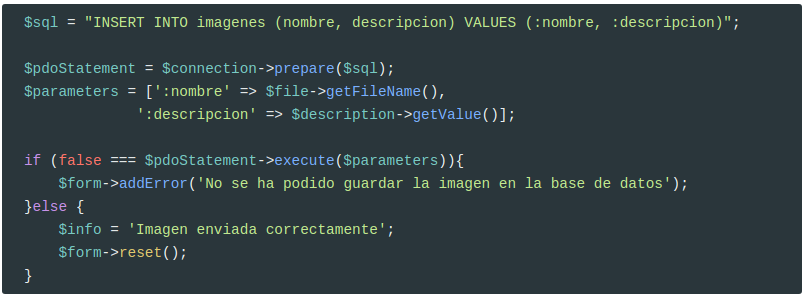
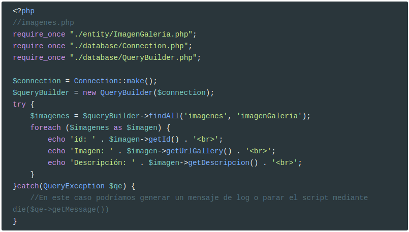
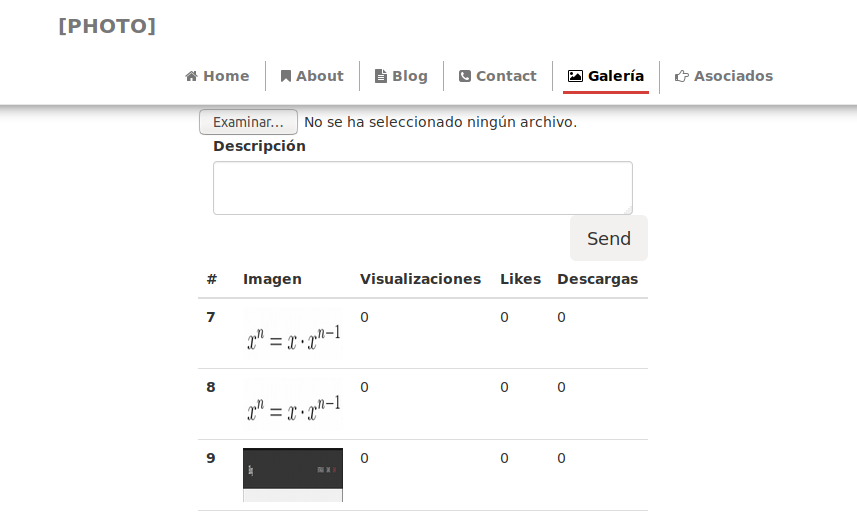
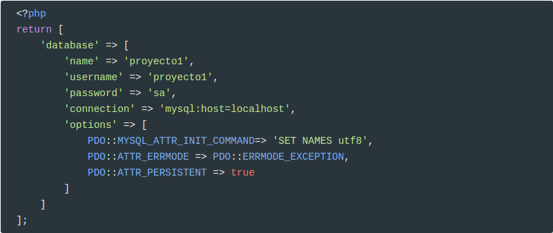
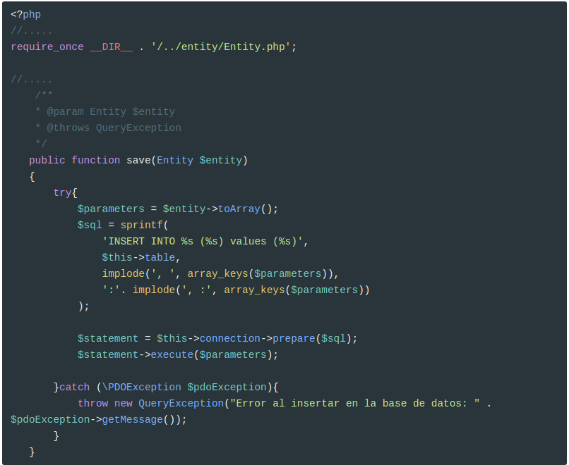
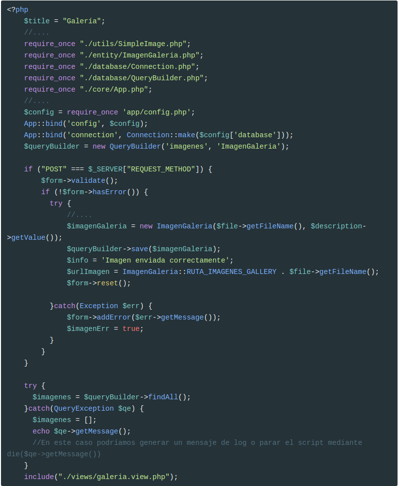
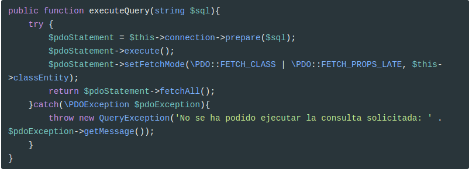
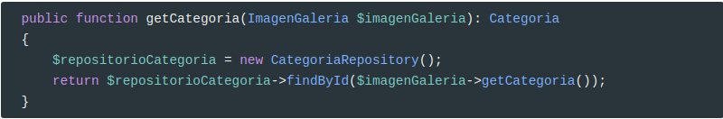
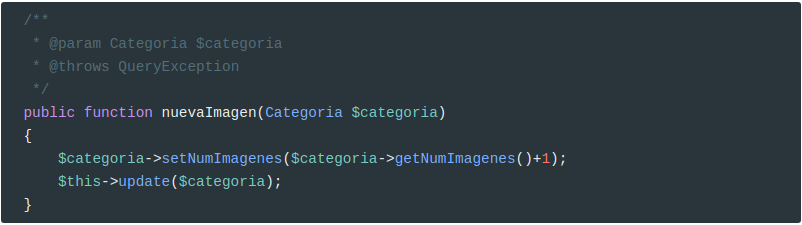

---

typora-copy-images-to: assets
---

## Crear la base de datos

Vamos a usar una base de datos, llamada **proyecto1**


Y creamos un usuario para la base de datos que **sólo tenga privilegios sobre datos**:

<video src="assets/usuario.m4v" />
Crear la tabla **imagenes**

```sql
CREATE TABLE `imagenes` (
  `id` int(11) NOT NULL,
  `nombre` varchar(255) COLLATE utf8_spanish_ci NOT NULL,
  `descripcion` text COLLATE utf8_spanish_ci,
  `numVisualizaciones` int(11) NOT NULL DEFAULT '0',
  `numLikes` int(11) NOT NULL DEFAULT '0',
  `numDownloads` int(11) NOT NULL DEFAULT '0'
) ENGINE=InnoDB DEFAULT CHARSET=utf8 COLLATE=utf8_spanish_ci;

ALTER TABLE `imagenes`
  ADD PRIMARY KEY (`id`),
  ADD UNIQUE KEY `nombre` (`nombre`);

ALTER TABLE `imagenes`
  MODIFY `id` int(11) NOT NULL AUTO_INCREMENT;
```

## Trabajar con bases de datos

**Crear la conexión**

Crear la clase `Connection` dentro de la carpeta `database`:


### Insertar datos a la antigua usanza

En `galeria.php`


Pero esta forma de realizar las modificaciones en la base de datos tiene un serio problema ya que permite a un atacante realizar un ataque de [inyección de SQL](https://www.w3schools.com/sql/sql_injection.asp) que es una de los principales técnicas para atacar la base de datos.

Según la [Wikipedia](https://en.wikipedia.org/wiki/SQL_injection),

> **SQL injection**  is a [code injection](https://en.wikipedia.org/wiki/Code_injection) technique, used  to [attack](https://en.wikipedia.org/wiki/Attack_(computing)) data-driven applications, in which malicious [SQL](https://en.wikipedia.org/wiki/SQL) statements are inserted into an entry field for execution (e.g. to dump the database contents to the attacker).[[1\]](https://en.wikipedia.org/wiki/SQL_injection#cite_note-1) SQL injection must exploit a [security vulnerability](https://en.wikipedia.org/wiki/Security_vulnerability) in an application's software, for example, when user input is either incorrectly filtered for [string literal](https://en.wikipedia.org/wiki/String_literal) [escape characters](https://en.wikipedia.org/wiki/Escape_sequence) embedded in SQL statements or user input is not [strongly typed](https://en.wikipedia.org/wiki/Strongly-typed_programming_language) and unexpectedly executed. SQL injection is mostly known as an attack [vector](https://en.wikipedia.org/wiki/Vector_(malware)) for websites but can be used to attack any type of SQL database. 
>
> SQL injection attacks allow attackers to spoof identity, tamper  with existing data, cause repudiation issues such as voiding  transactions or changing balances, allow the complete disclosure of all  data on the system, destroy the data or make it otherwise unavailable,  and become administrators of the database server. 
>
> In a 2012 study, it was observed that the average web application  received 4 attack campaigns per month, and retailers received twice as  many attacks as other industries.[[2\]](https://en.wikipedia.org/wiki/SQL_injection#cite_note-2) 

Por ejemplo supón que alguien introduce la siguiente descripción:

```sql
Mensaje');delete from imagenes where ('1' = '1
```

Lo que va a ocurrir es que cuando creemos la cadena `$sql`, esta sea la siguiente:

```sql
"INSERT INTO imagenes (nombre, descripcion) VALUES ('1541703793_e1.png', 'Mensaje');delete from imagenes where ('1' = '1')"
```

Y esto va a provocar que se **borre toda la tabla de imágenes** (o que haga un drop, ...)

### Evitar SQL Injection

Para evitar este tipo de ataques se deben utilizar **Prepared Statements** donde se usan marcadores de posición:

```php
$sql = "INSERT INTO imagenes (nombre, descripcion) VALUES (:nombre, :descripcion)";
```

Que luego se fijan con `$connection->bindValue()`,  antes de llamar a `exec()` se debe llamar a `prepare()`. Por ejemplo:


> **Cuidado**. Cuando queremos usar el valor devuelto por una **función** (y `$file->getFileName()` lo es), hemos de usar `bindValue`. Si por el contrario es una **variable** normal podemos usar `bindParam`.

También se puede usar *?* para marcar la posición:


Pero lo más adecuado es crear un array con los parámetros y pasárselo a `execute()`:



## Mapeo entidad-relación

Vamos a usar la capacidad (*limitada*) de autogenerar objetos desde una consulta que nos ofrece PDO. Es muy sencillo: sólo hemos de llamar a uno de los métodos de PDO e indicarle que queremos obtener objetos (no registros) de una clase concreta:

Por ejemplo,

```php
$pdoStatement->fetchAll(\PDO::FETCH_CLASS | \PDO::FETCH_PROPS_LATE, 'ImagenGaleria)
```

devolvería un array de objetos con todas las imágenes de la galería.

Pero antes de usarlo hemos de modificar un poco la clase `ImagenGaleria`, ya que hace falta crear el atributo **id**, y modificar el constructor para que todos los atributos tengan un valor por defecto. Así que en `ImagenGaleria.php`

```php
/**
 * @var int
 */
private $id;


// .....

public function __construct(string $nombre = '', string $descripcion = '',
                            int $numVisualizaciones = 0, int $numLikes = 0,
                            int $numDownloads = 0){
    $this->id = null;
    $this->nombre = $nombre;
    $this->descripcion = $descripcion;
    $this->numVisualizaciones = $numVisualizaciones;
    $this->numLikes = $numLikes;
    $this->numDownloads = $numDownloads;

}
//.....
/**
 * @return int|null
 */
public function getId()
{
    return $this->id;
}

/**
 * Set the value of id
 *
 * @param  int  $id
 *
 * @return  self
 */ 
public function setId(int $id)
{
    $this->id = $id;

    return $this;
}
//....
```

## Crear un repositorio

Vamos a juntar todo el código referente a seleccionar entidades de la base de datos y a convertirlas en objetos en una clase llamada `QueryBuilder`, que estará ubicada dentro de la carpeta `database`.

### Inyección de dependencias

En el constructor de la clase le pasaremos como argumento la conexión a la base de datos, usando inyección de dependencia (DI). 

Según la [Wikipedia]():

> In [software engineering](https://en.wikipedia.org/wiki/Software_engineering), **dependency injection** is a technique whereby one object supplies the dependencies of another object. A dependency is an object that can be used (a [service](https://en.wikipedia.org/wiki/Service_(systems_architecture))). An injection is the passing of a dependency to a dependent object (a [client](https://en.wikipedia.org/wiki/Client_(computing))) that would use it. The service is made part of the client's [state](https://en.wikipedia.org/wiki/State_(computer_science)).
>
> The intent behind dependency injection is to [decouple](https://en.wikipedia.org/wiki/Coupling_(computer_programming))  objects to the extent that no client code has to be changed simply  because an object it depends on needs to be changed to a different one.  Dependency injection is one form of the broader technique of [inversion of control](https://en.wikipedia.org/wiki/Inversion_of_control). As with other forms of inversion of control, dependency injection supports the [dependency inversion principle](https://en.wikipedia.org/wiki/Dependency_inversion_principle).  The client delegates the responsibility of providing its dependencies  to external code (the injector). The client is not allowed to call the  injector code;it is the injecting code that constructs the services and calls the  client to inject them.  This means the client code does not need to know  about the injecting code, how to construct the services or even which  actual services it is using; the client only needs to know about the  intrinsic interfaces of the services because these define how the client  may use the services.  This separates the responsibilities of use and  construction. 
>
> There are three common means for a client to accept a dependency injection: [setter](https://en.wikipedia.org/wiki/Mutator_method)-, [interface](https://en.wikipedia.org/wiki/Interface_(object-oriented_programming))- and [constructor](https://en.wikipedia.org/wiki/Constructor_(object-oriented_programming))-based  injection. Setter and constructor injection differ mainly by when they  can be used.  Interface injection differs in that the dependency is  given a chance to control its own injection. Each requires that separate  construction code (the injector) takes responsibility for introducing a  client and its dependencies to each other.

Además, la clase tiene un método `findAll` que nos devuelve todos los registros de la base de datos mapeados en objetos.

La clase sería de la siguiente forma:


En el **constructor le pasamos la dependencia**, de tal forma que esta clase está **desacoplada** de la conexión.

Si no seguimos el patrón de inyección de dependencia, la clase `QueryBuilder` sería de la siguiente forma:

```php
<?php
require_once __DIR__ . '/../exceptions/QueryException.php';
require_once "./database/Connection.php";
class QueryBuilder
{
    /**
     *
     * @var PDO
     */
    private $connection;

    public function __construct()
    {
        $this->connection =  Connection::make();
    }
    public function findAll(string $table, string $classEntity){
		// El mismo que antes
} 
```

Es decir, esta clase está totalmente acoplada de la clase `Connection`. Y, ¿qué ocurre si después cambiamos la definición de la clase `Connection` o creamos por ejemplo una conexión que guarde los datos en disco con un método distinto para realizar la conexión?. Pues que habría que modificar la clase `QueryBuilder`, simplemente porque hemos cambiado una clase de la que depende estrechamente.

Según la Wikipedia, el [acoplamiento](https://en.wikipedia.org/wiki/Coupling_(computer_programming)),

> In [software engineering](https://en.wikipedia.org/wiki/Software_engineering), **coupling** is the degree of interdependence between software modules; a measure of how closely connected two routines or modules are; the strength of the relationships between modules.
>
> Coupling is usually contrasted with [cohesion](https://en.wikipedia.org/wiki/Cohesion_(computer_science)). [Low coupling](https://en.wikipedia.org/wiki/Loose_coupling) often correlates with high cohesion, and vice versa. Low coupling is often a sign of a well-structured [computer system](https://en.wikipedia.org/wiki/Computer) and a good design, and when combined with high cohesion, supports the general goals of high readability and maintainability

Y la [cohesión](https://en.wikipedia.org/wiki/Cohesion_(computer_science)),

> In [computer programming](https://en.wikipedia.org/wiki/Computer_programming), **cohesion** refers to the *degree to which the elements inside a module belong together*. In one sense, it is a measure of the strength of relationship between  the methods and data of a class and some unifying purpose or concept  served by that class. In another sense, it is a measure of the strength  of relationship between the class’s methods and data themselves. 
>
> Cohesion is an [ordinal](https://en.wikipedia.org/wiki/Level_of_measurement#Ordinal_scale)  type of measurement and is usually described as “high cohesion” or “low  cohesion”. Modules with high cohesion tend to be preferable, because  high cohesion is associated with several desirable traits of software  including [robustness](https://en.wikipedia.org/wiki/Robustness_(computer_science)), reliability, [reusability](https://en.wikipedia.org/wiki/Reusability),  and understandability. In contrast, low cohesion is associated with  undesirable traits such as being difficult to maintain, test, reuse, or  even understand. 
>
> Cohesion is often contrasted with [coupling](https://en.wikipedia.org/wiki/Coupling_(computer_science)), a different concept. High cohesion often correlates with [loose coupling](https://en.wikipedia.org/wiki/Loose_coupling), and vice versa.The [software metrics](https://en.wikipedia.org/wiki/Software_metric) of coupling and cohesion were invented by [Larry Constantine](https://en.wikipedia.org/wiki/Larry_Constantine) in the late 1960s as part of [Structured Design](https://en.wikipedia.org/wiki/Structured_Design),  based on characteristics of “good” programming practices that reduced  maintenance and modification costs. Structured Design, cohesion and  coupling were published in the article [Stevens, Myers & Constantine (1974)](https://en.wikipedia.org/wiki/Cohesion_(computer_science)#CITEREFStevensMyersConstantine1974) and the book [Yourdon & Constantine (1979)](https://en.wikipedia.org/wiki/Cohesion_(computer_science)#CITEREFYourdonConstantine1979); the latter two subsequently became standard terms in software engineering. 

En el desarrollo de software se busca siempre **una alta cohesión y un bajo acoplamiento**.

Una forma de conseguir lo segundo es mediante el uso de **DI**.

De hecho ya lo hemos usado en las clases `Validator`, aunque allí la inyección la hemos hecho con setters (`setValidador` y `appendValidator`) que es otra de las formas para inyectar una dependencia. 

Se puede hacer DI con un setter cuando esta dependencia no es crucial para el objeto. En el caso del `Validator`, las clases que derivan de `DataElement` **pueden funcionar** sin `Validator`, es por ello que se puede usar la inyección por setter. Pero la clase `QueryBuilder` **no puede funcionar**  sin una conexión y, por tanto, se inyecta en el constructor.

Como podéis observar, cuando la consulta no funciona, lanza una excepción de tipo `QueryException` que hemos de crear también en la carpeta `exceptions`.

De momento esta excepción simplemente hereda de la clase `Exception`:

```php
<?php

class QueryException extends Exception
{
    public function __construct(string $message){
        parent::__construct($message);
    }
}
```

Vamos a hacer una prueba:



## Mostrar las imágenes de la base de datos

Ahora es muy sencillo seleccionar registros:


Y vamos a modificar `galeria.view.php` para mostrar una tabla con todos los registros:

```php
//.....
<?=$form->render();?>
<hr class="divider">
<div class="imagenes_galeria">
    <table class="table">
        <thead>
        <tr>
            <th scope="col">#</th>
            <th scope="col">Imagen</th>
            <th scope="col">Visualizaciones</th>
            <th scope="col">Likes</th>
            <th scope="col">Descargas</th>
        </tr>
        </thead>
        <tbody>
        <?php foreach ($imagenes as $imagen): ?>
            <tr>
                <th scope="row"><?= $imagen->getId(); ?></th>
                <td>
                    getUrlGallery(); ?>"
                         alt="<?= $imagen->getDescripcion(); ?>"
                         title="<?= $imagen->getDescripcion(); ?>"
                         width="100px">
                </td>
                <td><?= $imagen->getNumVisualizaciones(); ?></td>
                <td><?= $imagen->getNumLikes(); ?></td>
                <td><?= $imagen->getNumDownloads(); ?></td>
            </tr>
        <?php endforeach; ?>
        </tbody>
    </table>
</div>
```

Y este es el resultado:



## Reestructurar código (parte I)

Vamos a refactorizar la clase `Connection` para que no esté harcodeada la conexión a la base de datos. Generalmente se suele usar un archivo de configuración con todos los datos relativos a la configuración de la aplicación en un script aparte, de tal forma que se pueden tener varias versiones del mismo dependiendo de si el entorno es desarrollo, producción, test, etc.

Este archivo de configuración se llamará `config.php` y estará en la carpeta **app**. De momento, constará de los datos necesarios para conectar con la base de datos.



> **IMPORTANTE**
> El archivo `config.php` **no debe subirse al repositorio** ya que tiene los datos reales de la conexión.
> En su lugar, subiremos un archivo `config-sample.php` donde no aparecerán los datos relevantes.
>
> Por ejemplo:
>
> ```php
> <?php
> return [
>     'database' => [
>         'name' => 'nombre-de-la-base-de-datos',
>         'username' => 'usuario',
>         'password' => 'contraseña',
>         'connection' => 'mysql:host=localhost',
>         'options' => [
>             PDO::MYSQL_ATTR_INIT_COMMAND=> 'SET NAMES utf8',
>             PDO::ATTR_ERRMODE => PDO::ERRMODE_EXCEPTION,
>             PDO::ATTR_PERSISTENT => true
>         ]
>     ]
> ];
> ```
>
> Cada cambio realizado en `config.php` también debe reflejarse en `config-sample.php`


Modificamos la clase `Connection` para que reciba esta configuración en el constructor:


Y ahora es tan sencillo como asignar este array a una variable que almacene la configuración. Por ejemplo,

```php
//galeria.php
// ....
$config = require_once 'app/config.php';
$connection = Connection::make($config['database']);

if ("POST" === $_SERVER["REQUEST_METHOD"]) {
  // .... 
```

##  Service Locator o Dependency Injection Containers

Este es otro patrón de desarrollo de software que se usa para encapsular servicios (entendiendo un servicio como cualquier objeto que se pueda necesitar en toda la aplicación) en un contenedor centralizado. Generalmente es usado junto con DI.

Según la [Wikipedia](https://en.wikipedia.org/wiki/Service_locator_pattern):

> The **service locator pattern** is a [design pattern](https://en.wikipedia.org/wiki/Design_pattern_(computer_science)) used in [software development](https://en.wikipedia.org/wiki/Software_development) to encapsulate the processes involved in obtaining a service with a strong [abstraction layer](https://en.wikipedia.org/wiki/Abstraction_layer). This pattern uses a central registry known as the "service locator",  which on request returns the information necessary to perform a certain task. The main criticism of service location is that it obscures dependencies.
> Meanwhile, its proponents say the approach should not be discarded as it simplifies component-based applications where all dependencies are cleanly listed at the beginning of the whole application design, 
> consequently making traditional dependency injection a more complex way of connecting objects. The usual criticism of service locator pattern as being the one which is "much harder to test" actually becomes a benefit in such applications.

**Vamos a verlo con un ejemplo.**

Se trata de guardar los objetos necesarios para la aplicación en un contenedor, de tal forma que podemos guardarlos y recuperarlos cada vez que sea necesario, sin tener que crear nuevos objetos.

Lo creamos dentro carpeta `core` con el nombre `App.php`

```php
<?php
require_once './exceptions/AppException.php';

class App
{
    /**
     * @var array
     */
    private static $container = [];

    /**
     * @param string $key
     * @param $value
     */
    public static function bind(string $key, $value)
    {
        self::$container[$key] = $value;
    }

    /**
     * @param string $key
     * @return mixed
     * @throws AppException
     */
    public static function get(string $key)
    {
        if (!array_key_exists($key, static::$container)){
            throw new AppException("No se ha encontrado la clave $key en el contenedor");
        }

        return self::$container[$key];
    }
}
```

Vamos a crear la excepción `AppException`, dentro de la carpeta `exceptions`.

```php
<?php
class AppException extends Exception
{
    public function __construct(string $message){
        parent::__construct($message);
    }
}
```

Y modificamos la clase `Connection`, para que use este contenedor:

```php
require_once __DIR__ . '/../core/App.php';
//....
public static function make()
    {
        try{
             $config = App::get('config')['database'];
            //resto de código
```

En `QueryBuilder`, modificamos el constructor:

```php
public function __construct()
{
    $this->connection =  App::get('connection');
}
```

Y ahora en el inicio de cada controlador, hemos de rellenar el contenedor de servicios con la configuración y la conexión:


Como hemos visto en `QueryBuilder` para acceder a la conexión, simplemente hemos de utilizar el contenedor de dependencias:

```php
App::get('connection')
```

De esta forma ya no hace falta inyectar la dependencia manualmente en cada clase. De hecho hay frameworks como **Symfony** que inyectan dependencias automáticamente simplemente pasándoles un parámetro al constructor, que debe estar determinado con **type hint** (ya lo veremos más adelante). Lo importante aquí es que os quedéis con el concepto de Contenedores de Dependencias.

## Reestructurar código (parte II)

Refactorizamos la clase `QueryBuilder` porque en el constructor deberíamos pasarle tanto la tabla como la entidad:

```php
<?php
require_once __DIR__ . '/../exceptions/QueryException.php';
require_once __DIR__ ."/Connection.php";
require_once __DIR__ . '/../core/App.php';

class QueryBuilder
{
    
    private $connection;

    /**
     * @var string
     */
    private $table;
    /**
     * @var string
     */
    private $classEntity;

    public function __construct(string $table, string $classEntity)
    {
        $this->connection =  App::get('connection');
        $this->table = $table;
        $this->classEntity = $classEntity;
    }
    
    public function findAll(){
        $sql = "SELECT * FROM $this->table";
        try {
            $pdoStatement = $this->connection->prepare($sql);
            $pdoStatement->execute();
            $pdoStatement->setFetchMode(PDO::FETCH_CLASS | PDO::FETCH_PROPS_LATE, $this->classEntity);
            return $pdoStatement->fetchAll();
        }catch(\PDOException $pdoException){
            throw new QueryException('No se ha podido ejecutar la consulta solicitada: ' . $pdoException->getMessage());
        }
    }
} 
```

Además vamos a hacer que esta clase sea genérica y que nos permita hacer actualizaciones y modificaciones de cualquier entidad de nuestra base de datos. Todas las entidades deben implementar un método llamado `toArray` que va a ser particular para cada entidad. Tenemos dos opciones para implementar este comportamiento:

1. Como las entidades no extienden ninguna clase, podemos hacer una clase **abstracta** `Entity` con un método también abstracto llamado `toArray()`. Si por el contrario estas dos clases extendieran clases distintas, la única opción sería crear un interfaz
2. O crear una interfaz, que declare este método.

Vamos a optar por la opción 1, creando la clase `Entity` en el directorio `entity` y haciendo que todas las entidades extiendan a esta:

```php
<?php

abstract class Entity 
{
    public abstract function toArray():array;
}
```

Este método convertirá  nuestra entidad en un array asociativo que luego usaremos en el `QueryBuider`.

Por ejemplo, en la clase `ImagenGaleria`

```php
<?php
require_once __DIR__ .'/Entity.php';
class ImagenGaleria extends Entity
{
//...
    
public function toArray(): array
{
    return [
        'id' => $this->getId(),
        'nombre' => $this->getNombre(),
        'descripcion' => $this->getDescripcion(),
        'numVisualizaciones' => $this->getNumVisualizaciones(),
        'numLikes' => $this->getNumLikes(),
        'numDownloads' => $this->getNumDownloads()
    ];
}
```

Y creamos un método `save` en `QueryBuilder` que permita hacer un **insert** de cualquier entidad:



Y ahora modificamos `galeria.php` para llamar a este método:



### Crear repositorios

En general, para cada entidad se deben crear repositorios que son clases que encapsulan tanto la creación y modificación de entidades como todas las consultas relacionadas con ellas.

Para ello, primero modificamos la clase `QueryBuilder` para que sea abstracta de tal forma que no se pueda instanciar.

```php
abstract class QueryBuilder
```

Y luego creamos tantos repositorios como entidades tenga nuestra aplicación. Estos repositorios los guardaremos dentro de la carpeta `repository`.

Por ejemplo, vamos a crear `ImagenGaleriaRepository`:

```php
<?php
require_once __DIR__ . '/../entity/ImagenGaleria.php';
require_once __DIR__ . '/../database/QueryBuilder.php';
class ImagenGaleriaRepository extends QueryBuilder
{
    public function __construct(){
        parent::__construct('imagenes', 'ImagenGaleria');
    }
}
```

Y ahora vamos a usarlo en `galeria.php`


## Relaciones

Vamos a crear una relación entre imágenes y categorías.

Para ello creamos la tabla **categorias**.

```sql
CREATE TABLE `categorias` (
  `id` int(11) NOT NULL,
  `nombre` varchar(255) COLLATE utf8_spanish_ci NOT NULL,
  `numImagenes` int(11) NOT NULL DEFAULT '0'
) ENGINE=InnoDB DEFAULT CHARSET=utf8 COLLATE=utf8_spanish_ci;

ALTER TABLE `categorias`
  ADD PRIMARY KEY (`id`);

INSERT INTO `categorias` (`id`, `nombre`, `numImagenes`) VALUES
(1, 'Categoría I', 20),
(2, 'Categoría II', 2),
(3, 'Categoría III', 2);

ALTER TABLE `categorias`
  MODIFY `id` int(11) NOT NULL AUTO_INCREMENT, AUTO_INCREMENT=4;
```

Y a continuación creamos la clave ajena en la tabla **imagenes**, borrando previamente todas las filas para que no nos dé problemas de integridad referencial:

```sql
TRUNCATE TABLE `imagenes`;

ALTER TABLE `imagenes` ADD  `categoria` int(11) NOT NULL;

ALTER TABLE `imagenes`
  ADD KEY `FK_CATEGORIA_IMAGEN` (`categoria`);

ALTER TABLE `imagenes`
  ADD CONSTRAINT `FK_CATEGORIA_IMAGEN` FOREIGN KEY (`categoria`) REFERENCES `categorias` (`id`);
```

Y ahora creamos la entidad `Categoria` dentro de la carpeta `entity`.

```php
<?php
require_once __DIR__ .'/Entity.php';
class Categoria extends Entity
{
     /**
     * @var int
     */
    private $id;

    /**
     * @var string
     */
    private $nombre;
    
    /**
     * @var int
     */
    private $numImagenes;

    public function __construct(string $nombre = '', int $numImagenes = 0){
        parent::__construct();
        $this->id = null;
        $this->nombre = $nombre;
        $this->numImagenes = $numImagenes;

    }
	//Setters y getters
    // .....
    
    public function toArray(): array
    {
        return [
            'id' => $this->getId(),
            'nombre' => $this->getNombre(),
            'numImagenes' => $this->getNumImagenes()
        ];
    }
}
```

Y ahora modificamos la clase `ImagenGaleria` para que tenga un nuevo atributo llamado `categoria` con su setter y getter:

```php
<?php
    
    // ....
	/**
     * @var int
     */
    private $categoria;
    
	 public function __construct(string $nombre = '', string $descripcion = '',
                                int $numVisualizaciones = 0, int $numLikes = 0,
                                int $numDownloads = 0, int $categoria = 0){
        $this->id = null;
        $this->nombre = $nombre;
        $this->descripcion = $descripcion;
        $this->numVisualizaciones = $numVisualizaciones;
        $this->numLikes = $numLikes;
        $this->numDownloads = $numDownloads;
        $this->categoria = $categoria;
    }

//....
/**
     * Get the value of categoria
     *
     * @return  int
     */ 
    public function getCategoria()
    {
        return $this->categoria;
    }

    /**
     * Set the value of categoria
     *
     * @param  int  $categoria
     *
     * @return  self
     */ 
    public function setCategoria(int $categoria)
    {
        $this->categoria = $categoria;

        return $this;
    }

    public function toArray(): array
    {
        return [
            'id' => $this->getId(),
            'nombre' => $this->getNombre(),
            'descripcion' => $this->getDescripcion(),
            'numVisualizaciones' => $this->getNumVisualizaciones(),
            'numLikes' => $this->getNumLikes(),
            'numDownloads' => $this->getNumDownloads(),
            'categoria' => $this->getCategoria()
        ];
    }
```

Creamos el repositorio para las categorías, `CategoriaRepository`:

```php
<?php
require_once __DIR__ . '/../entity/Categoria.php';
require_once __DIR__ . '/../database/QueryBuilder.php';
class CategoriaRepository extends QueryBuilder
{
    public function __construct(){
        parent::__construct('categorias', 'Categoria');
    }
}
```

Modificamos también el controlador para añadir un nuevo `input` de tipo `select` con todas las categorías:


Y modificamos también la vista para que muestre la categoría. 

```php+HTML
<table class="table">
    <thead>
    <tr>
        <th scope="col">#</th>
        <th scope="col">Imagen</th>
        <th scope="col">Visualizaciones</th>
        <th scope="col">Likes</th>
        <th scope="col">Descargas</th>
        <th scope="col">Categoría</th>
    </tr>
    </thead>
    <tbody>
    <?php foreach ($imagenes as $imagen): ?>
        <tr>
            <th scope="row"><?= $imagen->getId(); ?></th>
            <td>
                getUrlGallery(); ?>"
                     alt="<?= $imagen->getDescripcion(); ?>"
                     title="<?= $imagen->getDescripcion(); ?>"
                     width="100px">
            </td>
            <td><?= $imagen->getNumVisualizaciones(); ?></td>
            <td><?= $imagen->getNumLikes(); ?></td>
            <td><?= $imagen->getNumDownloads(); ?></td>
            <td><?= $imagen->getCategoria(); ?></td>
        </tr>
    <?php endforeach; ?>
    </tbody>
</table>
```

Y este es el resultado:


Como podéis observar, en la columna categoría aparece el **id**, no el **nombre**. Vamos a modificar el código para que muestre la categoría. Para ello necesitamos un método en el repositorio de imágenes que nos devuelva la categoría (como objeto) de la imagen, por lo que crearemos un nuevo método en `QueryBuilder` llamado `findById()` al que le pasemos un **id** y nos devolverá la categoría correspondiente.

Primero refactorizamos `QueryBuilder`, creando un método genérico que nos permita realizar cualquier consulta (es una copia de `findAll`, pero se le pasa como parámetro la consulta SQL).



Luego refactorizamos `findAll`:


Y por último creamos el método `findById`:


Creamos también la excepción `NotFoundException`, dentro de la carpeta `exceptions`:

```php
<?php

class NotFoundException extends Exception
{
    public function __construct(string $message){
        parent::__construct($message);
    }
}
```

Ya lo tenemos todo para modificar `ImagenGaleriaRepository`:



Y ahora ya podemos usarlo en `galeria.view.php`:

```php+HTML
<td><?= $imagen->getNumDownloads(); ?></td>
<td><?= $repositorio->getCategoria($imagen)->getNombre(); ?></td>
```

Y este es el resultado:


## Transacciones

Según la [Wikipedia](https://en.wikipedia.org/wiki/Database_transaction)

> A **transaction** symbolizes a unit of work performed within a [database management system](https://en.wikipedia.org/wiki/Database_management_system)  (or similar system) against a database, and treated in a coherent and  reliable way independent of other transactions. A transaction generally  represents any change in a database. Transactions in a database  environment have two main purposes: 
>
> 1. To provide reliable units of work that allow correct recovery  from failures and keep a database consistent even in cases of system  failure, when execution stops (completely or partially) and many  operations upon a database remain uncompleted, with unclear status.
> 2. To provide isolation between programs accessing a database  concurrently. If this isolation is not provided, the programs' outcomes  are possibly erroneous.
>
> In a Database Management System, a transaction is a single unit of  logic or work, sometimes made up of multiple operations. Any logical  calculation done in a consistent mode in a database is known as a  transaction. One example is a transfer from one bank account to another:  the complete transaction requires subtracting the amount to be  transferred from one account and adding that same amount to the other. 
>
> A database transaction, by definition, must be [atomic](https://en.wikipedia.org/wiki/Atomicity_(database_systems)), [consistent](https://en.wikipedia.org/wiki/Consistency_(database_systems)), [isolated](https://en.wikipedia.org/wiki/Isolation_(database_systems)) and [durable](https://en.wikipedia.org/wiki/Durability_(database_systems)). Database practitioners often refer to these properties of database transactions using the acronym [ACID](https://en.wikipedia.org/wiki/ACID). 
>
> Transactions provide an "all-or-nothing" proposition, stating  that each work-unit performed in a database must either complete in its  entirety or have no effect whatsoever. Further, the system must isolate  each transaction from other transactions, results must conform to  existing constraints in the database, and transactions that complete  successfully must get written to durable storage. 

Para empezar a trabajar con transacciones vamos a crear un método en `QueryBuilder` que permita ejecutar una transacción que recibirá como parámetro un [callable](https://www.php.net/manual/en/language.types.callable.php) que tenga todas las consultas a realizar, de tal forma que se ejecutan todas o ninguna. Hay que recordar que **PDO** funciona con **autocommit**, es decir que siempre que se ejecuta cualquier consulta de modificación de datos, esta se confirma automáticamente. Para modificar este comportamiento por defecto, es necesario primero llamar a `beginTransaction()`


### Ejemplo de uso

Vamos a hacer que cada vez que se inserte una imagen se actualice el campo **numImagenes** de la tabla **categoria**.

Para ello modificamos el método `save` en `ImagenGaleriaRepository` en el que haremos las dos cosas.

Primero crearemos un método en el repositorio de Categorías que nos permita actualizar el número de imágenes de la misma, que va a ser muy sencillo porque va a ser usar el getter y el setter. 

Así que en `CategoriaRepository` creamos este nuevo método:



Pero nos hace falta modificar la clase `QueryBuilder` para que también permita actualizar y no sólo añadir como hasta ahora:


Una vez creados los métodos que nos hacen falta, sobrescribimos el método `save` en `ImagenGaleriaRepository`:


Estamos creando una función anónima (**callable**) con todas las instrucciones que se deben ejecutar como una transacción.

------

## Credits.

Víctor Ponz victorponz@gmail.com

Este material está licenciado bajo una licencia [Creative Commons, Attribution-NonCommercial-ShareAlike](https://creativecommons.org/licenses/by-nc-sa/3.0/)


Adaptado del curso [Desarrollo web con PHP y MVC](https://www.udemy.com/desarrollo-web-con-php-7-y-mysql-utilizando-mvc/), realizado en el Cefire, impartido por [**Alejandro Amat Reina**](https://www.udemy.com/user/alejandro-amat-reina/)


