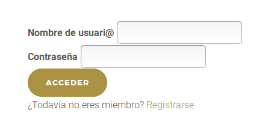

En la siguiente práctica vamos a trabajar con sesiones.

## Tabla

Antes de empezar a trabajar con sesiones, hemos de crear la siguiente tabla en MySql.


Os dejo el sql para crearla.

<script src="https://gist.github.com/victorponz/aed46fcc09fef9e8df24f21aa48a97d0.js"></script>


## Formulario de registro

El formulario de registro será parecido a este:


Si todo va bien, guardamos el nuevo usuario y, de momento, mostramos la información introducida.

## Formulario de login

Y el de login, será parecido a este:



Si todo va ido bien, mostraremos los datos del usuario logeado.

## Entidad y Repositorio

A partir de la estructura de la tabla `Users`, debemos crear una nueva entidad en PHP.

Y su correspondiente repositorio.  En un principio vamos a guardar la contraseña en texto plano. Luego ya le pondremos encriptación.

En este repositorio debemos crear un método (`findByUserNamePassword`) que devolverá el usuario, si existe, con el nombre y correo introducido en el formulario de login.

## Registro completo

En esta práctica realizaremos un proceso completo de registro y de inicio de sesión.  
Una de las funcionalidades que vamos a aprender y que se usa mucho en desarrollo en la parte servidor es a hacer redirecciones.  
Por ejemplo, cuando el usuario se logea correctamente queremos que vaya automáticamente a su página privada. Esto se consigue en php mediante la función `header()`

```php
<?php
    session_start(); 
    //Proceso de logeo
    //Si todo es correcto le redirigimos
    header('location: pagina_privada.php');
?>
```

Otro ejemplo, es cuando el usuario no ha iniciado sesión y quiere acceder a una página en la que se necesita haberlo hecho. En este caso, le hemos de redirigir a la página de inicio de sesión.

```php
<?php 
    session_start(); 
    if (!isset($_SESSION['username'])) {
        $_SESSION['msg'] = "Para acceder a esta página, debes iniciar sesión primero";
        header('location: login.php?returnToUrl=galeria.php');
    }
    ...
?>
```

En las siguientes secciones se explica cómo generar un proceso de registro completo:

### Login

Cuando el usuario se logea correctamente, ya podemos fijar la sesión con los datos relativos a éste. La primera instrucción antes de generar ningún código HTML debe ser `session_start()`.


Fijaos que uso el parámetro del queryString `returnToUrl`.  Si este tiene valor, redirigo al usuario a dicha página. De esta forma se sigue el flujo: si el usuario había intentado acceder a una página donde es necesario estar logeado, le redirigimos a login pasándole como parámetro `returnToUrl` la página a donde había intentado conectarse. Una vez se logea correctamente, le volvemos a redirigir a la página donde había intentado entrar.

Hemos de modificar la vista y el controlador que muestra el formulario de login para comprobar si el usuario ya está logeado. En este caso sólo mostramos la información del mismo. En otro caso mostramos el formulario de registro:

```php
if (isset($_SESSION['username']))
```

### Logout

El código para cerrar la sesión es muy sencillo:


### Register

El proceso es parecido a Login. Añadimos el usuario a la base de datos, fijamos los datos de sesión y redirigimos.

### Páginas privadas

En  nuestro caso, las páginas privadas son `asociados.php` y `galeria.php`. En estas páginas hemos de comprobar si el usuario está logeado y, en caso contrario, redirigir a la página de registro, informando el valor del parámetro del querystring `returnToUrl`.

### Propagar redirecciones

Cuando el usuario visita una página en la que se necesita estar logeado es importante que durante todo el flujo del proceso no se pierda el valor de `returnToUrl`.  

Por ejemplo, la página de `login` tiene un formulario y un enlace para registrarse. En ambos casos hemos de informar `returnToUrl`. El en caso del enlace a registro es tan fácil como añadirlo a la url del enlace. En el caso del formulario, lo que hemos de hacer es pasarlo o bien como un campo `hidden` del `form` o bien como parámetro en el `action`.

Lo mismo debemos hacer en el formulario de registro.


## Credits.

Víctor Ponz victorponz@gmail.com

Este material está licenciado bajo una licencia [Creative Commons, Attribution-NonCommercial-ShareAlike](https://creativecommons.org/licenses/by-nc-sa/3.0/)


