# Implementación de Sesiones

Vamos a ver la implementación de todo el proceso de registro de usuarios.

## Creación de la entidad Usuario

A partir de la definición de la base de datos, creamos la entidad `Usuario`. 

<script src="https://gist.github.com/victorponz/b350128f6b5fc4b257d2007c5798ce5c.js"></script>
## Repositorio

Creamos un nuevo repositorio para la entidad `Usuario` en `repository/UsuarioRepository.php`.

En el constructor fijamos tanto la tabla como la entidad así como el validador de la contraseña (tal como se vio en el punto 6 Interfaces y Clases)

## Formulario de registro

Este formulario (`/register.php`) nos permite grabar un nuevo usuario en la base de datos.

En este caso, fijaos que `returnToUrl` lo paso en el `action` del formulario.

```php
    session_start();

    $info = "";
    $nombreUsuario = new InputElement('text');
    $nombreUsuario
      ->setName('username')
      ->setId('username');

    $nombreUsuario->setValidator(new NotEmptyValidator('El nombre de usuari@ no puede estar vacío', true));
    $userWrapper = new MyFormControl($nombreUsuario, 'Nombre de usuari@', 'col-xs-12');

    $email = new EmailElement();
    $email
      ->setName('email')
      ->setId('email');
    $emailWrapper = new MyFormControl($email, 'Correo electrónico', 'col-xs-12');

    $pv = new NotEmptyValidator('La contraseña no puede estar vacía', true);

    $pass = new PasswordElement();
    $pass
    ->setName('password')
    ->setId('password');
    
    $pass->setValidator($pv);
    $passWrapper = new MyFormControl($pass, 'Contraseña', 'col-xs-12');

    $repite = new PasswordElement();
    $repite
    ->setName('repite_password')
    ->setId('repite_password');
    $repite->setValidator(new PasswordMatchValidator($pass, 'Las contraseñas no coinciden', true));
    $repiteWrapper = new MyFormControl($repite, 'Repita la contraseña', 'col-xs-12');

    $b = new ButtonElement('Registro', '', '', 'pull-right btn btn-lg sr-button');
    $form = new FormElement();
    $form
      ->appendChild($userWrapper)
      ->appendChild($emailWrapper)
      ->appendChild($passWrapper)
      ->appendChild($repiteWrapper)
      ->appendChild($b);

```

Y la parte de validación:

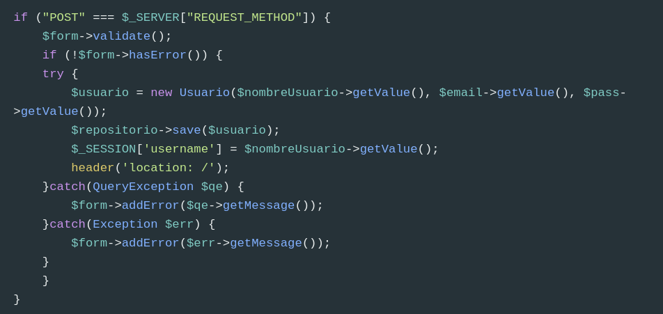

Y modificamos la vista (`register.view.php`):

```php
<?php
  include __DIR__ . "/partials/inicio-doc.part.php";
  include __DIR__ . "/partials/nav.part.php";
  ?>
<div id="register">
    <div class="container">
        <div class="col-xs-12 col-sm-8 col-sm-push-2">
            <h1>REGISTRO</h1>
            <hr>
            <?php if (isset($_SESSION['username'])) :?>
                Ya está logeado como <?=$_SESSION['username']?>
            <?php else: ?>
                <?php
                    include __DIR__ . "/partials/show-messages.part.php";
                ?>
                <?=$form->render();?>
                <a href='/login.php'>
                    ¿Ya eres miembro? Acceso a usuari@s
                </a>
            <?php endif?>
        </div>
    </div>

</div>

<?php
  include __DIR__ . "/partials/fin-doc.part.php";
?>
```

### Restricciones en la base de datos

Tanto el campo `username` como `email` tienen un índice único. Por tanto al intentar grabar un nuevo usuario con alguno de estos campos duplicados, aparece el siguiente error.

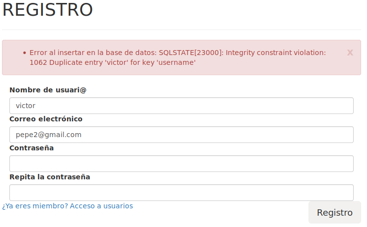

Pero este mensaje no es **User Friendly**, así que vamos a mostrar un mensaje adecuado dependiendo del mensaje de error que haya devuelto la excepción.

Los errores de `Duplicate entry` tienen el código de error **1062**. Para solucionarlo de una manera casera (la solución real es más elaborada que la mostrada a continuación) vamos a *parsear* el mensaje que nos devuelve la excepción.

Por ejemplo, 

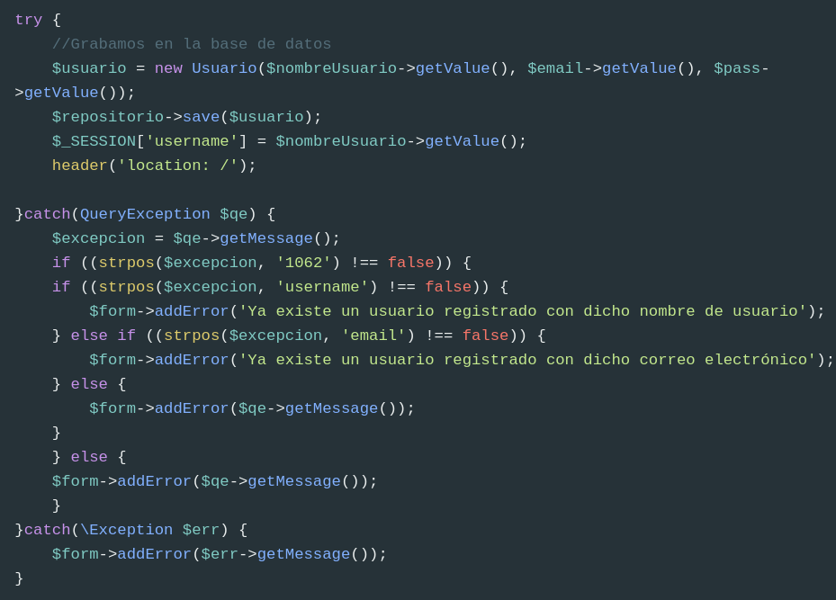

Y ahora el mensaje ya informa correctamente al usuario:

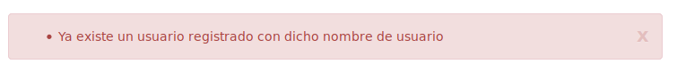


## Logout

Simplemente hay que cerrar la sesión y redirigir a otra página.

```php
<?php
  session_start();
  session_unset();
  session_destroy();
  
header('location: /');
  
```

## Formulario de login

Necesitamos crear lo siguiente:

* Un formulario de login
* Un método en repositorio de login (`findByUserNameAndPassword`) que os permita obtener el usuario (si existe) con dicho nombre y contraseña.
* Si todo va bien, iniciar la variable de sesión `$_SESSION['username']` con el nombre del usuario.

**Formulario**

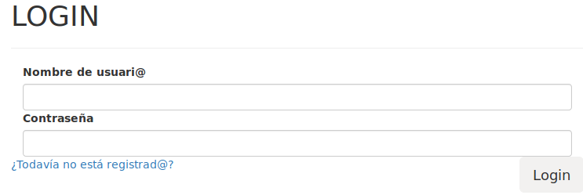

Y ya podemos implementar el formulario de login.

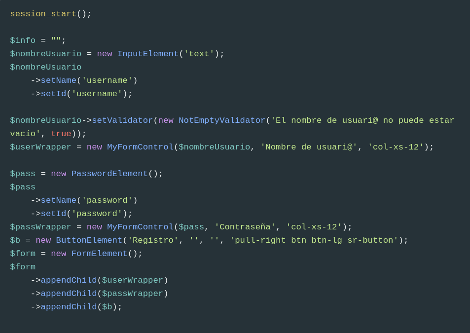

El código quedaría como sigue (es una copia de `executeQuery` pero con parámetros).

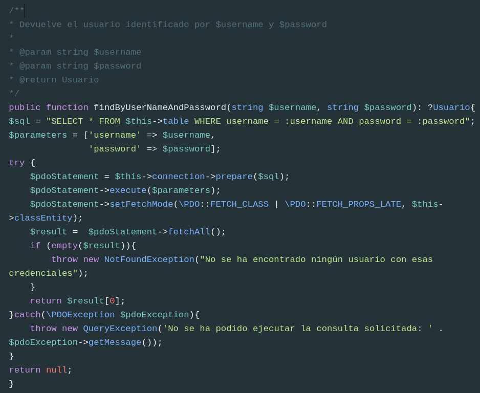

Y ahora hacemos las validaciones:

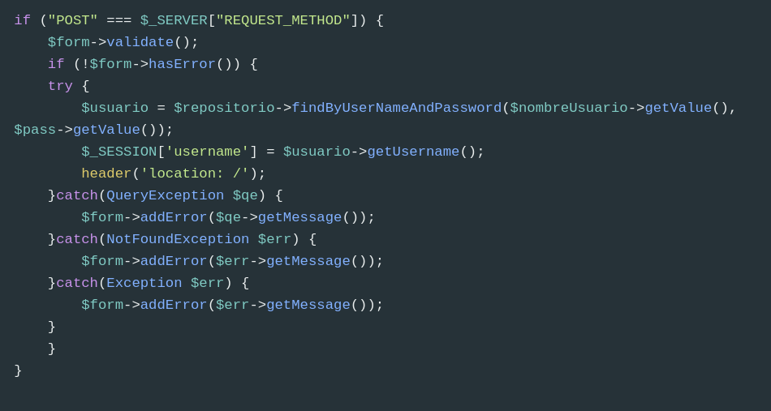

Y modificamos la vista para que nos aparezca un mensaje cuando ya está logeado y el formulario cuando no lo está:

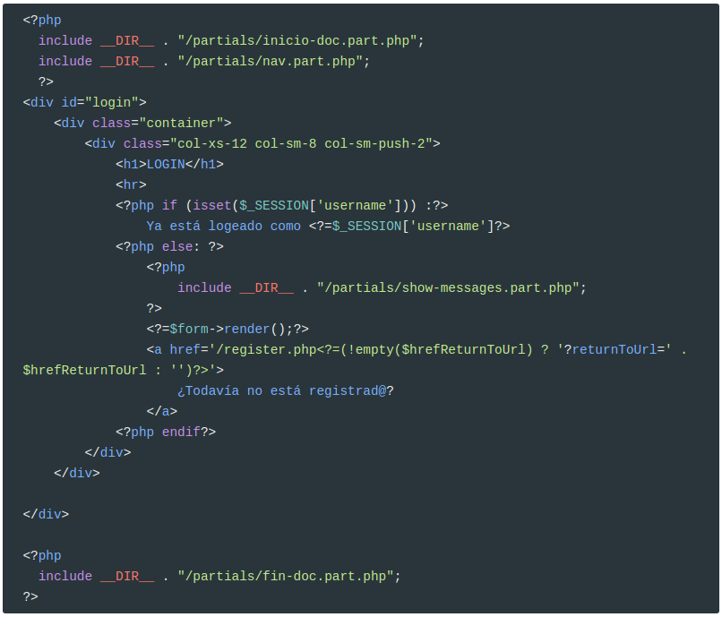

## Navegación

Vamos a modificar la navegación:

* Si el usuario no está registrado, pondremos un enlace para login y otro para registro. Además las opciones Galería y Asociados no aparecerán
  
* En caso de que sí que lo esté, aparecerán las opciones Galería y Asociados y un enlace para cerrar la sesión.
  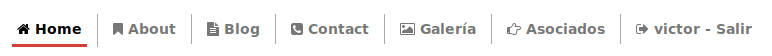

Sólo hay que comprobar si el usuario está registrado en la sesión. Así que sustituimos los enlaces a Asociados y Galería por el siguiente código:

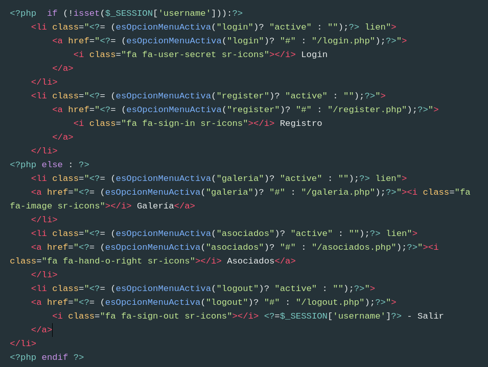


> **IMPORTANTE**
> No os olvidéis de hacer `session_start()` al principio de todos los controladores.

Falta impedir que usuarios no registrados entren en `Galería` y `Asociados`. Es tan sencillo como:

```php
<?php
     session_start();
     if (!isset($_SESSION['username'])) {
       header('location: /login.php');
     }
```

en `galeria.php` y 

```php
<?php
     session_start();
     if (!isset($_SESSION['username'])) {
       header('location: /login.php');
     }
   
```

en `asociados.php`

## Encriptación

Hasta ahora hemos almacenado la contraseña en texto plano, **algo terminantemente prohibido**. Vamos a implementar la seguridad en la contraseña, de tal forma que podamos cambiar el algoritmo de encriptación dependiendo de las necesidades. Cada algoritmo de encriptación necesita de consumo de CPU: a mayor complejidad, mayor consumo; pero también es más difícil un ataque de fuerza bruta.

Para ello vamos a usar, otra vez, el patrón de diseño Inyección de Dependencias. Al constructor de `UsuarioRepositorio` le pasaremos una instancia de nuestro encriptador de contraseñas.

Para ello, empezamos diseñando una interfaz que deben cumplir todos los encriptadores.

En la carpeta `/security` creamos el interface `IPasswordGenerator.php`

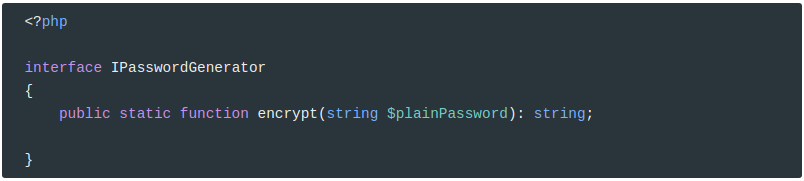

Y ahora creamos una nueva clase que implemente este interfaz. Esta clase va a ser el encriptador de texto plano que, realmente, no encripta :). Pero es por empezar por algo sencillo:

Por tanto, creamos la clase `PlainPasswordGenerator`:

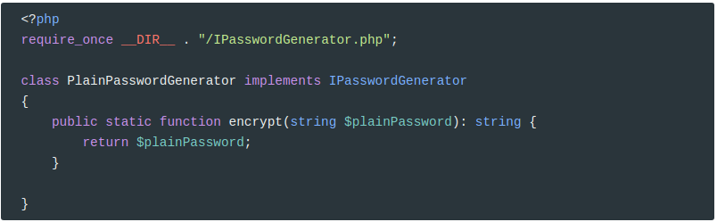

Ahora, modificamos el constructor de `UsuarioRepositorio`:

```php
/**
 * Generador de password
 *
 * @var IPasswordGenerator
 */
private $passwordGenerator;

public function __construct(IPasswordGenerator $passwordGenerator){
    $this->passwordGenerator = $passwordGenerator;
    parent::__construct('users', 'Usuario');
}
```

Y modificamos `findByUserNameAndPassword` para que antes de lanzar la consulta, encripte la contraseña:

```php
$parameters = ['username' => $username, 
               'password' => $this->passwordGenerator::encrypt($password)];
```

Y, por último, modificamos `login.php`  y `register.php` para pasar el encriptador de texto plano al constructor de `UsuarioRepositorio`.

```php
require_once "./security/PlainPasswordGenerator.php";
//...
$repositorio = new UsuarioRepository(new PlainPasswordGenerator());
```

Y ya funciona!!

## Algoritmos de encriptación

Vamos a encriptar la contraseña usando `password_hash()`.  Básicamente, encripta según el algoritmo que le pasemos como parámetro. Por ejemplo, 

```php
echo password_hash('123456', PASSWORD_DEFAULT);
```

Produciría el siguiente hash:

```
$2y$10$9fMjJx8i.dLPU75Sx05/x.pwrvw2rQXhOd7mfyBcTSB/iJn4lb1Lm
```

Pero este hash, no siempre es el mismo porque el propio algoritmo **bcrypt** le aplica un salt distinto cada vez. Por tanto la siguiente vez, nos puede devolver:

```
$2y$10$vI8aWBnW3fID.ZQ4/zo1G.q1lRps.9cGLcZEiGDMVr5yUP1KUOYTa
```

> El significado del hash es el siguiente: 
>
> Tiene tres campos delimitados por `$`:
>
> * **2y** indentifica la versión de bcrypt utilizada
> * **10** Es el factor coste, 2¹⁰ iteraciones; es decir 1024 rondas)
> * **vI8aWBnW3fID.ZQ4/zo1G.q1lRps.9cGLcZEiGDMVr5yUP1KUOYTa** es la sal y el texto cifrado concatenados y codificados en Base-64. Los primeros 22 caracteres descodificados en un valor de 16 bytes corresponden a la sal. El resto son los caracteres cifrados a ser comparados para la autenticación.

Ahora mismo, `PASSWORD_DEFAULT` se corresponde con `PASSWORD_BCRYPT`, pero puede que en un futuro éste cambie. Así que no se recomienda usar `PASSWORD_DEFAULT`.

Vamos a hacer un nuevo `IPasswordGenerator` para `bcrypt`.

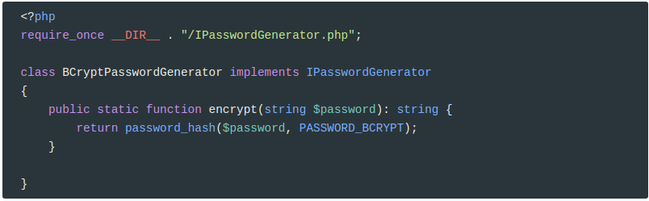

Además, como el hash no siempre es el mismo, lo que hemos de hacer para saber si la contraseña encriptada es la misma es llamar a `password_verify()`. Así que vamos a modificar el interfaz `IPasswordGenerator` para añadirle un nuevo método llamado `passwordVerify()`.

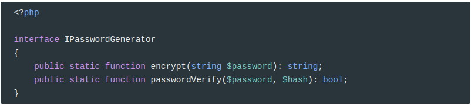

Y ahora modificamos la clase `PlainPasswordGenerator`:

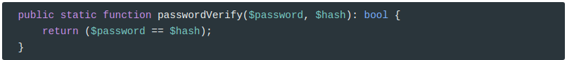

Y la clase `BCryptPasswordGenerator`:

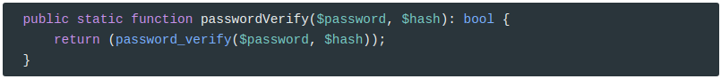

Pero antes de continuar, hemos de modificar el método `save()` de `UsuarioRepositorio` para que encripte la contraseña. Para ello, copiamos el método `save()` de `QueryBuilder` y lo modificamos, añadiendo la línea:

```php
 $parameters['password'] = $this->passwordGenerator::encrypt($parameters['password']);
```

Así que el método `save()` quedaría como sigue;

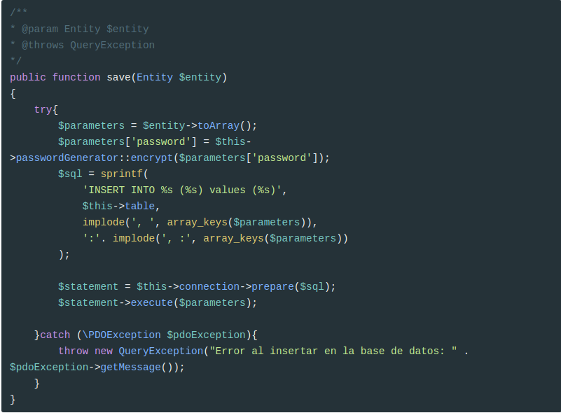

Aunque se puede refactorizar como:

```php
public function save(Entity $entity)
{
    $parameters = $entity->toArray();
    $entity->setPassword($this->passwordGenerator::encrypt($parameters['password']));
    parent::save($entity);    
}
```

Y modificamos `findByUserNameAndPassword` para que use `passwordVerify`.

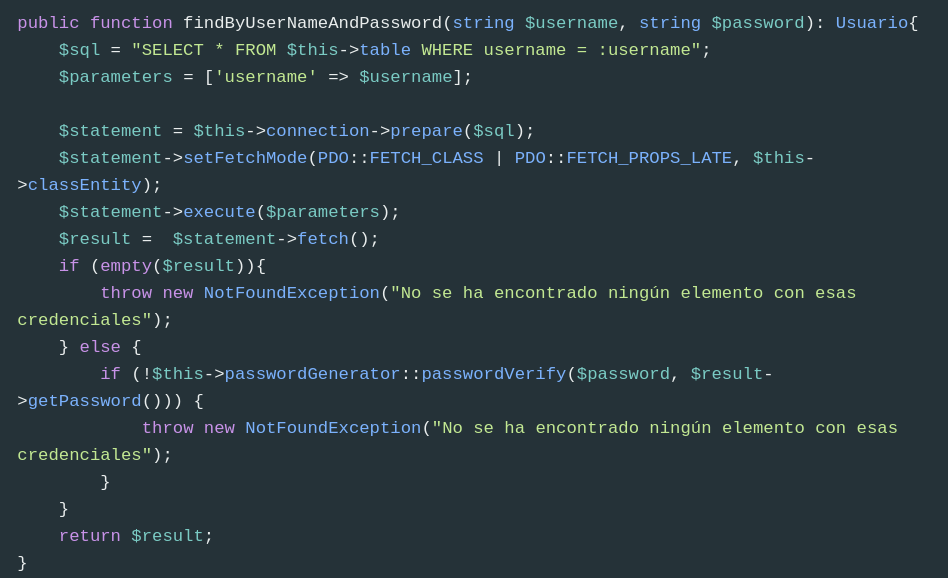

Ahora para usar un algoritmo de encriptación, simplemente se lo inyectamos en el constructor:

> **Nota**. Antes de cambiar el algoritmo de encriptación, debemos borrar todos los usuarios de la base de datos. De otra forma los antiguos no se podrán logear. En **producción** es evidente que no se puede proceder de esta forma. Os dejo un artículo de [stack overflow](https://stackoverflow.com/questions/5249350/changing-encryption-algorithm) sobre el tema.

Por ejemplo, en `login.php` y `register.php`

```php
require_once "./security/BCryptPasswordGenerator.php";
//...
$repositorio = new UsuarioRepository(new BCryptPasswordGenerator());
```

Ahora es muy sencillo tener diferentes algoritmos de encriptación. Por ejemplo vamos a encriptar usando el algoritmo `PASSWORD_ARGON2I`.

Sólo hemos de crear una nueva clase que implemente `IPasswordGenerator`.  Por ejemplo, creamos la clase `Argon2PasswordGenerator`.

```php
<?php
require_once __DIR__ . "/IPasswordGenerator.php";

class Argon2PasswordGenerator implements IPasswordGenerator
{
    public static function encrypt(string $plainPassword): string {
        return password_hash($plainPassword, PASSWORD_ARGON2I);
    }
    
    public static function passwordVerify($password, $hash): bool {
        return (password_verify($password, $hash));
    }
}
```

> NOTA. Este algoritmo de encriptación sólo está disponible a partir de PHP 7.2.0

E inyectar esta clase en el constructor de `UsuarioRepositorio`.


**Más información sobre encriptación en PHP:**

https://deliciousbrains.com/php-encryption-methods/

http://php.net/manual/es/function.password-hash.php

http://php.net/manual/es/function.password-verify.php


## Credits.

Víctor Ponz victorponz@gmail.com

Este material está licenciado bajo una licencia [Creative Commons, Attribution-NonCommercial-ShareAlike](https://creativecommons.org/licenses/by-nc-sa/3.0/)


