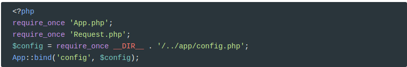

# MVC


Hasta ahora hemos creado un script php físico para cada una de las secciones de nuestra aplicación. En cada una de estos scripts realizamos siempre una serie de tareas comunes: iniciar sesión, conectarnos con la base de datos, ...

El controlador frontal se refiere a un patrón de diseño en el que un solo componente de su aplicación es responsable de manejar todas las solicitudes a otras partes de una aplicación. Centraliza la funcionalidad común que necesita el resto de su aplicación. Las plantillas, el enrutamiento y la seguridad son ejemplos comunes de la funcionalidad del controlador frontal. El beneficio de usar este patrón de diseño es que cuando el comportamiento de estas funciones necesita cambiar, solo una pequeña parte de la aplicación necesita ser modificada. De esta forma todo el código común se implementa en este controlador frontal que además es el encargado de cargar el script encargado de procesar la petición del usuario.

Para ello necesitamos que todas las solicitudes del usuario pasen por el controlador frontal. Necesitamos un fichero `.htaccess` con reglas de rescritura:

```
<IfModule mod_rewrite.c>
Options -MultiViews
RewriteEngine On
RewriteCond %{REQUEST_FILENAME} !-f
RewriteCond %{REQUEST_FILENAME} !-d
RewriteRule ^(.*)$ index.php [QSA,L]
</IfModule>
```

Las directivas `RewriteCond %{REQUEST_FILENAME} !-f` y `RewriteCond %{REQUEST_FILENAME} !-d` se utilizan para que la regla `RewriteRule ^(.*)$ index.php [QSA,L]` sólo se aplique cuando no se pide un fichero (f) o un directorio (d) existente. Y esta regla lo que hace es enviar todo al controlador frontal pasándole además cualquier parámetro en el querystring. 

Si alguien tiene interés en saber qué significa `MultiViews` y `QSA`, puede consultar las siguientes páginas:

* https://stackoverflow.com/questions/25423141/what-exactly-does-the-the-multiviews-options-in-htaccess
* https://wiki.apache.org/httpd/RewriteFlags/QSA

## Reestructurar el proyecto

En la raíz de nuestro proyecto sólo debe haber un fichero `index.php` (además de `.htaccess`). 

Todos los controladores que tenemos en raíz los movemos a un directorio nuevo llamado `/app/controllers/`.

> **IMPORTANTE**
>
> Para no perder la referencia de git, usad
>
>  `git mv about.php app/controllers/`

Las vistas también las movemos a `/app/views`

Se puede hacer con `git mv views/ app/` estando en raíz.

Y ahora modificamos los controladores para que carguen la vista del directorio correcto. Por ejemplo, en el controlador `index.php` cambiamos

```php
include("./views/index.view.php");
```

por

```php
include("app/views/index.view.php");
```

### Rutas del proyecto

Una de las tareas que debemos realizar a la hora de analizar un proyecto es cómo vamos a organizar la tabla de rutas.

Un ruta será la url que nos dará acceso a una operación. Lo que vamos a hacer es asociar los datos de la url con el script encargado de resolver esa operación. Para ello utilizaremos un array asociativo en el que mapearemos la ruta (que será la clave) con el script (que será el valor)
Por ejemplo, si tenemos esta tabla:

```php
<?php
return [
	'' => 'app/controllers/index.php',
	'about' => 'app/controllers/about.php',
    'contact' => 'app/controllers/contact.php',
    
	...
];
```

Significa que cuando el usuario se dirija a `miservidor.com/contact`, el controlador frontal llamará realmente al controlador `app/controllers/contact.php`

A este array se le llama **tabla de rutas**. Lo crearemos en `/app/routes.php` 

### Configuración de la aplicación

Lo habitual también es tener un script que se encargue de realizar todas las tareas necesarias para el inicio de la aplicación: sesiones, configuraciones, conexiones, etc.

Lo creamos dentro del directorio `/core/bootstrap.php` y, de momento, sólo va a cargar la configuración y añadirla al contenedor de servicios.


### Controlador frontal

Ahora nuestro controlador frontal (`index.php`) sólo se debe encargar de realizar la inicialización y cargar la ruta correspondiente:


### Prueba de nuestra aplicación

Si ahora visitáis `127.0.0.1:8080` debe mostrar la página de inicio. El resto de enlaces no funcionarán porque todavía no hemos refactorizado la navegación.


## Manejo de `Request`

Estamos de momento tratando el `request` en el mismo controlador frontal. Pero lo adecuado es que toda la gestión del `request` lo hagamos en una clase.

Esta clase estará ubicada en el directorio `/core/Request.php`.


Ahora esta clase la usaremos en el controlador frontal:


Y modificamos `bootstrap.php` para que use esta clase:



## Router

También es importante encapsular toda la operativa de las rutas en una nueva clase. Tendrá un atributo para almacenar las rutas.

Creamos la clase en `/core/Router.php`


Modificamos `bootstrap.php`


Y ahora la usamos en `index.php`


## Refactorizar la navegación

Vamos a acabar de configurar las rutas:


Ahora hace falta cambiar la navegación para que ya no incluya `.php` en los enlaces. Acordaos de cambiar también `single_post.php` en `blog.php`

Ahora todas las páginas irán correctamente excepto aquellas que se conectan a la base de datos, como `contact`.


Esto es así porque estamos cargando el archivo `config.php` cuando ya deberíamos usar el que hemos añadido en el controlador frontal.

Es decir, en vez de

```php
$config = require_once 'app/config.php';
App::bind('config', $config);
App::bind('connection', Connection::make($config['database']));
```

hacemos

```php
$config = App::get('config');
App::bind('connection', Connection::make($config['database']));
```

Es más, en principio todas las páginas de una aplicación se conectan a la base de datos por lo es mucho mejor hacerlo en el controlador frontal y así nos olvidamos de hacerlo en cada uno de los controladores.

Así que **movemos** el código a `index.php`


Y modificamos `bootstrap.php` para que haga el `require_once` de la clase `Connection`:

```php
require_once __DIR__ . '/../database/Connection.php';
```

Ahora en las páginas que nos conectamos con la base de datos, eliminamos todo el código relativo a conectarnos.

## Refactorizar redirect

Ahora las rutas han cambiado por lo que hemos de modificar `galeria.php` y `asociados.php` para que modifiquen el redirect:

```php
<?php
     session_start();
     if (!isset($_SESSION['username'])) {
       header('location: /login?returnToUrl=/asociados');
     }
   
```

También hemos de modificar el `redirect` en los enlaces de `login.view.php` y de `register.view.php`:

```php
 <a href='/register<?=(!empty($hrefReturnToUrl) ? '?returnToUrl=' . $hrefReturnToUrl : '')?>'>
  ¿Todavía no está registrad@?
 </a>
```


## Credits.

Víctor Ponz victorponz@gmail.com

Este material está licenciado bajo una licencia [Creative Commons, Attribution-NonCommercial-ShareAlike](https://creativecommons.org/licenses/by-nc-sa/3.0/)


Adaptado del curso [Desarrollo web con PHP y MVC](https://www.udemy.com/desarrollo-web-con-php-7-y-mysql-utilizando-mvc/), realizado en el Cefire, impartido por [**Alejandro Amat Reina**](https://www.udemy.com/user/alejandro-amat-reina/)

